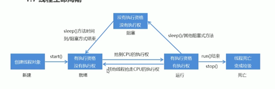

## 多线程

### 实现多线程
    
    进程：正在运行的程序
    
    是系统进行资源分配和调用的独立单位；
    
    每一个进程都有他自己的内存空间和系统资源。
    
    线程：是进程中的单个顺序控制流，是一条执行路径
    
    单线程：一个进程如果只有一条执行路径
    
    多线程：一个进程如果有多条执行路径
    

1. 多线程的实现方法：

方法1：继承Thread类

    定义一个类MyThread继承Thread类

    在MyThread类的对象

    启动线程

    （Void start()导致此线程开始执行

    Start（）启动线程，用run（）用来封装被线程执行的代码）

2. Thread类中设置和获取线程名称的方法：

`Void setName(String name)`：将此线程的名称更改为等于参数name。

`String getName（）`：返回此线程的名称

`MyThread my=new MyThread();`

`My.setNme(“…”)`

3.  线程调度的两种模型:

    分时间调度模型：所有线程轮流使用cpu的使用权，平均分配每个线程占用CPU的时间片

    抢占式调度模型：优先让优先级高的线程使用CPU，如果线程的优先级相同，则随机选择一个，优先级高的线程获取CPU时间片相对多一些。

    Java使用抢占式调度模型

4. Thread类中设置和获取线程优先级的方法：

    `Public final int getPriority()：`返回此线程的优先级

    `Public final void setPriority(int newPriority)：`更改此线程的优先级

    最后优先级：10

    最低优先级：1

    默认优先级：5

- 线程控制

•  线程的生命周期

方法2：实现Runable接口

    定义一个类MyRunable实现       Runable接口

    在MyRunable类中重写run方法

    创建MyRunable类对象

    创建Thread类对象，把MyRunable对象作为构造方法的参数

    启动线程

    同步代码块：

    锁多条语句操作共享数据，可以使用同步代码块实现

    Synchronized(任意对象){

    多条语句操作共享数据的代码

    }

### 线程同步
    
    同步方法：
    
    修饰符 synchronized 返回值类型 方法名（方法参数）{  }
    
### 线程安全的类
    
    StringBuffer：线程安全，可变的字符序列，JDK5开始，之后使用StringBuilder
    
    Vector：之后该类改进为List接口，如果不需要线程安全实现，建议使用ArrayList代替Vector
    
    Hashtable：该类实现了一个哈希表，将键映射到值。
    
### Lock锁
    
    Lock实现提供比使用Synchronized方法和语句可以获得更广泛的锁定操作
    
    `Void lock():`获得锁
    
    `Void unlock():`释放锁
    
    Lock是接口不能直接实例化，采用实现类ReentrantLock来实例化
    
### 生产者消费者
    
    为了体现生产和消费过程中的等待和唤醒，java提供的方法：
    
    进程是程序的一次动态执行过程，它对应了从代码加载、执行到执行完毕的一个完整过程，这个过程也是进程从产生、发展到消亡的过程。
    
    线程是比进程更小的执行单位。一个进程在其执行过程中，可以产生多个更小的程序单元，这些更小的单元为线程。