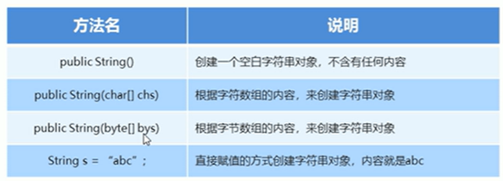
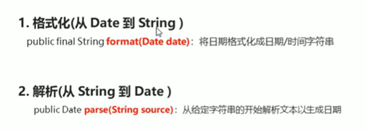
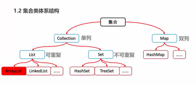

## Java辅助键

注释：单行 `ctrl+/`   多行`ctrl+shift+/`
快速生成mian()方法：`psvm`
快速生成输出语句：`sout`
格式化：`ctrl+alt+L`

## While循环

```java
while（布尔表达式）{
      //循环内容
}

do{
		//代码语句
}while（布尔表达式）
```

## for循环

```java
for(初始化；布尔表达式；更新){
	//代码语句
}
```

## If……else语句

```java
if(布尔表达式){
	//如果布尔表达式的值为true
}else{
	//如果布尔表达式的值为false
}

if(布尔表达式 1){ 
//如果布尔表达式 1的值为true执行代码 
}else if(布尔表达式 2){ 
//如果布尔表达式 2的值为true执行代码 
}else if(布尔表达式 3){ 
//如果布尔表达式 3的值为true执行代码 
}else { 
//如果以上布尔表达式都不为true执行代码 
}
```

## Switch语句

```java
switch(expression){ 
case value : 
//语句 
break; //可选 
case value : 
//语句 
break; //可选 
    //你可以有任意数量的case语句 
default : //可选 
//语句 
}
```

## Character类

用于对单个字符进行操作

```java
Character ch = new Character('a');
```

## 数组array

1. 定义格式：数据类型[] 变量名 `int[] arr`

                         数据类型 变量名[] `int arr[]`

**数组是存放在连续内存空间上的相同类型数据的集合**

- 数组的下标是从零开始的
- 数组的内存空间地址是连续的
- 数组的元素不可以删除，只能覆盖

  **2.  动态初始化**：数据类型[] 变量名 = new 数据类型[数组长度]；

`Int[] arr = new int[3];`    new:为数组申请内存空间

**静态初始化：**初始化时指定每个数组元素的初始值，有系统决定组长度

****格式：数据类型[] 变量名={数据1，数据2，数据3.。。。}

      `Int[] arr={1,2,3,,,}`

****数组初始化时，会为存储空间添加默认值0/0.00/null

1. 数组元素访问：
    
    变量访问方式：数组名[索引]
    
    索引的特征：从0开始；连续；每次加1
    
2. 内存分配：内存地址 数据
    
    栈内存：存储局部变量  局部变量：定义在方法中的变量arr，使用完就会消失
    
    堆内存：存储new出来的内容（实体、对象）
    
3. 常见问题：数组越界；空指针异常
4. 数组常见操作：获取最值：①定义一个变量用于保存最值；②取数组中第一个数据作为变量的初始值；③与数组中剩余的数据逐个比对；④打印结果

## 方法

1. 方法概述： 将具有独立功能的代码块组织成一个整体，使其具有特殊功能的代码集。 方法必须县创建才可以使用；创建完必须要调用才可以使用
2. 方法的定义和调用：

```java
public static void 方法名（）{   //定义
//方法体
}

方法名()； //调用 
```

1. 带参数方法的定义与调用
    
    定义：`public static void 方法名（数据类型 参数）{....}`
    
    调用：方法名（变量值/变量名）；
    
    注意：方法调用时数据类型和变量名不可以缺少，多参数用，隔开；方法调用时参数的数量与类型必须和定义中的一致。
    
2. 带返回值方法的定义和调用

```java
public static 数据类型 方法名（参数）{
				return 数据；
}

方法名(参数);
```

1. 方法的注意事项：方法不能嵌套定义；void无返回值
2. 方法的通用格式：

```java
public static 返回值类型 方法名（参数）{
		方法体；
		return 数据；
}
```

参数由数据类型和变量名组成；明确有无返回值类型，没有-void，有-数据类型

1. 方法重载：多个方法在同一个类当中；多个方法具有相同的方法名；多个方法的参数不同或类型不同或数量不同
2.  对于引用类型参数，形式参数的改变，影响实际参数的值

## 输入

```java
Scanner sc=new Scanner(System.in);
Int a=sc.nextInt();
```

## 面向对象基础

1. 类和对象
    
    类：类是对现实生活中一类具有共同属性和行为的事物的抽象
    对象：是能够看得到摸得着的真实存在的实体
    
2. 类的定义
    
    类是java程序的基本组成单位
    类的组成：属性和行为
    属性：在类中通过成员变量来体现（类中方法外的变量）
    行为：在类中通过成员方法来体现（和前面的方法相比去掉static关键字）
    类的定义步骤：
    
    - 定义类
    - 编写类的成员变量
    - 编写类的成员方法
    
    ```java
    public class 类名{
    	//成员变量
    	变量1的数据类型 变量1；
      变量2的数据类型 变量2；
      .......
       //成员方法
       方法1；
       方法2；
       .....
    }
    ```
    
3. 对象的使用
    
    创建对象：类名 对象名 = new 类名（）
    
    使用对象：①使用成员变量：对象名.变量名
    
                 ②使用成员方法：对象名.方法名（）
    
4. 成员变量和局部变量
    
    成员变量：类中方法外的变量
    
    局部变量：方法中的变量
    
5. 封装
    
    Private关键字：是一个权限修饰符；可以修饰成员；作用是保护成员不被别的类使用，被private修饰的成员只在本类中才能访问。
    
    针对private修饰的成员变量：
    
    - 提供“ get变量名()” 用于获取成员变量的值，方法用public修饰
    - 提供“set变量民（参数）”，用于设置成员变量的值，方法用public修饰
    
    Private使用：一个标准类的编写
    
    - 把成员变量用`private`修饰
    - 提供对应的`getxxx/setxxx（）`方法
    
    This关键字：修饰变量用于指代成员变量；
    
    封装概述：是面向对象的三大特征之一（封装、继承、多态）；
    
    封装原则：不允许外部程序直接访问，而是通过该类提供的方法来实现对隐藏信息的操作和访问成员变量private。
    
    封装好处：提高代码安全性；提高代码复用性
    
6. 构造方法
    
    作用：创建对象
    
    ```java
    public class类名{
    修饰符 类名（参数）{
    	}
    }
    ```
    
    功能：主要是完成对象数据初始化
    

## 字符串

1. API：（Application Programming Interface）应用程序编程接口
    
    Java API：指的就是JDK中提供的各种功能的Java类
    
    字符串输入：
    
    `Scanner str=new Scanner(System.in)`
    
    `String line=str.nextLine()`
    
2. String:字符串
    
    字符串不变：字符串在创建之后是不可以更改的
    
    虽然String的值不可变，但他们可以被共享
    
    `String s4=”abc”;`(直接赋值)
    
    字符串效果上相当于字符数组（`char[]`）,但是底层原理是字节数组（`byte[]`）
    
    String类的构造：
    
    
    
    String对象特点：
    
    - 通过new创建的字符串对象，每一次new都会申请一个内存空间，虽然内容相同，但是地址值不同。
3. 字符串的比较
    
    `“==”`比较：基本类型-比较的是数值是否相同；引用类型-比较的是地址值是否共同（字符串里面`“==”`为比较地址是否相同）
    
    字符串是对象，比较内容是否相同：`equals()`    `s1.equals(s2)`
    
    遍历字符串：`str.charAt()`返回指定索引处的char值，字符串索引从0开始；
    
    统计字符串：大写字母：`ch>=’A’&&ch<=’Z’`
    
    小写字母：`ch>=’a’&&ch<=’z’`
    
    数字：`ch>=’0’&&ch<=’9’`
    
4. 字符串遍历
    
    `CharAt(int index):`返回指定索引处的char值，字符串的索引也是从0开始的
    
    ```java
    for(int i=0;i<s.length();i++){
    	s.charAt(i);
    }
    ```
    
5. 拼接字符串
    
    ①定义一个int类型的数组，用静态初始化完成数组元素的初始化
    
    ②定义一个方法，用于把int数组中的数据按照规定格式拼接成一个字符串返回，返回值类型String 参数列表int[] arr
    
    ③在方法中遍历数组，按照要求进行拼接
    
    ④调用方法，用一个变量接收结果
    
    ⑤输出结果
    
    | 方法名 | 说明 |
    | --- | --- |
    | equals(a,b) | 比较字符串的内容，严格区分大小写 |
    | charAt(int index) | 返回指定索引处char值 |
    | length( ) | 返回此字符串的长度 |
6. String Builder
String Builder 是一个可变的字符串类（内容是可变的），可以把他看成是一个容器。
但是String里面的内容是不可变得。
    
    String Builder的构造方法：
    
    | 方法名 | 说明 |
    | --- | --- |
    | StringBuilder( ) | 创建一个空白可变字符串对象，不含任何内容 |
    | StringBuilder(String str) | 根据字符串的内容，来创建可变字符串对象 |
    | append(’任意类型’) | 添加数据，并返回对象本身 |
    | reverse( ) | 根据字符串的内容，来创建可变字符串对象 |
1.  StringBuilder 和 String 相互转换


## 集合基础

1.  集合的特点：提供一种存储空间可变的存储模型，存储的数据容量可以发生改变

1. `ArrayList<E>`:
    
    可调整大小的数组实现
    
    `<E>`是一种特殊的数据类型，泛型。
    
2. ArrayList构造方法和添加方法
    
    
    | 方法名 | 说明 |
    | --- | --- |
    | ArrayList() | 创建一个空的集合对象 |
    | add(E e) | 将指定的元素追加到此集合末尾 |
    | add(int index,E e) | 在此集合中的指定位置插入指定元素 |

```java
ArrayList<String>  array=new ArrayList<String>();
Array.add();
```

1. ArrayList集合常用方法
    
    
    | 方法名 | 说明 |
    | --- | --- |
    | remove(Object o) | 删除指定的元素，返回删除是否成功 |
    | remove(int index) | 删除指定索引处的元素，返回被删除元素 |
    | set(int index,E element) | 修改指定索引处的元素，返回被修改的元素 |
    | get(int index) | 返回指定索引处的元素 |
    | size() | 返回集合中的元素格式 |
2. 遍历集合

```java
for(int i=0;i<array.size();i++){
	String s=array.get(i);
	System.out.println(s);
}
```

`Alt+Fn+insert`（自动生成构造方法和get、set方法）
`Shift`选中

## 继承

1. 继承概述
    
    继承是面向对象的三大特征之一。可以使得子类具有父类的属性和方法，还可以子类中重新定义，追加属性和方法
    
    继承的格式：public class 子类名 extends 父类名{}
    
    `Public class Zi extends Fu{}`
    
    其中：Fu是父类，也被称为基类，超类
    
    Zi是子类，也被称为派生类
    
    继承中子类的特点：
    
    子类可以有父类的内容
    
    子类还可以有自己特有的内容
    
    继承的好处：
    
    提高代码的复用性
    
    提高代码的维护性
    
    继承的弊端：
    
    削弱了子类的独立性
    
    什么时候使用继承？——继承体现的关系：is a（苹果和水果、猫和动物）
    
    继承中变量的访问特点：
    
    子类局部范围找——子类成员范围找——父类成员范围找——如果都没有报错提醒
    
2. Super
    
    直接访问是局部的变量
    
    访问本类的成员变量：this
    
    访问父类的成员变量：super
    
    This:代表本类对象的引用
    
    Super：代表父类存储空间的表示（可以理解为父类对象引用）
    
    
    
3. 继承中构造方法的访问特点
    
    子类中所有的构造方法默认都会访问父类中的无参的构造方法
    
    （因为子类会继承父类中的数据，可能还会使用父类的数据，所以，子类初始化之前，一定要先完成父类数据的初始化；每一子类构造方法的第一句默认都是super（））
    
4. 继承中成员方法的访问特点
    
    子类范围找——父类范围找——如果找不到就报错
    
5. 方法重写
    
    概述：子类中出现了和父类一模一样的方法声明
    
    `@override`：是一个注解，可以帮助我们检查重写方法声明的正确性
    
    注意事项：私有方法不可以被重写（父类私有成员子类是不可能被继承的）
    
    子类方法访问权限不能更低（public>默认>私有）
    
    Java中继承的注意事项：java中类只支持单继承，不支持多继承
    
    Java中类支持多层继承
    
    ## 修饰符
    
    1. Package(文件夹)
        
        对类进行分类管理
        
        包的定义格式：packag 包名（多级包用.分开）
        
        Package come.ithe;
        
        导包：import cn.itcast.teacher(在开头开始导包)
        
        格式：import+包名
        
    2. 权限修饰符
    
    
    
    3. 状态修饰符
        
        Final：可以修饰成员方法（不能被重写），成员变量（常量，不能被赋值），类（该类不可以被继承）
        
        Final修饰局部变量：
        
        - 修饰基本类型：数据值不可以变
        - 修饰引用类型：地址值不可以改变，但是地址里面的内容是可以改变的
    
    Static：可以修饰成员方法，成员变量（被类的所有对象共享，可以通过类名调用）
    
    Static访问特点
    
    非静态的成员方法：能访问静态的成员变量，能访问非静态的成员变量，能访问静态的成员方法，能访问非静态的成员方法。
    
    静态的成员方法：能访问静态的成员变量；能访问静态的成员方法。
    
    静态成员方法只能访问静态成员
    
    ## 多态
    
    4. 概述：同一对象，对不同时刻表现出来的不同形态
        
        多态的前提和体现：有继承/实现关系；有方法重写；有分类引用指向子类对象。
        
    5. 多态中成员访问特点：
        
        成员变量：编译看左边，执行看左边
        
        成员方法：编译看左边，执行看右边
        
    6. 多态的好处和弊端
        
        好处：提高了程序的扩展性
        
        弊端：不能使用子类的特有功能
        
    7. 多态中的转型
        
        向上转型：从子到父，父类引用指向子类对象
        
        向下转型：从父到子，父类引用转为子类对象
        

## 抽象类

1. 概述：一个没有方法体的方法应该被定义为抽象方法，而类中如果有抽象方法，该类必须定义为抽象类。
    
    `Public abstract class xxx()` 抽象类
    
    `Public abstract void xxx()` 抽象方法
    
2. 特点：
    - 抽象类和抽象方法必须用abstract关键字修饰
    
    `Public abstract class 类名{}`
    
    `Public abstract void eat()`
    
    - 抽象类中不一定有抽象方法，但是有抽象方法的类一定是抽象类
    - 抽象类不能实例化，必须通过子类对象实例化，抽象类多态
    - 抽象类的子类，要么重写抽象类中的所有抽象方法，要么是抽象类
3. 抽象类的成员特点
    - 成员变量：可以是变量也可以是常量
    - 构造方法：有构造方法但是不能实例化（作用是用于子类访问父类数据的初始化）
    - 成员方法：可以有抽象方法（限定子类必须完成某些动作），也可以有非抽象方法（提高代码复用性）

## 接口

1. 概述：java中的接口更多的体现在对行为的抽象
2. 特点：接口用关键字interface修饰，`public interface 接口名{}`
    
    类实现接口用implements表示，`public class 类名 接口名{}`
    
    接口不能实例化，想要实例化需要参照多态的方式，通过实现类对象实例化（接口多态），多态的形式：具体类多态，抽象类多态，接口多态
    
    接口的实现类，要么重写接口中的所有抽象方法，要么是抽象类
    
3. 接口的成员特点
    - 成员变量只能是常量，默认修饰符：`public static final`
    - 接口没有构造方法，因为接口主要是对行为进行抽象的，没有具体存在一个类，如果没有父类，默认继承自object类
    - 接口中只有抽象方法，`public abstract（）`
4. 类和接口的关系
    
    类和类的关系：继承关系，只能单继承，但可以多层继承
    
    类和接口的关系：实现关系，可以单实现，也可以多实现，还可以在继承一个类的同时实现多个接口
    
    接口和接口的关系：继承关系，可以单继承，也可以多继承
    
5. 抽象类和接口的区别
6. 形参和返回值
    - 类名作为形参和返回值
    
    方法的形参是抽象类名，其实需要的是该抽象类的子类对象
    
    方法的返回值是抽象类名，其实返回的是该抽象类的子类对象
    
    - 接口名作为形参
    
    方法的形参是接口名，其实需要的是该接口的实现类对象
    
    方法的返回值是接口名，其实返回的是该接口的实现类对象
    

## 内部类

1. 概述：在一类中定义一个类
2. 格式：

```java
public class 类名{
			修饰符 class 类名{
			}
	}
```

1. 内部类的访问特点：内部类可以直接访问外部类的成员，包括私有；外部类要访问内部类成员，必须创建对象。
2. 内部类的分类：在类的成员位置——成员内部类
    
    在类的局部位置——局部内部类
    
3. 成员内部类的是用格式：外部类名 内部类名 对象名=外部对象.内部类对象；
    
    `Outer.inner oi=new outer().new inner();`
    
4. 局部内部类：外部无法直接访问，需要在方法内部创建对象并使用；该类可以直接访问外部类的成员，也可以访问方法内的局部变量。
5. 匿名内部类（前提：存在一个类或者接口，这里的类可以是具体的类也可以是抽象的类）

```java
new 类名或者接口名（）{
		重写方法；
	};
```

本质是一个继承了该类或者实现了该接口的子类匿名对象

## 常用API

1. Math：包含执行基本数字运算的方法:
    1. `Math.abs(a)`：取a的绝对值
    2. `Math.sqrt(a)`：取a的平方根
    3. `Math.cbrt(a)`：取a的立方根
    4. `Math.max(a,b)`：取a、b之间的最大值
    5. `Math.min(a,b)`：取a、b之间的最小值
    6. `Math.pow(a,b)`：取a的b平方
2. System：包含几个有用的类字段和方法，他不能被实例化
    
    
    | 方法名 | 说明 |
    | --- | --- |
    | exit(int status) | 终止当前运行的Java虚拟机，非零表示异常终止 |
    | currentTimeMillis() | 返回当前时间(以毫秒数为单位) |
3. Object：是类层次结构的根，每个类都可以将Object作为超类。所有类都直接或者间接的继承自该类。
4. Arrays
    
    排序：将一组数据按照固定的规则进行排序
    
    冒泡排序：对要进行排序的数据中相邻的数据进行两两比较，将较大的数据放在后面，依次对所有的数据进行操作，直至所有数据按照要求完成排序。
    
    - 如果有n个数据进行排序，总共需要比较n-1次
    - 每一次比较完毕，下一次的比较就会少一个数据参与
    
    | 方法名 | 说明 |
    | --- | --- |
    | toString(int[] a) | 返回指定数组的内容的字符串表示形式 |
    | sort(int[] a) | 按照数字顺序排列指定的数组 |
5. 基本类型包装类
    
    将基本数据类型封装成对象的好处在于可以在对象中定义更多的功能方法操作该数据。
    
    常用的操作之一：用于基本数据类型与字符串之间的转换
    

Integer类的概述和使用：

| 方法名 | 说明 |
| --- | --- |
| valueOf(int i) | 返回表示指定的int值的Integer实例 |
| valueOf(String s) | 返回一个保存指定值的Interger对象String |

int和String的相互转换：

- 用字符串的加减 `String s1 =” ”+number(int定义)`
- `Public static String valueOf(int i);`
    
    `String s2=String.valueOf(number);`
    
- String——Interger——int
    
    `Integer i=Integer.valueOf(s);`
    
    `Int x=i.intValue ();`
    
- `Int y=Integer.parseInt(s);`


1. 自动装箱和拆箱
    
    装箱：把基本数据类型转换为对应的包装类类型
    
    拆箱：把包装类类型转换为对应的基本数据类型
    
2. 日期类:Date类概述和构造方法：Date代表一个特定的时间，精确到毫秒




1. Calendar类
    
    Calendar为某一时刻和一组日历字段之间的转换提供了一些方法，并为操作日历字段提供了一些方法
    
    Calendar提供了一个类方法getinstance用于获取Calendar对象，初始化：
    
    ```java
    Calendar rightNow = Calendar.getInstance();
    Month+1;
    ```
    
    
    

## 异常

1. JVM默认处理方案
    
    如果程序出现问题，我们没有做任何处理，最终JVM会做默认处理：
    
    - 把异常的名称，异常原因及异常出现的位置输出在控制台
    - 程序停止执行
2. 异常处理
    
    异常处理值try----catch----
    

```java
try{
		可能出现异常的代码；
	       }catch（异常类名 变量名）{
	            异常的处理代码；
}
```

1. Throwable的成员方法
    
    
    | 方法名 | 说明 |
    | --- | --- |
    | getMessage() | 返回此throwable的详细信息字符串 |
    | toString() | 返回此可抛出的简短描述 |
    | printStackTrace() | 把异常的错误信息输出在控制台 |

## 集合进阶

集合的特点：提供了一种存储空间可变的存储模型，存储的数据容量可以随时发生改变。

集合类体系结构：
Clooection 单列（List 可重复；Set 不可重复）
Map 双列



1. Collection
    
    概述：单列集合的顶层接口，表示一组对象，这些对象称为Collection的元素
    
    JDK不提供此接口的任何直接实现，它提供更具体的子接口（List，Set）实现
    
    创建Collection集合的对象：多态的方式；具体的实现类ArrayList
    


`Collection<String> c=new ArrayList<String>();`

Collection集合的遍历：

- Iterator迭代器，集合的专用遍历方式

`Iterator<E>iterator()`:返回此集合中元素的迭代器，通过集合的iterator()方法得到

常用方法：`E next()`:返回迭代中的下一个元素

`Boolean  hasNext():`如果迭代具有更多元素，则返回true

`Iterator<String> it=c.iterator();`


1. List集合概述和特点
    
    List集合概述：有序集合用户可以精确控制列表中每个元素的插入位置。用户可以通过整数索引访问元素，并搜索列表中的元素。
    
    与Set集合不同，列表通常允许重复的元素。
    
    List集合特点：
    
    - 有序：存储和取出的元素顺序一致
    - 可重复：存储的元素可以重复
    
    ```java
    List<String> list=new ArrayList<String>();
    List.add(“ ”);
    Iterator<String> it=list.iterator();
    ```
    
    List集合的特有方法：
    
    
    
2. ListIterator（列表迭代器）
    
    通过List集合的`listator（）`方法得到，所以说它是list集合特有的迭代器
    
    常用方法: `E next()`:返回迭代中的下一个元素
    
    `Boolean  hasNext()`:如果迭代具有更多元素，则返回true
    
    逆向遍历 `E previous();`
    
    `ListIterator<String> lit=list.listIterator();`
    
    `Lit.hasPrevious();`
    
    `Lit.previous();`
    
3. 增强for循环
    
    增强for：简化数组和Collection集合的遍历
    
    实现Iterable接口的类允许其对象成为增强型for语句的目标
    
    格式：
    
    For(元素数据类型 变量名：数组或者Collection集合){
    
    //使用变量，该变量就是元素
    
    }
