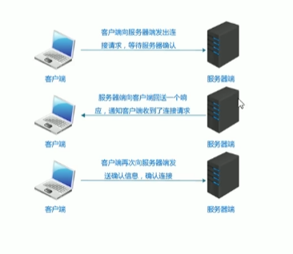

## 网络编程

### 概述

计算机网络：是指地理位置不同的具有独立功能的多台计算机及其外部设备，通过通信线路连接起来，在网络操作系统，网络管理软件及网络通信协议的管理和协调下，实现资源共享和信息传递的计算机系统。

网络编程：在网络通信协议下，实现网络互联的不同计算机上运行的程序间可以进行数据交换

网络编程三要素：

- IP地址

每台计算机都一个标识号

- 端口

网络的通信本质上是两个应用程序的通信，端口号可以唯一表示设备中的应用程序

- 协议

位于同一个网络中的计算机在进行连接和通信是需要遵守一定的规则（网络通信协议，常见的协议UDP/TCP）

### IP地址（网络中设备的唯一标识）

IPv4：给每个网络上的主机分配一个32bit地址，按照TCP/IP规定，IP地址用二进制表示，每个IP地址长32bit，也就是4个字节。为了方便使用，IP地址经常被写为十进制形式，中间用“.”分割不同字节，点分十进制表示法

IPv6：IP地址的需求量越来越大，但是网络地址资源有限，为了扩大地址空间，采用128位地址长度，每16个字节一组，分成8组十六进制数

常用命令：

Ipconfig：查看本机IP地址

Ping IP地址：检查网络是否连通

特殊IP地址：127.0.0.1 返回地址，可以代表本机地址，一般用来测试使用

InetAddress

//确定主机名称的IP地址

`InetAddress address=InetAddress.getByName(“主机名称”);`

//获取IP地址的主机名

`String name=address.getHostName();`

//返回IP地址字符串

`String ip=address.getHostAddress();`

### 端口（设备上应用程序的唯一标识）

端口号：用两个字节表示的整数，它的取值范围0~65535，其中0~1023之间的端口号用于一些知名的网络服务和引用，普通的应用程序需要使用1024以上的端口号。

### 协议

计算机网络中，连接和通信的规则被称为网络通信协议

UDP协议：用户数据报协议，是一种无连接通信协议，即在数据传输是，数据的发送端和接收端不建立逻辑连接。UDP协议消耗资源小，通信效率高，所以通常都会用于音频、视频和普通数据的传输。在传输重要数据时不建议使用UDP协议。

TCP协议：传输控制协议，面向连接的通信协议，即传输数据之前，在发送端和接收端建立逻辑连接，然后再传输数据，提供了两台计算机之间可靠误差错的数据传输。TCP连接中必须明确客户端与服务端，由客户端向服务端发送连接请求，每次连接创建都需要经过“三次握手”。

三次握手：在TCP协议中，在发送数据的准备阶段，客户端与服务器之间的三次交互，以保证连接的可靠。

    第一次握手：客户端向服务器发出连接请求，等待服务器确认

    第二次握手：服务器向客户端回送一个响应，通知客户端收到了连接请求

    第三次握手：客户端再次向服务器端发送确认信息，确认连接

完成三次握手，连接建立后，客户端和服务器就可以开始进行数据传输了。由于这种面向连接的特性，TCP协议可以保证传输数据的安全，所以应用十分广泛，例如上传文件、下载文件、浏览网页。

### UDP通信程序

UDP发送数据步骤：

- 创建发送端的Socket对象（DatagramSocket）

`DatagramSocket ds=new DatagramSocket();`

- 创建数据，并把数据打包

`DatagramPacket(byte[ ] buf, int length ,InetAdress address, int port)`

- 调用DatagramSocket对象的方法发送数据

`ds.send( );`

- 关闭发送端

`ds.close( );`

UDP接受数据步骤：

- 创建接收端的Socket对象（DatagramSocket）

Datagr

- 创建数据包，用于接收数据
- 调用DatagramSocket对象的方法接收数据
- 解析数据包，并把数据在控制台显示
- 关闭接收端