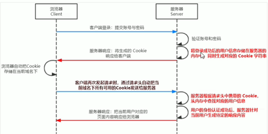
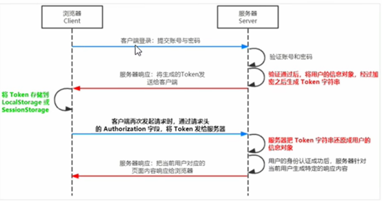

内置API是由运行环境提供的特殊接口，只能在所属的运行环境中被调用

node.js是一个基于chrome V8引擎的JavaScript运行环境

浏览器是JS的前端运行环境

Node.js是JS的后端运行环境

Node.js中无法调用DOM和BOM等浏览器内置API

JS基础语法+浏览器内置API(DOM+BOM)+第三方库(jQuery、art-template);      浏览器中JS学习

JS基础语法+Node.js内置API模块（fs,path,http等）+第三方API模块(express,mysql等)； Node.js学习

终端中的快捷键：

1、tab键快速补全

2、esc键快速清空当前输入

3、cls清空终端内容

## **fs文件系统模块**

fs模块是Node.js官方提供的、用来操作文件模块。提供了一系列的方法和属性，用来满足用户对文件的操作需求

`fs.readFile()` 方法，用来读取指定文件中的内容

```jsx
fs.readFile(path[, options],callback)
//参数1：必须按参数，字符串，表示文件路径
//参数2：可选参数，表示以什么编码格式来读取文件
//参数3：必须按参数，读取完成之后通过回调函数拿到读取的结果

function(err,dataStr){
	console.log(err);
	console.log('------');
	console.log(dataStr);
}
//如果文件读取成功err的值为null
//如果读取失败，则err的值为错误对象，dataStr的值为undefined

const fs=require('fs');
fs.readFile(path,'utf8',function(err,result){
	if(err){
		return console.log('文件读取失败'+err.message);
	}
	console.log('文件读取成功，内容是：'+result);
})
```

`fs.writeFile()` 方法，用来向指定的文件中写入内容

```jsx
fs.writeFile(file,data[,options],callback)
//参数1：必须按参数，需要制定一个文件路径的字符串，表示文件的存放路径
//参数2：必须按参数，表示要写入得内容
//参数3：可选参数，表示以什么格式写入文件内容，默认值utf8
//参数4：文件写入完成后的回调函数
const fs=require('fs');
fs.writeFile(path,'abcd(写入内容)',function(err){
	if(err){
		return console.log('文件写入失败'+err.message);
	}
	console.log('文件写入成功！');
})
```

`fs.writeFile`方法只能用来创建文件，不能用来创建路径；重复调用该方法，新写入的内容会覆盖之前的旧内容。

导入fs模块来操作文件：`const fs=require(’fs’);`

在使用fs操作模块的时候，如果提供的操作路径是`./`或`../`开头的为绝对路径时，很容易出现路径动态拼接错误的问题，**原因**：代码在执行的时候，会执行node命令所出的目录，动态拼接处被操作文件的完整路径。

**解决方案1**：直接提供完整的路径，但是移植性差，维护不方便

**解决方案2**：`__dirname`表示当前文件所处的目录

## Path路径模块

官方提供的、用来处理路径的模块

`path.join()`方法，用来将多个路径片段拼接成一个完整的路径字符串

`path.basename()`方法，用来从路径字符串中，将文件名解析出来

`path.extname()`方法，用来获取路径中的文件扩展名

## http模块学习

客户端：负责消费资源的电脑

服务器：负责对外提供网络资源的电脑

http模块用来创建web服务器的模块，通过http提供的`http.createServer( )` 能够将一台普通的电脑，变成一台服务器，从而提供Web资源服务。

使用http模块创建Web服务器，需要先导入：

```jsx
const http=require('http');
```

**创建基本的web服务器：**

1、导入http模块

2、创建web服务器实例

调用`http.createServer()` ，可以快速创建一个web服务器

```jsx
const server=http.createServer();
```

3、为服务器实例绑定request事件，监听客户端请求

```jsx
server.on('request',(req,res)=>{
	console.log('....');
})
```

req请求对象：

只要服务器接收到了客户端的请求，就会通过调用`server.on()`为服务器绑定request事件处理函数

`req.url` 是客户端请求的URL地址

`req.method` 是客户端的method请求类型

res响应对象：

`res.end()`方法：向客户端发送指定的内容，并结束这次请求的处理过程

中文乱码的处理：`res.setHeader(’content-Type’,’text/html; charset=utf-8’);`

4、启动服务器

```jsx
server.listen(端口号-80,()=>{
	consloe.log('......');
})
```

**根据不同的url响应不同的html内容：**

1、获取请求的url地址

2、设置默认的响应内容为404 Not found

3、判断用户请求是否为`/`或`/index.html`首页

4、判断用户请求是否为`/about.html`关于页面

5、设置content-type响应头，防止中文乱码

6、使用`res.end()`把内容响应给客户端

## 模块化(ES6)

模块化就是遵循固定的规则，把一个大文件拆成独立并且互相依赖的多个小模块

把代码放进模块化拆分的好处：

1、提高代码的复用性

2、提高代码的可维护性

3、可以实现按需加载

4、防止命名冲突

node.js中根据模块来源不同，将模块分为3大类，分别是：

1、内置模块(fs path http)

2、自定义模块(用户创建的每个.js文件，都是自定义模块)

3、第三方模块

ES6模块化语法：

export：用于规定模块的对外接口

import：用于输入其他模块提供的功能

暴露数据语法：

```jsx
//分别暴露
export let name='zs'
export function findJob(){
	console.log('已找到')
}
//统一暴露
let name='zs'
function findJob(){
	console.log('已找到')
}
export{name,findJob}
```

babel对模块化代码进行转换：

①安装工具  `babel-cli` `babel-present-env` `browserify`

②通过 `npx babel src/js -d  dist/js`

③打包 `npx browserify dist/js/app.js -o dist/bundle.js`

加载模块：`require( )`，可以加在需要的内置模块、自定义模块、第三方模块

module模块：

`module.exports`对象：可以使用该对象，将模块内的成员共享出去，供外界使用

默认情况下`module.exports={ }`； 外界用require方法导入自定义模块，就可以得到`module.exports`所指向的对象

node.js遵循了CommonJS模块规范化，CommonJS规定了模块的特性和各模块之间如何相互依赖

1、每个模块内部，module变量代表当前模块

2、module变量是一个对象，它的exports属性时对外的接口

3、加载某个模块时其实是加载该模块的`module.exports`属性，`require（）`方法用于加载模块

- npm与包
    
    node.js中的第三方模块又叫做包
    
    **格式化时间传统做法：**
    
    1、创建格式化时间的自定义模块
    
    2、定义格式化时间的方法
    
    3、创建补零函数
    
    4、从自定义模块中导出格式化时间的函数
    
    5、导入格式化时间的自定义模块
    
    6、调用格式化时间的函数
    
    **格式化时间的高级做法：**
    
    1、使用npm包管理工具，在项目中安装格式化时间的包moment
    
    安装包：`npm install 包的完整名称`  简写：`npm i 完整的包名字` 
    
    安装指定版本的包：`npm i moent@2.22.2` 
    
    2、使用`require( )`导入格式化时间的包
    
    3、参考moment的官方API文档对时间进行格式化
    
- 包管理配置文件
    
    快速创建package.json包管理配置文件：`npm init -y`  
    
    注意：新建项目文件夹时不要使用中文，不能出现空格
    
    **dependencies节点：**记录使用`npm install`命令安装过哪些包
    
    一次性安装所有包：`npm install` 
    
    卸载包：`npm uninstall` 
    
    **devDependencies节点：**某些包只在项目开发阶段会用到，在项目上线之后不会用到建议放到devDependencies节点中    `npm i 包名 -D`
    
    解决下包速度慢的解决：淘宝NPM镜像服务器
    
    ```jsx
    //查看当前下包镜像源
    npm config get registry
    //将下包的镜像源切换为淘宝镜像源
    npm config set registry=https:registry.npm.taobapo.org/
    //检查镜像源是否下载成功
    npm config get registry
    //安装nrm快速切换源
    npm i nrm -g    //-g可将nrm安装位全局可用的镜像源
    nrm ls  //查看所有可用的镜像源
    nrm use taobao  //切换为淘宝镜像
    ```
    
- 包的分类
    
    1、项目包
    
    那些被安装到项目的node_modules目录中的包，都是项目包
    
    项目包分为两类：
    
    开发依赖包：被记录到devDependencies节点中的包，只会在开发期间用到 `npm i 包名 -D`
    
    核心依赖包：被记录到dependcies节点中的包，在开发和上线期间都会用到 `npm i 包名`
    
    2、全局包
    
    `npm install -g`
    
    会被保存到`C:\Users\DELL\AppData\Roaming\npm\node_modules`路径下
    
    3、i5ting_toc
    
    是一个可以吧md文档转换为html页面的小工具
    
    4、规范的包结构
    
    一个规范的包，它的组成结构，必须符合以下3点要求：
    
    ①包必须以单独的目录而存在
    
    ②包的顶级目录下要必须包含package.json这个包管理配置文件
    
    ③package.json中必须包含name(包的名字) version(包的版本) main(包的入口)这三个属性
    
    5、开发属于自己的包
    
    初始化包的基本结构：
    
    ①新建“包名子”文件夹，作为包的根目录
    
    ②在该文件夹下新建三个文件夹：package.json(包管理配置文件) index.js(包的入口文件) REDEME.md(包的说明文档)
    
    初始化package.json：
    
    ```jsx
    {
    	"name":  //包名不可以重复，需要先去检索以下   都用逗号隔开
    	"version":
    	"main":
    	"description":
    	"keywords":
    	"license": "ISC"
    }
    ```
    
    将不同功能进行模块化拆分：
    
    ①将不同功能进行拆分为不同的 .js 文件
    
    ②在index.js中，导入两个模块，得到需要向外共享的方法
    
    ③在index.js中，使用module.exports 把对应的方法共享出去
    
    编写文档说明：
    
    包含以下内容：安装方式、导入方式、不同方法的使用示例、开源协议
    
    6、发布包
    
    ①注册npm账号
    
    ②登录npm账号（在终端登录）  `npm login` 之后依次输入用户名、密码、邮箱
    
    在运行npm login之前需要把下包的服务器切换到npm官方服务器上。否则会发布失败
    
    ③发布到npm上  将终端切换到根目录`npm publish`
    
    ④删除已发布的包： `npm unpublish 包名 --force`
    
    npm unpublish命令只能删除72小时以内发布的包  通过该命令删除的包在24小时内不允许重新发布
    
- 模块的加载机制
    
    1、优先从缓存中加载
    
    模块在第一次加载后会被缓存。即多次调用require()不会导致模块的代码被执行多次，从而提高模块的加载效率
    
    2、内置模块的加载机制
    
    内置模块是node.js官方提供的模块，内置模块的加载优先级最高
    
    3、自定义模块的加载机制
    
    使用`require()`加载自定义模块时，必须指定./ ../开头的路径标识符
    
    4、第三方模块的加载机制
    
    如果传递的require模块标识不是一个内置模块，也没有./ ../的路径标识符，则node.js会从当前模块的父目录开始，尝试从`/node_modules`文件夹中加载第三方模块
    
    如果没有找到对应的第三方模块，则移动到上一层父目录中，进行加载，直到文件系统的根目录
    

## Express

Express是基于node.js平台，快速、开放、极简的Web开发框架

Express的作用和Node.js内置的http模块类似，是专门用来创建Web服务器的

本质是一个npm上的第三方包，提供了快速创建Web服务器的便捷方法，使用Express可以方便，快速的创建Web网站的服务器或API接口的服务器

```jsx
//创建最基本的服务器
const express=require('expresss')
const app=express();
app.listen(80,() => {
	console.log('       ');
})
```

- 监听GET请求
    
    通过`app.get()`方法，监听客户端的GET请求
    
    ```jsx
    app.get('请求URL',function(req,res){处理函数})
    //参数1：客户端请求的URL地址
    //参数2：请求对应的处理函数 req：请求对象  res：响应对象
    ```
    
- 监听POST请求
    
    通过`app.post()`方法，可以监听客户端的POST请求
    
    ```jsx
    app.post('请求URL',function(req,res){处理函数})
    ```
    
- 把内容响应给客户端
    
    通过`res.send()`方法，可以把处理好的内容·发送给客户端
    
    ```jsx
    app.get('/user',(req,res) => {
    	//向客户端发送JSON对象
    	res.send({name:''})
    })
    
    app.post('/user',(req,res) => {
    	//向客户端发送文本内容
    	res.send('请求成功')
    })
    ```
    
- 获取URL中携带的查询参数
    
    通过`req.query()`对象，可以访问到客户端通过查询字符串的形式，发送到服务器的参数
    
    ```jsx
    app.get('/',(req,res) => {
    	console.log(req.query)
    })
    ```
    
- 获取URL中的动态参数
    
    通过`req.params`对象，可以访问到URL中，通过：匹配到的动态参数
    
    ```jsx
    app.get('/user/:id',(req,res) => {
    	console.log(req.params)
    })
    ```
    
- 托管静态资源
    
    1、`express.static()`   `app.user(express.static('public'))`
    
    express在指定的静态目录中查找文件，并对外提供资源的访问路径。因此，存放静态文件的目录名不会出现在URL中
    
    2、托管多个静态资源目录
    
    ```jsx
    app.use(express.static('public'))
    app.use(express.static('files'))
    ```
    
    3、挂载路径前缀
    
    ```jsx
    app.use('/user',express.static('public'))
    ```
    
- nodemon
    
    `npm install -g nodemon`
    
    nodemon app.js来启动项目
    

### Express-路由

路由就是映射关系

在express中路由指的是客户端的请求与服务器处理函数之间的映射关系

express中的路由分为三部分：请求的类型，请求的URL地址，处理函数

```jsx

app.METHOD(PATH,HANDLER)

```

- 路由的使用

在express中使用路由最简单的方式就是把路由挂载到app上

```jsx
app.get('/',(req,res) => { res.send('   ')})
app.post('/',(req,res) => { res.send('  ')})
```

- 模块化路由

不建议将路由直接挂载到app上，而是推荐将路由抽离为单独的模块

抽离路由的步骤：

①创建路由模块对象的.js文件

②调用`express.Router()`函数创建路由对象

③向路由对象上挂载具体的路由

为路由模块添加前缀：`pp.use('/api',userRouter)`

### Express-中间件

中间件调用流程：当一个请求到达express的服务器之后，可以连续调用多个中间件，从而对这次请求进行预处理

中间件的格式：本质上就是一个function处理函数：

```jsx
app.get('/',function(req,res,next){
	next();
})
//next函数的作用：实现多个中间件连续调用的关键，它表示把流转关系转交给下一个中间件或路由
```

定义中间件函数：

```jsx
const mv=function(req,res,next){
	console.log('这是一个最简单的中间件函数')
	next()   //在当前中间件的业务处理完毕后，必须调用next()函数
}
```

- 全局生效的中间件
客户端发起的任何请求，到达服务器之后，都会出发的中间件，叫做全局生效的中间件
通过调用`app.use(中间件函数)`，即可定义一个全局生效的中间件
- 中间件的作用：
    
    多个中间件之间，共享同一份req和res，基于这样的特性，我们可以在上游的中间件中，统一为req或res对象添加自定义的属性和方法，供下游的中间件或路由进行使用
    
- 定义多个全局中间键
    
    使用`app.use()`连续定义多个全局中间件。客户端请求到达服务器之后，会按照中间件定义的先后顺序依次进行调用
    
- 局部生效的中间件
    
    不适用`app.use()`定义的中间件，叫做局部生效的中间件
    
- 定义多个局部中间件
    
    ```jsx
    app.get('/',mw1,mw2,(req,res,next) => {res.send('home page')})
    app.get('/',[mw1,mw2],(req,res) => {res.send('home page')})
    ```
    
- 注意事项
    
    1、**一定要在路由之前注册中间件**
    
    2、客户端发送过来的请求，可以连续调用多个中间件进行处理
    
    3、执行完中间件的业务代码之后，不要忘记调用next()函数
    
    4、调用完`next()`之后不要再添加其他代码
    
    5、连续调用多个中间件时，多个中间件之间，共享req和res对象
    

- 中间件分类
    
    1、应用级别的中间件：通过`app.use()`或`app.get()`或`app.post()`，绑定到app实例上的中间件，叫做应用级别的中间件
    
    2、路由级别的中间件：绑定到`express.Router()`实例上的中间件
    
    3、错误级别的中间件：作用——用来捕获整个项目中发生的异常错误，从而防止项目异常崩溃的问题；格式——错误级别的中间件函数中，必须包含四个新参(err,req,res,next);
    
    4、express内置的中间件：
    
    `express.static`快速托管静态资源的内置中间件
    
    `express.json`解析json格式的请求数据
    
    `express.urlencoded`解析URL-encoded格式的请求体数据
    
    ```jsx
    app.use(express.json())
    app.use(express.urlencoded({extended:false}))
    ```
    
    5、第三方中间件
    
    6、自定义中间件
    
    实现步骤：
    
    ①定义中间件
    
    ②监听req的data事件
    
    ③监听req的end事件
    
    ④使用querystring模块解析请求体数据
    
    ⑤将解析出来的数据对象挂载为req.boby
    
    ⑥将自定义中间件封装为模块
    

### Express-接口

- 创建API路由模块
    
    ```jsx
    const express = require('express')
    const apiRouter = express.Router()
    module.exports = apiRouter
    
    const apiRouter = require('./apiRouter.js')
    app.use('/api',apiRouter)
    ```
    
- 编写GET接口
    
    ```jsx
    apiRouter.get('/get', (req, res) => {
        const query = req.query
        res.send({
            status: 0,   //状态0为成功，1为失败
            msg: 'GET请求成功',   //状态描述
            data: query  //需要响应给客户端的具体数据
        })
    })
    ```
    
- 编写POST接口
    
    ```jsx
    apiRouter.post('/post', (req, res) => {
        const body = req.body
        res.send({
            status: 0,
            msg: 'POST请求成功！'，
            data:body    
        })
    })
    ```
    
- CORS跨域资源共享
    
    解决跨域问题：CORS、JSONP（仅支持GET请求）
    
    1、使用cors中间件解决跨域问题   
    
    安装：`npm install cors`
    
    导入：`const cors=require(’cors’)`
    
    配置中间件：`app.use(cors())`
    
    2、注意
    
    cors主要在服务器端进行配置，客户端无须做任何额外的配置
    
    3、cors响应头部   `Access-Contorl-Allow-Origin`
    
    ```jsx
    Access-Control-Allow-Origin:<origin> | *//域名
    res.setHeader('Access-Control-Allow-Methods','POST,GET,DELETE,HEAD')
    res.setHeader('Access-Control-Allow-Methods','*')
    ```
    
    4、cors请求分类
    
    ①请求方式：GET POST HEAD三者之一
    
    跨域：指的是浏览器不能执行其他网站的脚本。它是由浏览器的同源策略造成的，是浏览器施加的安全限制
    
    > 同源策略：浏览器最核心也是最基本的安全功能。同源策略会阻止一个域的js脚本和另一个域的内容进行交互。
    > 
    
    解决跨域问题的主要方案：
    
    ①CORS
    
    ②JSNOP(有缺陷，只支持GET请求)
    
    使用CORS中间件解决跨域问题：
    
    CORS是由一系列HTTP响应头组成
    

## 数据库

数据库：用来组织、存储和管理数据的仓库

常见的数据库：

MySQL数据库——免费目前适用范围广、流行度高

Oracle数据库

SQL Server——前三个都是传统型数据库（关系型数据库或SQL数据库）

Mongobd数据库——新型数据库（非关系型数据库）

传统型数据库的组织结构：

数据库(database)、数据表(table)、数据行(raw)、字段(field)

MySQL Server:专门用来提供数据存储和服务的软件

MySQL Server：可视化的MySQL管理工具，可以方便的操作存储在MySQL Server中的数据

创建数据表：

DataType 数据类型

1、int 整数

2、varchar(len)字符串

3、tinyint(1) 布尔值

字段的特殊标识

1、PK（primary key）：主键、唯一标识

2、NN（Not Null）：值不允许为空

3、UQ（Unique）：值唯一

4、AI（Auto Increment）：值自动增长

SQL（Structured Query Language）是结构化查询语言，专门用来访问和处理数据库的编程语言。能够让我们以编程的形式，操作数据库里面的数据

- 查询数据(SELECT)
    
    ```sql
    --从FROM指定的表中，查询所有的数据  *表示所有列
    SELECT * FROM 表名称
    --从FROM指定的表中，查询出指定列名称字段的数据
    SELECT 列名称 FROM 表名称
    --多个列之间使用逗号隔开
    ```
    
- 插入(INSERT)
    
    ```sql
    -- 列和值需要对应，多个列和多个值需要使用逗号隔开
    INSERT INTO table_name(列1，列2，。。。) VALUES (值1，值2，。。。)
    -- insert into users (username,password) values ('zf','098123');
    ```
    
- 修改(UPDATE)
    
    ```sql
    UPDATE 表名称 SET 列名称 = 新值 WHERE 列名称 = 某值
    ```
    
- 删除(DELETE)
    
    ```sql
    DELETE FROM 表名称 WHERE 列名称=值
    ```
    
- 限定选择的标准（WHERE）
    
    ```sql
    -- 查询语句中的WHERE条件
    SELECT 列名称 FROM 表名称 WHERE 列 运算符 值
    -- 更新语句中的WHERE条件
    UPDATE 表名称 SET 列=新值 WHERE 列 运算符 值
    -- 删除语句中的WHERE条件
    DELETE FROM 表名称 WHERE 列 运算符 值
    ```
    
- AND 和 OR
    
    AND表示必须同时满足多个条件
    
    OR表示只需满足任意一个条件即可
    
- ORDER BY排序
    
    ```sql
    SELECT * FROM users ORDER BY status;
    SELECT * FROM users ORDER BY status ASC;
    -- ASC为升序，默认升序
    -- desc为降序
    ```
    
- count(*)函数
    
    用于返回查询结果的总数据条数
    
    ```sql
    SELECT COUNT(*) FROM 表名称
    ```
    
- 使用AS为列设置别名

在项目中操作数据库的步骤：

①安装操作mysql数据库的第三方模块

`npm install mysql` 

②通过mysql模块连接到mysql数据库

```jsx
const mysql=require('mysql')
const db=mysql.createpool({
	host:'127.0.0.1',   //数据库的IP地址
	user:'root',      //登录数据库的账号
	password:'123456',  //登录数据库的密码
	database:'my----'   //指定要操作哪个数据
})

//检测mysql模块能否正常工作
db.query('SELECT 1',(err,results) => {
	if(err) return console.log(err.message)
	console.log(resluts)
})
```

③通过mysql模块执行sql语句

```jsx
//查询数据
db.query('SELECT * FROM users',(err,results) => {
	if(err) return console.log(err.message)
	console.log(results)
})

//插入数据
const user={username:'ssS',password:'pcc321'}
const sqlStrl='INSERT INTO users (username,password) VALUES (?,?)'
//？？占位符
db.query(sqlStrl, [user.username, user.password], (err, result) => {
    if (err) return console.log(err.message);
    if (result.affectRows === 1) console.log('插入数据成功');
})

//简写版插入数据
const user = { username: 'sss', password: '123456' }
const sqlStr = 'insert into users value ?'

db.query(sqlStr, user, (err, result) => {
    if (err) return console.log(err.message);
    if (result.affectRows === 1) return console.log('插入数据成功');
})

//更新数据
const user = { id: 3, username: 'aaa', password: '123abc' }
const sqlStr = 'update users set username=?,password=? where id=?'
db.query(sqlStr, [user.username, user.password, user.id], (err, results) => {
    if (err)
        return console.log(err.message);
    if (results.affectedRows === 1)
        console.log('数据更新成功！');
})

//简写版的更新数据
const user = { id: 3, username: 'lh', password: '123abc' }
const sqlStr = 'update users set ? where id=?'
db.query(sqlStr, [user, user.id], (err, results) => {
    if (err)
        return console.log(err.message);
    if (results.affectedRows === 1)
        console.log('数据更新成功！');
})

//删除数据
const sqlStr = 'delete from users where id=?'
db.query(sqlStr, 5, (err, results) => {
    if (err) return console.log(err.message);
    if (results.affectedRows === 1) {
        console.log('删除数据成功');
    }
})
```

### Web的开发模式

- 基于服务端渲染的传统Web开发模式
    
    服务器发送给客户端的HTML页面，是在服务器通过字符串的拼接动态生成的
    
    优点：前端耗时少、有利于SEO
    
    缺点：占用服务器端资源、不利于前后端分离，开发效率低
    
- 基于前后端分离的新型Web开发模式
    
    前后端分离的开发，依赖于Ajax技术的广泛应用，后端只负责提供API接口，前端使用Ajax调用接口的开发模式
    
    优点：开发体验好、用户体验好、减轻服务器端的渲染压力
    
    缺点：不利于SEO
    
- 身份认证
    
    通过一定的手段，完成对用户身份信息的确认   手机验证码登录、邮箱密码登录、二维码登录
    
    服务端渲染推荐使用Session认证机制
    
    前后端分离推荐使用JWT认证机制
    
- Session认证机制
    
    HTTP协议的无状态性，指的是客户端的每次HTTP请求都是独立的，连续多个请求之间没有直接关系，服务器不会主动保留每次HTTP请求状态。
    
    Cookie是存储在用户浏览器中的一段不超过4KB的字符串，由一个名称，一个值和其他几个用于控制Cookie有效期、安全性、适用范围的可选属性组成。
    
    Cookie的特性：自动发送 域名独立 过期时限 4KB限制
    
    提高身份认证的安全性：会员卡+刷卡认真
    
    Session的工作原理：                                                                                                                                                                                                                                                                                                                                                                                                                                                                                                                                                     
    
    
    
    安装Express-session中间件
    
    ①安装express-session中间件  `npm install express-session`
    
    ②配置express-session中间件  `app.use()`来注册session中间件
    
    ```jsx
    const { application } = require('express')
    const session = require('express-session')
    
    application.use(session({
        secret: 'keyboard cat',   //secret属性值可以为任意字符串
        resave: false, //固定写法
        saveUninitialized: true //固定写法
    }))
    ```
    
    ③向session中存数据
    
    ```jsx
    const session = require('express-session')
    
    application.use(session({
        secret: 'keyboard cat',   //secret属性值可以为任意字符串
        resave: false, //固定写法
        saveUninitialized: true //固定写法
    }))
    
    const express = require('express')
    const app = express.server()
    
    app.post('/api/login', (req, res) => {
        if (req.body.username !== 'admin' || req.body.password !== '000000') {
            return res.send({status:1,msg:'登陆成功'})
        }
    })
    
    req.session.user = req.body   //将用户信息，存储到Session中
    req.session.islogin=true   //将用户登录状态，存储到Session中
    
    app.listen(80, () => {
        console.log('http://127.0.0.1');
    })
    ```
    
    ④session中取数据
    
    ```jsx
    app.get('/api/username', (req, res) => {
        if (!req.session.islogin) {
            return res.send({status:1,msg:'fail'})
        }
        res.send({status:0,msg:'sucesss',username:req.session.user.username})
    })
    ```
    
      ⑤清空session   `req.session.destroy()`
    
- **JWT认证机制**
    
    Session认证机制需要配合Cookie才能够实现，但是Cookie不支持跨域访问，所以当涉及到前端跨域请求后端接口的时候，需要做很多额外的配置，才能实现跨域Session认证
    
    注意：当前段请求后端接口不存在跨域问题的时候，推荐Session身份认证机制
    
    当前端需要跨域请求后端接口的时候，不推荐使用Session身份认证机制，推荐使用JWT认证机制
    
    
    
    用户信息  通过Token字符串形式，保存在客户端浏览器中。服务器通过还原Token字符串的形式来认证用户的身份
    
    ①JWT的组成部分
    
    Header头部、Payload有效载荷、Signature签名
    
    ```jsx
    Header.Payload.Signature
    ```
    
    Payload部分是真正的用户信息，它是用户信息经过加密之后生成的字符串
    
    Header和Signature是安全性相关的部分，只是为了保证Token的安全性
    
    ②JWT的使用方式
    
    客户端收到服务器返回的JWT之后，通常会将他存在loaclStorage或sessionStorage中。推荐的做法是把JWT放在HTTP请求头的Authorization字段中
    
    ```jsx
    Authorization:Bearer<token>
    ```
    
    ③安装JWT相关的包
    
    ```jsx
    npm install jsonwebtoken express-jwt
    //其中jsonwebtoken用于生成JWT字符串
    //express-jwt用于将JWT字符串解析还原成JSON对象
    
    //导入两个包
    const jwt=require('jsonwebtoken')
    const expressJWT=require('express-jwt')
    ```
    
    ④定义secret密钥
    
    为了保证JST字符串的安全性，防止JT字符串在网络传输当中被别人破解，定义一个用于加密和解密的secret密钥：
    
    当生成JWT字符串的时候，需要使用secret密钥对用户信息进行加密，最终得到加密好的JWT字符串；当把JWT字符串解析还原成JSON对象的时候，需要使用secret密钥进行解密
    
    ```jsx
    const secretKey='   '
    //密钥本质就是一个字符串
    ```
    
    ⑤登录成功后生成JWT字符串  使用jwt.sign()
    
    ```jsx
    //登录接口
    app.post('/api/login', (req, res) => {
        res.send({
            status: 200,
            message: '登陆成功！',
            //调用jwt.sign()生成JWT字符串，三个参数分别是：用户信息对象，加密密钥、配置对象
            token:jwt.sign({username:userinfo.username},secretKey,{expiresIn:'30s'})
        })
    })
    ```
    
    ⑥将JWT字符串还原为JSON对象
    
    ```jsx
    //使用app.use()来注册中间件
    app.use(expressJWT({secret:secretKey}).unless({path:[/^\/api\//]}))
    ```
    
    ⑦捕获解析JWT失败后产生的错误
    
    ```jsx
    app.use((err, req, res, next) => {
    	//token解析失败导致的错误
        if (err.name === 'UnauthorizedError') {
            return res.send({ status: 401, message: '无效的token' })
        }
    	//其他原因导致的错误
        res.send({status:500,message:'未知错误'})
    })
    ```
    

Node.js的工作原理

node.js是一个使用JS作为其脚本语言，运行在chrome的V8 JS引擎的虚拟机。

基本上node.js是基于事件驱动的架构，使用I/O异步运行，使其轻量而有效

Node.js比其他框架的优势

1、node.js提供简单开发，因为他基于欧束的模型导致较短的响应事件和并发处理，与开发人员必须使用线程管理的其他框架不同

2、运行在chromV8引擎当中，该引擎有C++编写，并且不断改进的高性能

3、将前后端都是用JS开发，可以加快开发速度

4、还有很多库可以使用

Node.js如何克服I/O操作阻塞问题

由于结点有事件循环，可用于以异步方式处理所有I/O操作，而不会阻塞main函数