## VUE基础

什么是Vue：用于构建用户界面的前端框架

1、构建用户界面：往Html页面中填充数据

2、框架：一套现有的解决方案；vue指令、组件(是对UI结构的复用)、路由、vuex、vue组件库

### **Vue的特性**

1、数据驱动视图

数据的变化会驱动视图自动更新

好处：程序员只管数据维护，页面会自动重新渲染

注意：数据驱动视图是单向的数据绑定

2、双向数据绑定

双向数据绑定可以辅助开发者在不操作DOM的前提下，自动把用户填写内容同步到数据源中。

好处：开发者不再需要手动操作DOM元素，来获取表单元素最新的值

**MVVM**

MVVW是vue实现数据驱动视图和双向数据绑定的核心原理。

Model表示当前页面渲染时所有依赖  的数据源

View表示当前页面所渲染的DOM结构

ViewModel表示vue实例，是MVVW的核心

### Vue的基本使用

1、导入Vue的库文件

```jsx
<script src="lib/vue-2.6.12.js"></script>
```

2、创建Vue的实例对象

```jsx
<!-- 创建vue的实例对象 -->
<script>
    const vm = new Vue({
	    // el属性是固定的写法，表示当前vm实例要控制页面上的哪个区域，它是 DOM 元素中的 id
	    el: '#app',
	    // data对象就是要渲染到页面上的数据
      data: {
           username: 'zs'
      }，
			methods:{

			}
    })
</script>
```

Vue的指令与过滤器

指令是为Vue为开发者提供的模板语法，用于辅助开发者渲染页面的基本结构

指令是Vue开发中最基础、最常用、最简单的知识点

Vue的指令按照不同的用途可以分为如下6大类：

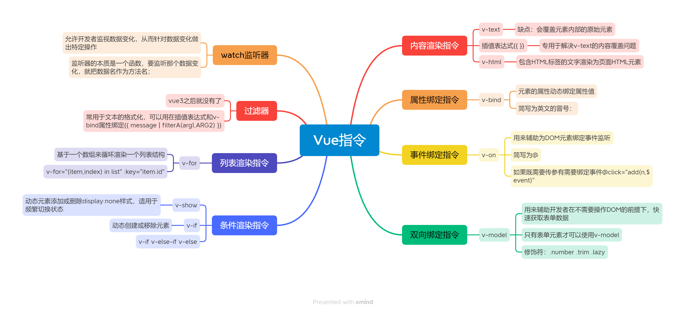

- 内容渲染指令
    
    内容渲染指令用来辅助开发者渲染DOM元素的文本内容
    
    - v-text
    
    v-text指令的缺点：会覆盖元素内部原有的内容
    
    ```jsx
    <p v-text="username"></p>
    <p v-text="gender">性别</p>
    ```
    
    - 插值表达式
    
    插值表达式，专门用来解决v-text的内容覆盖问题
    
    在实际开发中运用最多，知识内容的占位符，不会覆盖原有的内容
    
    ```jsx
    <p>姓名：{{username}}</p>
    <p>性别：{{gender}}</p>
    ```
    
    - v-html
    
    v-text指令和插值表达式只能渲染纯文本内容。如果把包含HTML标签的文字穿渲染为页面的HTML元素，则需要用到v-html指令
    
    ```jsx
    <p v-html="discription"></p> 
    ```
    
- 属性绑定指令
    
    插值表达式只能那个用在元素的内容节点中，不能用在元素的属性节点中
    
    - v-bind
    
    元素的属性动态绑定属性值，则需要用到v-bind属性绑定指令
    
    v-bind可以简写为英文的冒号  `:`
    
    ```jsx
    <input type="text" v-bind:placeholder="tips">
    ```
    
    在使用v-bind属性绑定期间，如果绑定内容需要进行动态拼接，则字符串的外面应该包裹单引号
    
    ```jsx
    <div :title="'box'+index">这是一个 div</div>
    ```
    
- 事件绑定指令
    - v-on事件绑定指令，用来辅助程序员为DOM元素绑定事件监听
    
    ```jsx
    <button v-on:click="addCount">+1</button>
    ```
    
    v-on指令可以被简写为@
    
    ```jsx
    <button @click="addCount">+1</button>
    ```
    
    v-on:click  v-on:input  v-on:keyup
    
    绑定事件的时候没有传参默认是e，可以对其进行DOM操作 
    
    如果既需要传参又需要绑定事件  `@click=”add(n,$event)”`
    
    事件修饰符：
    
    `event.preventDefault()`
    
    `event.stopPropagation()`
    
    按键修饰符：
    
    `@keyup.enter=”  ”`
    
    `@keyup.esc=”  ”`
    
- 双向绑定指令
    
    `v-model`双向数据绑定指令，用来辅助开发者在不操作DOM的前提下，快速获取表单的数据
    
    注意：v-value是单向绑定，数据变化不会同步到数据源当中
    
         只有表单元素才可以使用`v-model`
    
    `v-model` 修饰符
    
    | 修饰符 | 作用 |
    | --- | --- |
    | .number | 自动将用户的输入值转为数值类型 |
    | .trim | 自动过滤用户输入的首尾空白字符 |
    | .lazy | 在change时而非input时更新 |
    
    ```jsx
    <input type="text" v-model.number="n1">
    <input type="text" v-model.number="n2">
    <span>{{ n1+n2 }}</span>
    ```
    
- 条件渲染指令
    
    用来辅助开发者按需控制DOM的显示与隐藏，`v-if   v-show`
    
    `v-show`原理：动态为元素添加或删除display:none样式，来实现元素的显示和隐藏。如果频繁的切换元素的显示状态，用v-show性能更好
    
    `v-if`原理：每次动态创建或移除元素，实现元素的显示和隐藏。如果刚进入页面的时候，某些元素默认不需要被展示，而后期这个元素很可能也不需要被展示出来，此时v-if性能更好
    
    `v-if  v-else-if  v-else`
    
- 列表(循环)渲染指令
    
    `v-for` 用来辅助 开发者基于一个数组来循环渲染一个列表结构。v-for指令需要使用item in items形式的特殊语法，其中
    
    items是待循环的数组、item是被循环的每一项
    
    ```jsx
    data:{
    	list:[
    		{id:1,name:'zs'},
    		{id:2,name:'ls'}
    	]
    }
    
    <ul>
    	<li v-for:"item in list">{{item.name}}</li>
    </ul>
    ```
    
    `v-for=”(item,index) in list”`  其中index即为索引
    
    官方建议，用到v-for指令，一定要绑定一个`:key`属性，而且尽量把id作为key的值
    
    ```jsx
     <tr v-for="(item,index) in list":key="item.id">
    ```
    
- 过滤器(vue3没有了)
    
    常用于文本的格式化，过滤器可以用在两个地方：插值表达式和v-bind属性绑定
    
    ```html
    <p>{{ message|capitalize }}</p>
    ```
    
    注意：要定义到filters节点下，本质是一个函数；在过滤器函数中，一定要有return值；在过滤器的形参中就可以获取到管道符前面待处理的那个值；如果全局过滤器和私有过滤器名字一致，此时按照就近原则，调用的是私有过滤器。
    
    ```jsx
    <p>{{ message | filterA(arg1,arg2) }}</p>
    //第一个参数永远都是管道符前面待处理的值
    //第二个参数开始才是调用过滤器时传递过来的arg1和arg2参数
    Vue.filter('filterA',(msg,arg1,arg2)=>{
    	//过滤器代码逻辑
    })
    ```
    
- watch侦听器
    
    允许开发者监视数据变化，从而针对数据的变化做特定的操作
    
    侦听器的本质是一个函数，要监听那个数据变化，就把数据名作为方法名即可；新值在前旧值在后
    
    ```jsx
    const vm=new Vue({
    	el:'#app',
    	watch:{
    		username(newVal,oldVal){
    		//newVal是变化后的新值，oldVal是变化之前的旧值
    			console.log(newVal,oldVal)
    		}
    	}
    })
    ```
    
    侦听器的格式：
    
    方法格式的侦听器：缺点——无法在刚进入页面的时候自动触发；如果侦听的是一个对象，如果对象中的属性发生了变化，不会触发侦听器
    
    对象格式的侦听器：优点——可以通过`immediate` 选项，让侦听器自动触发；可以通过deep选项，让侦听器深度监听对象中每个属性的变化
    
    ```jsx
    const vm=new Vue({
    	el:'#app',
    	data:{
    		info:{
    			username:'admin'
    		}
    	},
    	watch:{
    		info:{
    			handler(newVal){
    				concole.log(newVal)
    			},
    			deep:true
    		}
    	}
    })
    ```
    
- 计算属性
    
    ```jsx
    var vm=new Vue({
    	el:'#app',
    	data:{
    		r:0,g:0,b:0
    	},
    	computed:{
    		rgb(){return 'rgb(${this.r},${this.g},$(this.b))'}
    	},
    	methods:{
    		show(){console.log(this.rgb)}
    	},
    })
    ```
    
    特点：定义的时候，要被定义为方法；在使用计算属性的时候，当普通的属性使用即可
    
    好处：实现了代码复用；只要计算属性中依赖的数据源变化了，则计算属性会重新求值
    

### **axios(发音：艾克C奥斯)**

axios是一个专注于网络请求的库

```jsx
axios({
	method:'请求的类型'，
	url:'请求的URL地址',
	//URL中的查询参数  GET请求
	params:{},
	//请求体参数  POST请求
	data:{}
}).then(result)=>{
	//.then用来指定请求成功之后的回调函数
	//形参中的result是请求成功之后的结果
}
```

如果调用某个方法的返回值是promise实例，则前面可以添加await

await只能在被async修饰的方法中

```jsx
document.querySelector('#  ').addEventListener('click',async function(){
	await axios({
		method:'POST',
		url:'    ',
		data:{
			name:'zs',
			age:20
		}
	})
})
```

结构赋值的时候，使用`:`进行重命名

axios.get

```jsx
await axios.get('URL地址'，{
	params:{}
})
```

axios.post

```jsx
await axios.post('url',{
	//POST请求体数据
})
```

### Vue-cli

单页面应用程序(SPA)：一个Web网站中只有唯一的一个HTML页面，所有的功能与交互都在这唯一的一个页面内完成

Vue-cli是Vue.js开发的标准工具，简化了程序员基于webpack创建工程化的Vue项目过程

安装和使用Vue-cli

1、`npm install -g @vue/cli`

2、基于vue-cli快速生成工具化的Vue项目 `vue create 项目的名称`

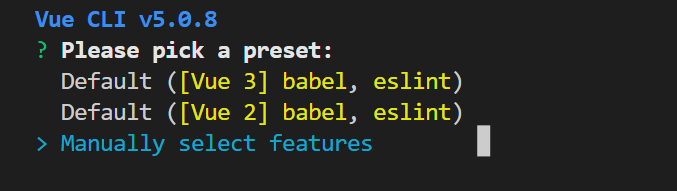

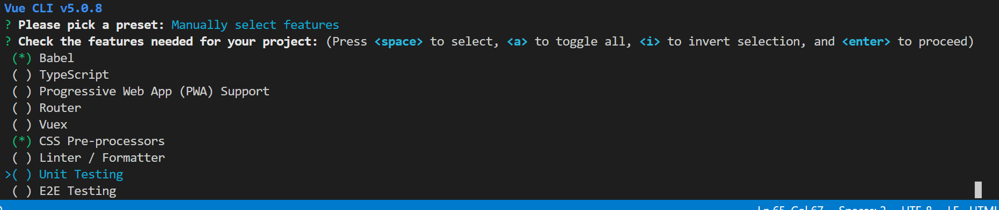

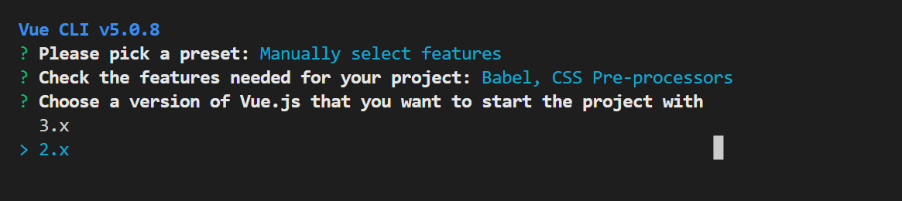

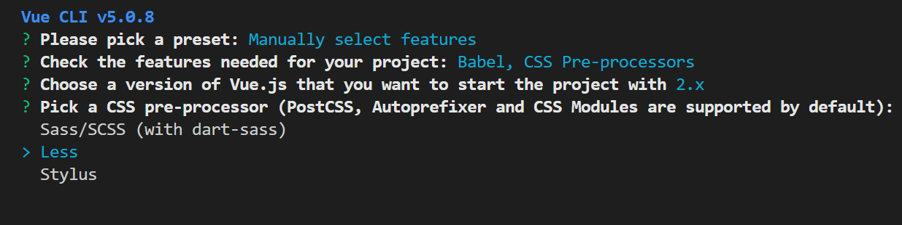

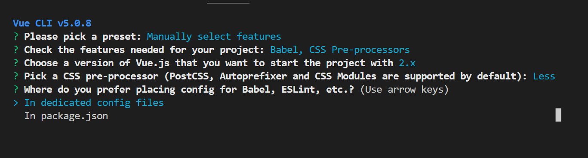

把Babel和Eslint等插件的配置项，放到自己独立的配置文件中

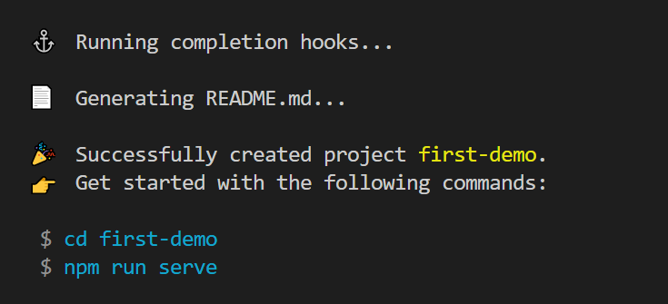

完成配置

3、vue项目中src目录的构成：

assets文件夹：存放项目中用到的静态资源文件

components 文件夹：程序员封装的、可复用的组件都要放到components目录下

main.js 是项目的入口文件，整个项目的运行需要先执行main.js

App.vue 是项目的根组件

```json
"client-install": "npm install --prefix client",
    "client": "npm start --prefix client",
    "test": "node server.js",
    "server": "nodemeon server.js",
    "dev": "concurrenly\"npm run server\"\"npm run client\""
```

vue实例的`$mount()`方法作用和el属性完全一样！

### Vue组件

vue是一个支持组件化开发的前端框架

vue规定，组件的后缀名是.vue

vue组件都是由3部分构成，分别是：

template：组件的模板结构(只能有唯一的根节点)

script：组建的JS行为

```jsx
<script>
export.default{
//组件中的data必须是一个函数
	data(){
		return{ 
			username:'admin'
		}
	}
}
</script>
```

style：组建的样式

```jsx
<style lang='less'>

</style>
```

- vue组件的父子关系
    
    使用组件的三个步骤：
    
    1、使用import语法导入需要的组件
    
    ```jsx
    import Left from '@/components/xxx'
    ```
    
    2、使用components节点注册组件
    
    ```jsx
    exports default{
    	components:{
    		Left
    	}
    }
    ```
    
    3、以标签的形式使用刚才注册的组件
    
    ```jsx
    <div class='box'>
    	<Left></Left>
    </div>
    ```
    
    配置路径提示插件Path Autocomplate
    
    在setting.json里面添加
    
    ```jsx
    //导入文件中是否携带文件的扩展名
    "path-autocomplete.extensionOnimport":true,
    //配置@的路径提示
    "path-autocomplete.pathMappings":{
    	"@":"${folder}/src"
    }
    ```
    
- 注册全局组件：在vue项目的main.js入口文件中，通过vue.component()方法，可以注册全局组件(适用于频繁使用的组件)
    
    ```jsx
    //导入需要全局注册的组件
    import Count from '@/components/xxx.vue'
    
    //参数1：字符串格式，表示组件的“注册名称”
    //参数2：需要被全局注册的那个组件
    Vue.component('MyCount',Count)
    ```
    
- 组件的props
    
    props是组件的自定义属性，在封装通用组件的时候，合理地使用props可以极大的提高组件的复用性
    
    ```jsx
     export default{
    	//组件自定义属性
    	props:{'自定义属性A','自定义属性B',...},
    	
    	//组件私有数据
    	data(){
    		return{}
    	}
    }
    ```
    
    props里面的数据，可以直接在模板结构中被使用
    
    props是只读的，不能直接修改props的值，否则会报错
    
    props的default默认值
    
    ```jsx
    export dafault{
    	props:{
    		init:{
    			default:0
    		}
    	}
    }
    ```
    
    props的值类型：通过type来定义属性的值类型
    
    ```jsx
    export dafault{
    	props:{
    		init:{
    			default:0,
    			type:Number
    		}
    	}
    }
    ```
    
    props的require必填项
    
- 组件之间的样式冲突
    
    解决样式冲突：利用属性选择器或**在`<style>`标签中添加scoped**
    
    当使用第三方组件库的时候，如果有修改第三方组件默认样式的需求，需要用到`/deep/` 使用`/deep/` 可以修改子组件的样式
    

### Vue父子组件通信

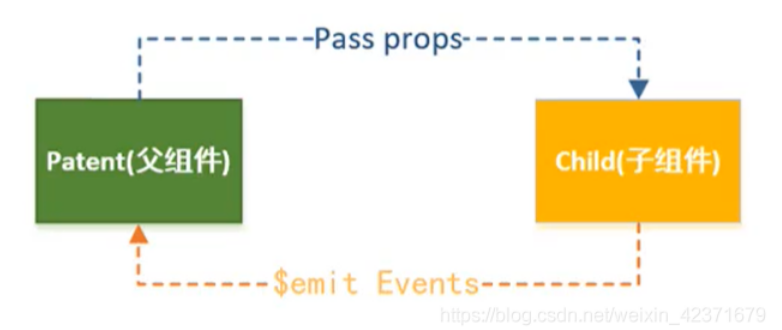

- 父传子
    
    **在父组件中**，使用v-bind动态绑定一个自定义属性，用于给子组件传递数据
    
    ```jsx
    //父组件
    <template>
      <div>
        <child :users="user"></child>
      </div>
    </template>
     
    <script>
    import { child } from "./child";
    export default {
      components: { child },
      data() {
        return {
          user: '张三'
        };
      }
    };
    </script>
    ```
    
    **在子组件中**，使用props接收父组件传过来的数据
    
    ```jsx
    //子组件
    <template>
      <div>{{ users }}</div>
    </template>
     
    <script>
    export default {
      props: ["users"]
    };
    </script>
    ```
    
- 子传父
    
    **子组件**通过事件的方式，利用`$emit`给父组件传值
    
    `$emit`的第一个参数是父组件自定义事件的方法名，后面”value”是子组件要给父组件传递的数据
    
    ```jsx
    <template>
      <div>
        <button @click="datas"></button>
      </div>
    </template>
     
    <script>
    export default {
      methods: {
        datas() {
          this.$emit("getInfo", value);
        }
      }
    };
    </script>
    ```
    
    **在父组件中**，绑定一个自定义事件，用来接收子组件传来的值
    
    ```jsx
    <template>
      <div>
        <child @info="getInfo"></child>
      </div>
    </template>
     
    <script>
    import { child } from "./child";
    export default {
      components: { child },
      methods: {
        getInfo(value) {
          // value 就是子组件传递过来的数据
        }
      }
    };
    </script>
    ```
    

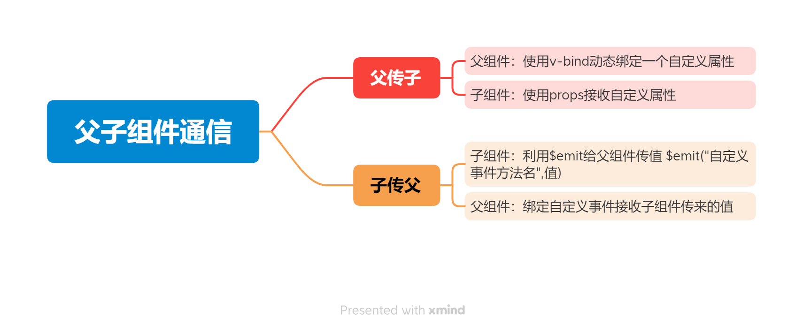

### 生命周期$数据共享

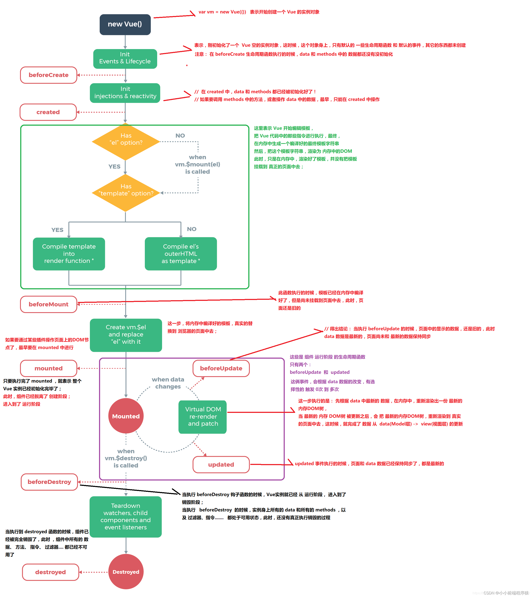

- 组件的生命周期
    
    生命周期(life cycle)是指一个组件从创建——运行——销毁的整个阶段，强调的是一个时间段
    
    生命周期函数：是由vue框架提供的内置函数，会伴随着组件的生命周期，自动按次序执行
    
    ①创建阶段：beforeCreate  created(发起Ajax请求数据)  beforeMount  mounted(组件第一次被渲染到浏览器中；操作DOM的最早的时机)
    
    ②运行阶段：beforeUpdate  updated(能够操作到最新的DOM元素)
    
    ③销毁阶段：beforeDestroy  destroyed
    
- 组件之间的数据共享
    
    在项目开发中，组件之间的最常见的关系分为如下两种：父子关系、兄弟关系
    
    **1、父子组件之间的数据共享**
    
    父子组件之间的数据共享又分为：父——子共享数据（使用自定义属性）
    
    子组件中，通过props来自定义属性
    
    父组件中，负责把数据通过v-bind绑定给子组件
    
    **2、子组件向父组件共享数据**
    
    子组件向父组件共享数据使用自定义事件
    
    子组件中，调用$emit()来触发自定义事件，其中参数1字符串，表示自定义事件的名称，参数2值要发送给父组件的数据
    
    父组件中，通过v-on来绑定自定义事件，并提供一个事件处置函数，通过事件处理函数的形参，接收到子组件传递过来的数据
    
    **3、兄弟组件之间的数据共享**
    
    在vue2中，兄弟组件之间数据共享的方案是EventBus
    
    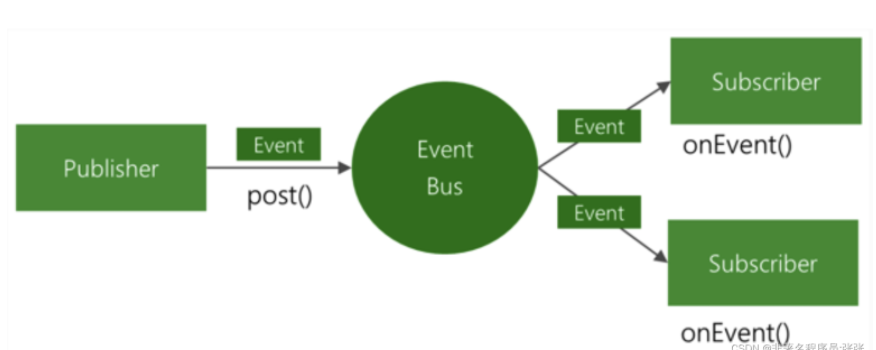
    
    EventBus的使用步骤
    
    ①创建eventBus.js模块，并向外共享一个Vue的实例对象
    
    ②在数据发送方，调用bus.$emit(’事件名称’，要发送的数据)方法触发自定义事件
    
    ③在数据接收方，调用bus.$on(’事件名称’，事件处理函数)方法注册一个自定义事件
    
- ref引用：开发者在不依赖jQuery的情况下，获取DOM元素或组件的引用
    
    使用ref引用页面上的组件实例
    
    ```jsx
    //使用ref属性，为对应的组件添加引用名称
    <my-count ref="counterRef"></my-counter>
    
    methods:{
    	getRef(){
    		console.log(this.$ref.counterRef)
    		this.$refs.counterRef.add()
    	}
    }
    ```
    
    ref可以获得子组件的方法，让父组件使用
    

**数组的some方法**

forEach循环，一旦开始就无法停止，必须要从头执行到尾，所以从数组当中寻找元素用some更好

```jsx
arr.some((item,index)=>{
	if(item===' '){
		console.log(index)		
	}
})
```

在找到对应的项之后，可以通过return true固定的语法，来终止some循环

**数组的every方法**，所有的数据都满足一个条件

```jsx
const result=arr.every(item=>item.state)
```

**数组的reduce方法**，相当于一个累加器

```jsx
arr.filter(item=>item.state).reduce(累加的结果，当前循环项)=>{},初始值）

arr.filter((item=>item.state).reduce(amt,item)=>{
	return amt += item.price*item.count
},0)
```

reduce方法的简写

```jsx
arr.filter((item=>item.state).reduce(amt,item)=> amt += item.price*item.count,0)
```

## 动态组件&插槽&自定义指令

### 动态组件

动态组件指的是动态切换组件的显示与隐藏

vue提供了一个内置的`<component>`组件，专门用来实现动态组件的渲染

component标签是vue内置，作用：组件的占位符

is属性的值表示要渲染的组件的名字

使用keep-alive保持状态  `<keep-alive></keep-alive>` 防止组件隐藏的时候被销毁

```jsx
<keep-alive>
	<component :is="comName"></component>
</keep-alive>
```

keep-alive可以把内部的组件进行缓存，而不是销毁组件

keep-alive对应的生命周期函数

当组件被缓存时，会自动触发组件的deactivated生命周期函数

当组件被激活时，会自动触发组件的activated生命周期函数

keep-alive的include属性

include属性用来指定：只有名称匹配的组件会被缓存。多个组件名之间使用英文的逗号分隔

```jsx
<keep-alive include="Left,Right">
	<component :is="comName"></component>
</keep-alive>
```

exclude属性指定哪些组件不需要被缓存，但是include和exclude不要同时使用

### 插槽(会使用)

插槽(Slot)是vue为组件的封装这提供的能力。允许开发者在封装组件时，把不确定的、希望由用户指定的部分定义为插槽。

官方规定，每一个slot插槽，都要有一个name名称 `<slot name=”  ”></slot>`

```jsx
//1.如果要把内容填充到指定名称的插槽中，需要使用v-slot这个指令
//2.v-slot后面要跟上插槽的名字
//3.v-slot指令不能直接用在元素身上，必须用在template标签上
//4.template这个标签，它是一个虚拟的标签，只起到包裹性质的作用，但是不会被渲染为任何实质性的html元素
//5.v-slot可以简写为#
<template v-slot:default>
	<p>xxxxx</p>
</template>

<slot name="default"></slot>
```

具名插槽(带名字的插槽)

作用域插槽   `mag=”1234”`   `<p>msg</p>`   

### 自定义指令

- 私有自定义指令
    
    在每个vue组件中，可以再directives节点下生命私有自定义指令
    
    ```jsx
    directives:{
    	color:{
    	//为绑定到的HTML元素设置红色的文字
    		bind(el,binding){
    			//当指令第一次被绑定到元素上的时候，会立即触发bind函数1
    			//形参中的el是绑定了此指令、原生的DOM对象
    			el.style.color='binding.value'
    		}
    	}
    }
    
    ```
    
      bind函数只调用1次：当指令第一次绑定到元素时调用，当DOM更新时bind函数不会被触发。updata函数会在每次DOM更新时被调用
    
    ```jsx
    directives:{
    	color:{
    	//为绑定到的HTML元素设置红色的文字
    		bind(el,binding){
    			el.style.color='binding.value'
    		}，
    		updata(el,binding){
    			el.style.color='binding.value'
    		}
    	}
    }
    ```
    
- 全局自定义指令
    
    ```jsx
    vue.directive(’color’,{
    	bind(el,binding){
    		el.style.color=this.binding.value
    	},
    	updata(el,binding){
    		el.style.color=this.binding.value
    	}
    })
    
    //简写
    vue.directive('color',function(el,binding){
    	el.style.color=this.binding.value
    })
    ```
    

## Eslint

可组装的JavaScript和JSX检查工具

1.eslint约束之下只能出现最多一个没用的空行

2.文件结束的末尾需要有一个空行

3.在文件的每一行空面不能有多余的空格

4.默认情况下字符串需要用单引号  quotes

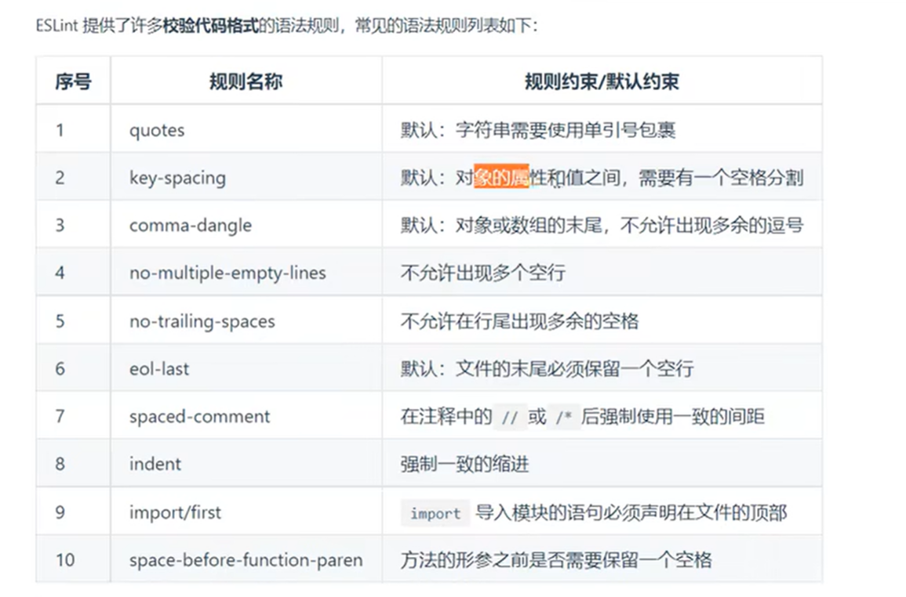

## 路由

路由就是对应关系，Hash地址(锚链接)与组件之间的对应关系

### 路由的工作方式

①用户点击页面上的路由连接

②导致URL地址栏中的Hash值发生了变化

③前端路由监听到了Hash地址的变化

④前端路由把当前Hash地址对应的组件渲染到浏览器当中

### vue-router的基本使用

vue-router是vue.js官方给出的路由解决方案。它只能结合vue项目进行使用，能够轻松地管理SPA(单页面应用程序)项目中组件的切换。

[Home | Vue Router (vuejs.org)](https://router.vuejs.org/zh/)

- vue-router安装和配置的步骤
    
    ①安装vue-router包  `npm i vue-router@3.5.2 -s`
    
    ②创建路由模块
    
    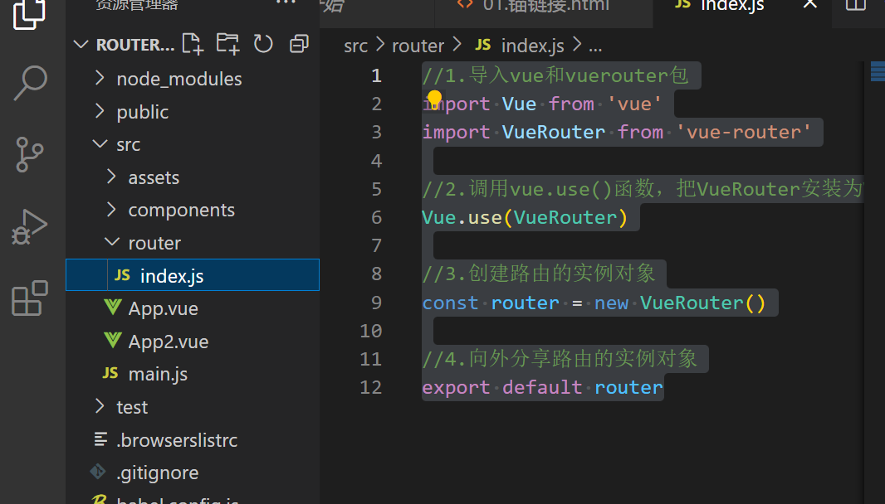
    
    ```jsx
    //1.导入vue和vuerouter包
    import Vue from 'vue'
    import VueRouter from 'vue-router'
    
    //2.调用vue.use()函数，把VueRouter安装为Vue插件
    Vue.use(VueRouter)
    
    //3.创建路由的实例对象
    const router = new VueRouter()
    
    //4.向外分享路由的实例对象
    export default router
    ```
    
    ③导入并挂载路由模板
    
    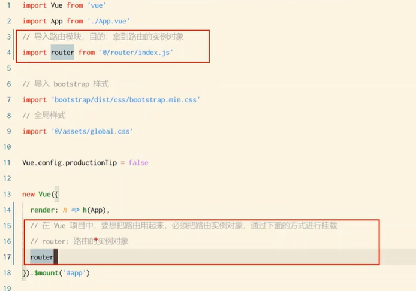
    
    ④声明路由连接和占位符
    
    <router-view></router-view> 占位符
    
    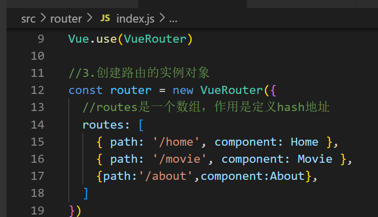
    
    ```jsx
    const router = new VueRouter({
      //routes是一个数组，作用是定义hash地址
      routes: [
        { path: '/home', component: Home },
        { path: '/movie', component: Movie },
        {path:'/about',component:About},
      ]
    })
    ```
    
    当安装和配置了vue-router之后，就可以使用router-link来替代普通的`<a>`链接  `<router-link to="/home">首页</router-link>`
    
- 嵌套路由
    
    通过路由实现组件的嵌套展示，叫做嵌套路由
    
    在src/router/index.js路由模块中，导入需要的组件，并使用children属性声明子路由规则
    
    ```jsx
    routes: [
      //路由规则
        { path: '/home', component: Home },
        { path: '/movie', component: Movie },
        { path: '/about', component: About,children: [
          { path: 'tab1', component: Tab1 },
          {path:'tab2',component:Tab2},
        ] },
      ]
    ```
    
    redirect路由的重定向
    
    如果children数组中，某个路由规则path值为空字符串，则这条路由规则叫做”默认子路由”
    
- 动态路由匹配
    
    动态路由指的是：把hash地址中可变的部分定义为参数项，从而提高路由规则的复用性
    
    在vue-router中使用英文的冒号来定义路由的参数项
    
     `{ path: '/movie/:id', component: Movie }`
    
    在hash地址中，/后面的参数项，叫做”路径参数”，在路由”参数对象”中，需要使用`this.$route.params`来访问路径参数
    
    在hash地址中，？后面的参数项，叫做“查询参数”，在路由”参数对象”中，需要使用`this.$router.query`来访问查询参数
    

### 声明式导航&编程式导航

在浏览器中，点击链接实现导航的方式，叫做**声明式导航**

普通网页的的`<a>`链接，vue项目中的`<router-link>`都属于声明式导航

在浏览器中，调用API方法实现导航的方式，叫做编程式导航

普通网页中调用Location.href跳转到新页面的方式，属于编程式导航

vue-router提供了许多编程式导航的API，其中最常用的导航API分别是：

- `this.$router.push(’hash地址’)`
    
    跳转到指定hash地址，并增加一条历史记录
    
- `this.$router.replace(’hash地址’)`
    
    跳转到指定的hash地址，并替换掉当前当前的历史记录
    
- `this.$router.go(数值n)`
    
    可以在浏览历史中前进和后退
    
    后退一层：`this.$router.go(-1)`  `$router.back()` 
    
    前进一层：`this.$router.go(1)`  `$router.forward()`
    

### 导航守卫

导航守卫可以控制路由的访问权限

- 全局前置守卫
    
    每次发生路由的导航跳转时，都会出发全局前置守卫。因此，在全局前置守卫中，程序员可以对每个路由进行访问权限的控制
    
    ```java
    //创建路由实例对象
    const router=new VueRouter({....})
    
    //调用路由实例对象的beforeEach方法，即可声明"全局前置守卫"
    //每次发生路由导航跳转的时候，都会自动触发fn个回调函数
    router.beforeEach(to,from,next)=>{
    	//to是将要访问的路由的信息对象
    	//from是将要离开的路由的信息对象
    	//next是一个函数，调用next()表示放行，允许这次路由导航
    }
    ```
    
    next函数的3中调用方式
    
    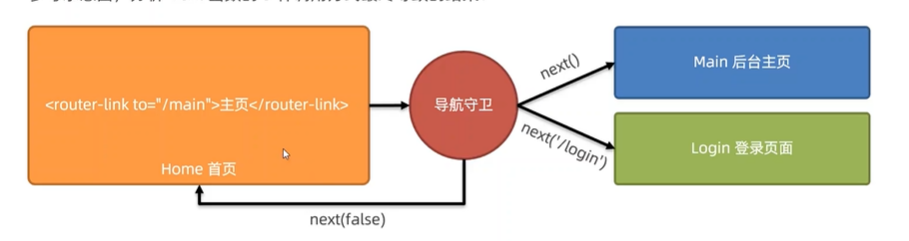
    
    ①当前用户拥有后台主页的访问其权限，直接放行next()
    
    ②当前用户没有后台主页的访问权限，强制其跳转到登录页面:next(’/login’)
    
    ③当前用户没有后台主页的访问权限，不允许跳转到后台主页:next(false)
    
    hash编码(URL内)都免都需要使用小写字母