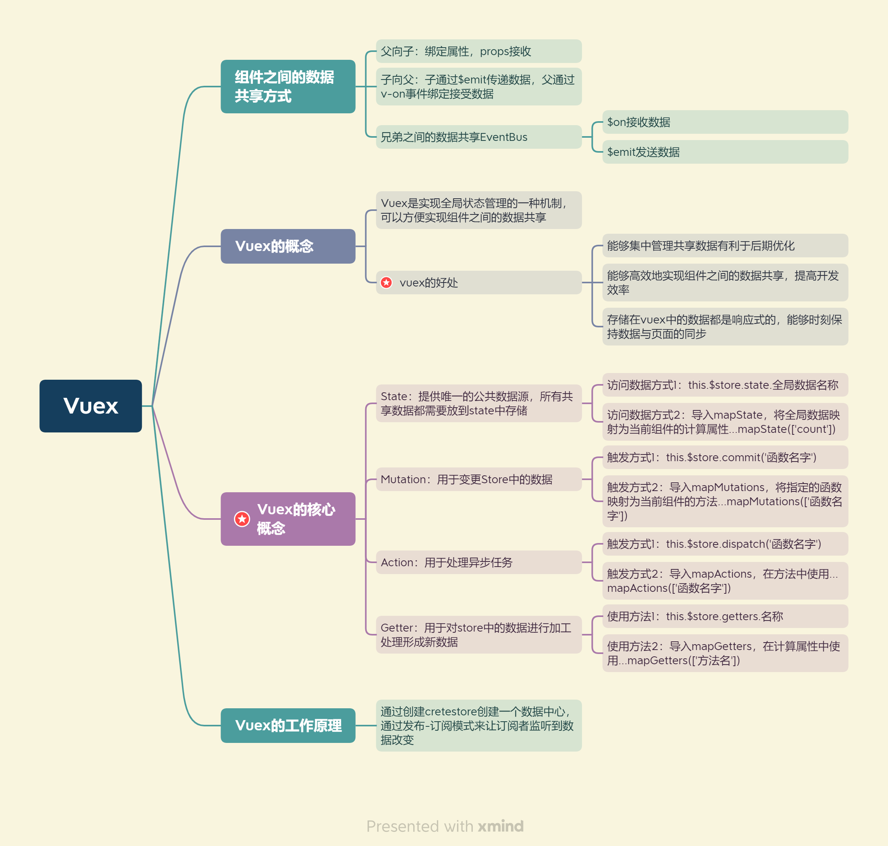

## 1、Vuex概述

### 1.1 组件之间共享数据的方式(小范围数据共享，大范围vuex)

父向子：v-bind属性绑定

子向父：v-on事件绑定

兄弟组件之间共享数据：EventBus

$on:接收数据的那个组件

$emit:发送数据的那个组件

### 1.2 Vuex的概念

Vuex是实现组件全局状态(数据)管理的一种机制，可以方便的实现组件之间数据的共享

### 1.3 使用Vuex的好处

- 能够在vuex中集中管理共享数据，易于开发和后期维护
- 能够高效地实现组件之间的数据共享，提高开发效率
- 存储在vuex中的数据都是响应式，能够实时保持数据与页面的同步

一般情况下，只有组件之间共享数据才需要存储到vuex中；对于组件中的私有数据，依然存储在组件自身的data中即可

## 2、Vuex的基本使用

1. 安装vuex依赖包  `npm install vuex` 
2. 导入vuex包

```jsx
import Vuex from 'vuex'
Vue.use(Vuex)
```

3. 创建store对象

```jsx
const store=new Vuex.Store({
	//state中存放的就是全局共享的数据
	state:{count:0}
})
```

4. 将store对象挂载到vue实例中

```jsx
new Vue({
	el:'#app',
	render:h=>h(app),
	router,
	store
})
```

## 3、Vuex的核心概念

### 3.1 State

State提供唯一的公共数据源，所有共享的数据都要统一放到Store的State中进行存储

```jsx
//创建store数据源，提供唯一公共数据
const store=new Vuex.Store({
	state:{count:0}
})
```

组件访问State中数据的第一种方式：   `this.$store.state.全局数据名称`

组件访问State中数据的第二种方式：   

```jsx
//1.从vuex中按需导入mapState函数
import {mapState} from 'vuex'
//2.将全局数据，映射为当前组件的计算属性
computed:{
	...mapState(['count'])
}
```

### 3.2 Mutation

Mutation用于变更Store中的数据

1. 只能通过mutation变更Store数据，不可以直接操作Store中的数据

2. 通过这种方式虽然操作起来稍微繁琐一些，但是可以集中监控所有数据的变化

```jsx
//定义Mutation
const store=new Vuex.Store({
	state:{
		count:0
	},
	mutations:{
		add(state){
			//变更状态
			state,count++
		}
	}
})
```

触发mutation：this.$store.commit()是触发mutation的第一种方式

```jsx
methods:{
	handle(){
		this.$store.commit('add')
	}
}
```

可以在mutation时传递参数：

```jsx
const store=new Vuex.Store({
	state:{
		count:0
	},
	mutations:{
		addN(state,step){
			state.count+=step
		}
	}
})

//触发mutation
methods:{
	handle2(){
		this.$store.commit('addN',3)
	}
}
```

触发mutation的第二种方式

```java
//1.从vuex中按需导入mapmutations函数
imports { mapmutations } from 'vuex'
//2.将指定的mutations函数,映射为当前组件的methods方法
methods:{
	...mapMutations(['add','addN'])
}
```

mutation中不可以写异步代码操作(比如定时器)

### 3.3 Action

Action用于处理异步任务

如果通过异步操作变更数据，必须通过Action，而不能使用Mutation，但是在Action中还是要通过触发Mutation的方式间接变更数据。

```java
//定义Action
const store=new Vuex.Store({
	mutations:{
		add(state){
			state.count++;
		}
	},
	actions:{
		addAsync(context){
			setTimeout(()=>{
				context.commit('add')
			},1000)
		}
	}
})

//触发Action
methods:{
	handle(){
		//第一种触发方式
		this.$store.dispatch('addAsync')
	}
}
```

触发actions异步任务携带参数

```java
//定义Action
const store=new Vuex.Store({
	mutations:{
		addN(state,setp){
			state.count+=step;
		}
	},
	actions:{
		addNAsync(context,step){
			setTimeout(()=>{
				context.commit('addN',step)
			},1000)
		}
	}
})

//触发Action
methods:{
	handle(){
		//第一种触发方式
		this.$store.dispatch('addAsync',5)
	}
}
```

触发actions的第二种方式

```java
import { mapActions } from 'vuex'

methods:{
	...mapActions{['addAsync','addNAsync']}
	handle(){
		//第二种触发方式
		this.addAsync()
}
```

### 3.4 Getter

Getter用于对Store中的数据进行加工处理形成新的数据

1. Getter可以对Store中已有的数据加工处理之后形成新的数据，类似Vue的计算属性

2. Store中数据发生变化，Getter的数据也会跟着发生变化

```java
//定义Getter
const store=new Vuex.Store({
	state:{
		count:0
	},
	getters:{
		showNum:state=>{
			return '当前最新的数量是'+state.count
		}
	}
})
```

使用getter的第一种方式：`this.$store.getters.名称` 

第二种方式：

```java
import { mapGetters } from 'vuex'
computed:{
	...mapGetters(['showNum'])
}
```

## 4、基于Vuex的案例

## 5、Vuex总结

vuex是一个专门为vue.js开发的状态管理模式，可以方便的实现组件之间数据的共享

应用场景：单页面应用中，组件之间的数据状态。

vuex的属性：State Getter Mutation Action Module

1. State：是数据源的存放地，对应于vue中的data，state里面存放的数据是响应式的，可以通过mapState将state和getters映射到当前组件的computed计算属性中
2. Getter：对state进行计算操作，就是store的计算属性；getters可以在多组件中复用
3. Mutation：用于变更Store中的数据；只能通过mutation变更Store数据，不可以直接操作Store中的数据
4. Action：用于处理异步任务
5. Moudle：可以让每一个模块拥有自己的state mutation action getters使结构非常清晰，方便管理

vuex的好处：

- 能够在vuex中集中管理共享数据，易于开发和后期维护
- 能够高效地实现组件之间的数据共享，提高开发效率
- 存储在vuex中的数据都是响应式，能够实时保持数据与页面的同步

vuex的整个触发过程：

vuex的数据流是组件中触发action，action提交mutations，mutations修改states，组件根据states或者getters来渲染页面。

vuex的工作原理：

vuex通过createstore创建一个数据中心，然后通过发布-订阅模式来让订阅者监听到数据改变。

