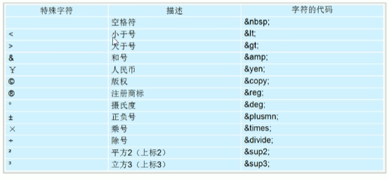
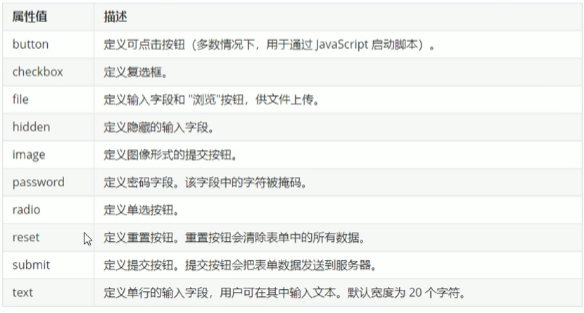
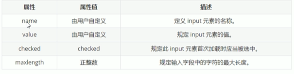

## HTML基础

HTML指的是超文本标记语言（Hyper Text Markup Language），用来描述网页的一种语言，HTML不是一种编程语言，而是一种标记语言

- 常用的浏览器
    
    IE浏览器、Edge浏览器
    
    火狐浏览器
    
    谷歌浏览器
    
    Safari浏览器
    
    Opera浏览器
    

浏览器内核（渲染引擎）：负责读取网页内容、整理讯息等

| 浏览器       | 内核    | 备注                      |
| ------------ | ------- | ------------------------- |
| IE           | Trident | 360浏览器、百度浏览器     |
| firefox      | Gecko   | 火狐                      |
| Safari       | Webkit  | 苹果                      |
| Chrome/Opera | Blink   | 谷歌。Blink是Webkit的分支 |

Web标准的构成：

| 标准 | 说明                                              |
| ---- | ------------------------------------------------- |
| 结构 | 用于对网页元素进行整理和分类，HTML                |
| 表现 | 用于设置网页元素的版式、颜色、大小等外观样式，CSS |
| 行为 | 网页模型的定义及交互的编写，Javascript            |

## HTML标签

### HTML语法规范

- HTML标签是由尖括号包围的关键字，`<html>`
- HTML标签通常是成对出现的，`<html>`和`</html>`为双标签：第一个标签是开始标签，第二个标签是结束标签
- 有些特殊的标签必须是单个标签，`<br />`：单标签

双标签的关系：包含关系和并列关系

```html
//包含关系
<head>
	<title></title>
</head>
//并列关系
<head></head>
<body></body>
```

### HTML的基本结构标签

| 标签名            | 定义       | 说明                                     |
| ----------------- | ---------- | ---------------------------------------- |
| `<html></html>`   | HTML标签   | 页面中最大的标签，称为根标签             |
| `<head></head>`   | 文档的头部 | head标签中必须要设置标签title            |
| `<title></title>` | 文档的标题 | 也免得网页标题                           |
| `<boby></boby>`   | 文档的主体 | 元素包含文档的全部内容，基本都放在boby内 |

```html
<html>
	<head>
		<title>我的第一个页面</title>
	<head>
	<body>
		好好学习
	</body>
</html>
```

### HTML常用标签

1. 标题标签`<h1>-<h6>`
    
    标签语义：作为标题使用，并且依据重要性递减
    
    加了标题的文字会变得加粗，字号也会依次变大；标题独占一行
    
    ```html
    <h1> 一级标题 </h1>
    ```
    
2. 段落和换行标签
    
    `<p>`标签用于定义段落
    
    ```html
    <p> 段落标签 </p>
    ```
    
    `<br/>`换行标签：强制换行
    
    ```html
    <br />   //单标签
    ```
    
3. 文本格式化标签
    
    
    | 语义   | 标签                       |
    | ------ | -------------------------- |
    | 加粗   | `<strong></strong>`或`<b></b>` |
    | 倾斜   | `<em></em>`或`<i></i>`         |
    | 删除线 | `<del></del>`或`<s></s> `      |
    | 下划线 | `<ins></ins>`或`<u></u> `      |
4. `<div>`和`<span>`标签：没有予以，用来装内容
    
    ```html
    <div> 这是头部 </div>
    <span> 今日价格 </span>
    ```
    

      `<div>`：分割、分区（一行只能放过一个`<div>`，大盒子）

    `<span>`：跨度、跨距（一行可以多个`<span>`，大盒子）

5. 图像标签和路径
    - 图像标签
    
    ``用于定义HTML页面中的图像，单标签
    
    ```html
    
    ```
    
    src是``标签的必须属性，它用于指定图像文件的路径和文件名。
    
    图像标签的其他属性：
    
    | 属性   | 属性值   | 说明                                 |
    | ------ | -------- | ------------------------------------ |
    | src    | 图片路径 | 必须属性                             |
    | alt    | 文本     | 替换文本。图像不能显示的文字         |
    | title  | 文本     | 提示文本，鼠标放到图片上会显示的文字 |
    | width  | 像素     | 设置图像的宽度                       |
    | height | 像素     | 设置图像的高度                       |
    | border | 像素     | 设置图像的边框粗细                   |
    
    图像标签可以拥有多个属性，必须写在标签名的后面
    
    属性之间不分先后顺序，标签名与属性、属性与属性之间以空格分开
    
    属性采取键值对的格式，属性=“属性值”
    
    - 图像路径
    
    相对路径：以图片相对于HTML页面的位置
    
    | 相对路径分类 | 符号 | 说明                                                  |
    | ------------ | ---- | ----------------------------------------------------- |
    | 同一级路径   |      | 图像位于HTML文件同一级                                |
    | 下一级路径   | /    | 图像位于HTML文件下一级 `` |
    | 上一级路径   | ../  | 图像位于HTML文件上一级  ``  |
    
    绝对路径:是指目录下的绝对位置，直接到达目标位置，通常从盘符开始的路径（**注意：绝对路径是\，相对路径是/**）网络地址也可以。
    
6. 超链接标签
    - 超链接的语法格式
    
    ```html
    <a href="图转目标" target="目标窗口的弹出方式"> 文本或图像</a>
    ```
    
    | 属性   | 作用                                                                  |
    | ------ | --------------------------------------------------------------------- |
    | href   | 用于指定链接目标的url地址，当标签应用herf属性时就具有了超链接功能     |
    | target | 用于指定链接页面的打开方式，_self为默认值，_blank为在新窗口中打开方式 |
    - 链接分类
    
    外部链接
    
    内部链接：网站内部之间的相互链接，直接链接内部页面名称
    
    空链接：当没有确定链接目标时`<a href=‘#’>首页</a>`
    
    下载链接：如何href里面地址是一个文件或者压缩包，会下载文件
    
    网络元素链接：在网页中的各种网页元素，如文本、图像、表格、音频等都可以添加超链接
    
    - 锚点链接：快速定位到页面中的某个位置
        
        在链接文本的href属性中，设置属性值为#名字的形式
        
        如`<a href=”#two”>第二集</a>`
        
        找到目标位置标签，里面添加一个id属性=上面的名字
        
        如`<h3 id=”two”>第二集介绍</h3>`
        

7. 注释标签和特殊字符

```html
<!--注释语句-->   快捷键：ctrl+/
```




8. 表格标签
    
    作用：用来显示和展示页面，主要用来展示数据
    
    ```html
    <table>
    	<tr>
    		<td>单元格内的文字</td>
    		......
    	</tr>
    	....
    </table>
    ```
    
         `<table></table>`是用于定义表格的标签
    
    `<tr></tr>`标签用于定义表格中的行
    
    `<td></td>`用于定义表格中的单元格
    
    字母td值表格数据，即数据
    
    - 表头单元格标签
        
        `<th>`表示HTML表格的表头部分（文字居中加粗显示）
        
    - 表格属性
    
    
    
    - 表格结构标签
        
        `<thead>`标签表格的头部区域
        
        `<tbody>`标签表格的主体区域
        
    - 合并单元格
        
        跨行合并：`rowspan=“合并单元格个数”`
        
        跨列合并：`colspan=”合并单元格个数”`   
        
        `<td colspan=”2”></td>`
        
    - 列表标签
        
        **无序列表**
        
        ```html
        <ul>
        	<li>列表项1</li>
        	<li>列表项2</li>
        	<li>列表项3</li>
        ......
        </ul>
        ```
        
        `<ul>`标签表示HTML页面中项目的无序列表
        
        `<ul>`标签中只能嵌套`<li>`
        
        `<li>`与`</li>`之间相当于一个容器，可以容纳所有元素
        
        无序列表带有自由的样式属性，但可以用css来设置
        
        **有序列表**
        
        ```html
        <ol>
        	<li>列表项1</li>
        	<li>列表项2</li>
        	<li>列表项3</li>
        </ol>
        ```
        
        **自定义列表**
        
        经常用于对术语或名词进行解释和表述，定义列表的列表项前没有任何项目符号
        
        ```html
        <dl>
        	<dt>名词1</dt>
        	<dd>名词1解释1</dd>
        	<dd>名词1解释2</dd>
        </dl>
        ```
        
        | 标签名    | 定义       | 说明                           |
        | --------- | ---------- | ------------------------------ |
        | <ul></ul> | 无序标签   | 只能包含li，没有顺序，使用较多 |
        | <ol></ol> | 有序标签   | 只能包含li，有顺序，使用较少   |
        | <dl></dl> | 自定义列表 | 只能包含dt, dd                 |
9. 表单标签
        
    使用表单是为了收集用户信息
        
    **表单组成：**表单域、表单控件和提示信息
        
    - 表单域：实现用户信息的收集和传递`<form>`，会把表单元素信息提交给服务器
        
    ```html
    <form action="url地址" menthod="提交方式" name="表单域名称">
        各种表单元素空间
    </form>
    ```
        
    | 属性   | 属性值   | 作用                                            |
    | ------ | -------- | ----------------------------------------------- |
    | action | url地址  | 用于指定接收并处理表单数据的服务器程序的url地址 |
    | method | get/post | 用于设置表单数据的提交方式，其取值为get或post   |
    | name   | 名称     | 指定表单的名称                                  |
    
    `<input>`表单元素
    
    ```html
    <input type="属性值" />
    ```
    
    
    
    
    
    `<label>:`为input元素定义标注
    
    ```html
    <label for="sex">男</label>
    <input type="radio" name="sex" id="sex" />
    ```
    
    `<select>`下拉标签
    
    ```html
    <select>
    	<option>选项1</option>
    	<option>选项2</option>
    	<option>选项3</option>
    	.....
    </select>
    ```
    
    `<textarea>`文本域元素：定义多行文本输入的控件
    
10. 查阅文档
    - w3school
    - [MDN](https://developer.mozilla.org/zh-CN/)