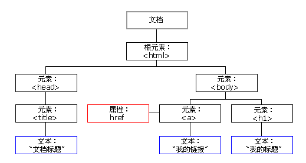
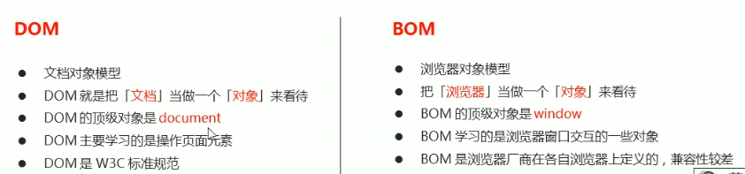
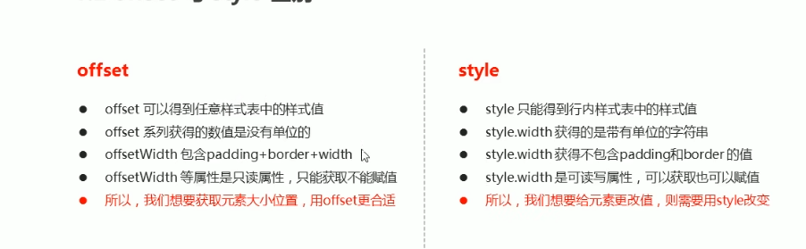

## JS基础

是一种运行在客户端的脚本语言(不需要编译、由js解释器逐行来进行解释并执行)

- JS组成
    
    ECMAscript  JS语法
    
    DOM  页面文档对象模型，通过DOM提供的接口可以对页面上的各种元素进行操作(大小、颜色、位置等)
    
    BOM  浏览器对象模型，通过BOM可以操作浏览器窗口，比如弹出框。控制浏览器挑战等
    
- JS书写位置：行内、内嵌和外部
- 注释：单行注释`//`  快捷键：`ctrl+/`   多行注释`/*  */`  快捷键：`shift+alt+a`
- JS输入输出语句

| 方法 | 说明 | 归属 |
| --- | --- | --- |
| alert | 浏览器弹出警示框 | 浏览器 |
| console | 浏览器控制台打印输出信息 | 浏览器 |
| prompt | 浏览器弹出输入框，用户可以输入 | 浏览器 |

## 变量

- 变量是程序在内存当中申请的一块用来存放数据的空间
- 变量使用
    
    1、**变量声明**： `var age;`
    
    var是JS的关键字，用来声明变量，使用该关键字后，计算机会自动为变量分配内存空间
    
    age是变量名，通过变量名来访问内存中分配的空间
    
    2、**赋值**：`age=10;`
    
    3、**变量初始化**：`var age=18;`
    
    4、同时声明多个变量：
    
    ```jsx
    var age=18;
        adress='火影村'；
        gz=2000;
    ```
    
    不声明直接赋值也可以，但是不建议，可能会变成全局变量
    
    5、变量的命名规范：字母、数字、下划线、美元符号组成的；严格区分大小写；不能以数字开头；不能是关键字变量名；遵守驼峰命名法；
    

## 数据类型

- 变量的数据类型
    
    JS是一种弱类型或者说动态语言
    
    变量的数据类型是由JS引擎根据=（等号）右边变量值得数据类型来判断的，运行完毕后，变量的数据类型就确定了
    
    JS拥有动态类型，相同的变量可用作不同的类型
    
- JS数据类型的分类
    
    **简单数据类型(Number、String、Boolean、Undefined、Null)**
    
    | 简单数据类型 | 说明 | 默认值 |
    | --- | --- | --- |
    | Number | 数字型，包含整数值（数字型）和浮点数 | 0 |
    | Boolean | 布尔类型，true或false | false |
    | String | 字符串类型，“”需要带引号 | “” |
    | Undefined | 声明了变量但是没有给值 | undefined |
    | Null | 声明了变量为空值 | null |
    - 数字型Number
        
        JS当中八进制前面加0、十六进制前面加0x
        
        JS中数值的最大值和最小值：`alert(Number.MAX_VALUE);     alert(Number.MIN_VALUE);`
        
        数字型的三个特殊值：Infinity——代表无穷大，大于任意值；-Infinity——代表无穷小，小于任意值；NaN——代表一个非数值
        
        isNaN()——这个方法用来判断非数字，如果是数字返回false，如果不是数字返回true；
        
    - 字符串String
        
        需要使用双引号或者单引号表示字符串，更推荐使用单引号
        
        JS可以使用单引号嵌套双引号，一般都是外双内单或者外单内双
        
        字符串转义符（通常都是由\开头）：
        
        | 转义符 | 解释说明 |
        | --- | --- |
        | \n | 换行符 |
        | \\ | 斜杠\ |
        | \’ | 单引号 |
        | \’’ | 双引号 |
        | \t | tab缩进 |
        | \b | 空格，blank |
        
        检测字符串长度：length
        
        字符串拼接：字符串+任何类型=拼接后新的字符串    数值相加，字符相连
        
    - 未定义undefined
        
        undefined+数字最后的结果是NaN；
        
    
    判断变量类型使用：typeof       `typeof age;`
    
    prompt输入的值都是字符型的
    
    - 数据类型转换
        
        
        | 方式 | 说明 |
        | --- | --- |
        | toString() | 转成字符串 |
        | String()强制转换 | 转成字符串 |
        | 加号拼接字符串 | 和字符串拼接的结果都是字符串 |
        
        | 方式 | 说明 | 案例 |
        | --- | --- | --- |
        | parseInt(String) | 将String类型转成整数数值型 | parseInt(‘78’) |
        | parseFloat(String) | 将String类型转成浮点数数值型 | parseFloat(‘78.21’) |
        | Number()强制转换 | 将String类型强制转换成数值型 | Number(‘78’) |
        | js隐式转换 | 利用算术运算隐式转换为数值型 | ‘12’-0 |
        
        | 方式 | 说明 | 案例 |
        | --- | --- | --- |
        | Boolean（） | 其他类型转换为布尔值 | Boolean(’true’) |
        
        代表空、否定的值会被转换成false，如‘’ 0 NaN null undefined
        
    
    **复杂数据类型（Object）**
    
    JS是解释型语言（运行时进行及时解释），JAVA属于编译型语言（代码执行之前进行编译）
    

## JS运算符（operator）

- 算数运算符
    
    加减乘除取余
    
    注意算数运算符优先级
    
- 递增和递减运算符
    
    递增`++` 递减`—`
    
    放在变量的前面，前置递增；放在变量的后面，后置递增
    
    递增和递减运算符必须和变量配合使用
    
    前置自增和后置自增如果单独使用，效果是一样的
    
    后置：先原值运算，后自加；前置：先自己，后运算
    
- 比较运算符
    
    `==`会默认转换数据类型，会把字符串的数据转换为数字型
    
    `===`   `!==`：全等，要求值和 数据类型都一致
    
- 逻辑运算符
    
    
    | 逻辑运算符 | 说明 |
    | --- | --- |
    | `&&` | 逻辑与  and  |
    | `||` | 逻辑或  or |
    | `！` | 逻辑非   not |
    
    短路运算(逻辑中断)：
    
    逻辑与：`表达式1&&表达式2`     如果第一个表达式为真则返回表达式2，如果第一个表达式为假返回表达式1；
    
    逻辑或：`表达式1||表达式2`   如果第一个表达式为真返回表达式1，如果第二个表达是为假返回表达式2；
    
- 赋值运算符
    
    `=   +=   -=   *=   /=   %=`
    
- 运算符优先级

从低到高依次为：逗号运算符、赋值运算符(先&&后||)、逻辑运算符、相等运算符、关系运算符、算数运算符、一元运算符、小括号

## JS流程控制

### 分支结构

分支结构：由上到下执行代码的过程中，根据不同条件，执行不同的路径代码，从而得到不同的结果

JS语言提供了两种分支结构语句：if语句、switch语句

- if语法结构
    
    ```jsx
    if(条件表达式){
    	    //执行语句
    }
    ```
    
- if-else语句
    
    ```jsx
    if(条件表达式){
    	//如果成立执行的代码
    }else {
    	//否则执行的代码
    }
    ```
    
- if-else if语句
    
    ```jsx
    if(条件表达式1){
    	//语句1
    }else if(条件表达式2){
    	//语句2
    }else {
    	//最后的语句
    }
    ```
    
- 三元表达式
    
    条件表达式 ？ 表达式1：表达式2       为真表达式1，为假表达式2
    
- switch语句
    
    ```jsx
    switch(表达式) {
    	case value1:
    		执行语句1；
    		break；
    	case value2:
    		执行语句2；
    		break；
    	。。。。
    	default:
    		执行最后的语句；
    }
    ```
    

switch和if-else if区别：

一般情况下两个语句可以互换

switch通常用于case为比较确定的值，if-else更加灵活，常用于范围判断(大于、等于某个范围)

分支较少的时候if-else效率更快

### 循环结构

- for循环
    
    ```jsx
    for(初始化变量；条件表达式；操作表达式){
    	//循环体
    }
    ```
    
- while循环
    
    ```jsx
    while(条件表达式){
    	//循环体
    }
    ```
    
- do-while循环
    
    ```jsx
    do{
    	//循环体
    }while (条件表达式)
    ```
    
- contiune和break
    
    contiune：跳出本次循环，继续下一次
    
    break：跳出循环
    

## 数组

- 创建数组
    
    ```jsx
    var 数组名 = new Array();
    var arr=new Array();   //创建一个数的空数组
    var arr=[1,2,3,4,5,6];    //利用数组字面量创建数组[]
    ```
    
    数组中可以存放任意类型的数据，例如字符串、数字、布尔值。
    
- 获取数组元素
    
    通过索引下表来访问数组元素的序号（数组小标从0开始）
    
    数组名     [索引号];
    
- 遍历数组
    
    把数组元素从头到尾访问一次
    
    通过循环实现
    
- 新增数组元素
    
    通过修改数组长度：`arr.length=n`；   不可以直接给数组元素赋值，否则数组元素都没有了
    

## 函数

- 函数的使用
    
    声明函数
    
    ```jsx
    function  函数名(){
    	//函数体
    }
    ```
    
    调用函数：  函数名();
    
    函数不调用，自己不执行
    
- 函数的参数
    
    利用函数的参数实现函数重复不同代码
    
    ```jsx
    function 函数名(形参1，形参2){
    	//函数体
    }
    
    函数名(实参1，实参2);
    ```
    
    如果实参的个数和形参的个数一致，正常输出
    
    如果实参的个数多于形参个数，会取到形参的个数
    
    如果实参的个数小于形参的个数，对于的形参被定义为undefined，最终结果是NaN
    
- 函数的返回值
    
    return语句
    
    ```jsx
    function 函数名(){
    	return 需要返回的结果；
    }
    函数
    ```
    
    如果没有return但会返回undefined
    
- arguments使用
    
    arguments对象中存储了传递的所有实参，只有函数才有
    
- 第二种函数声明方式
    
    ```jsx
    var fun = function(){
    	//函数体
    }
    fun();   //调用
    ```
    

## JS作用域

JS作用域：代码名字（变量）在某个范围内起作用和效果

目的：提高程序的可靠性、减少命名冲突

JS作用域(es6)之前：全局作用域、局部作用域

全局作用域：整个script标签或者一个单独的JS文件

局部作用域：在函数内部就是局部作用域，这个代码的名字只在函数内部其效果和作用

### 变量的作用域

全局变量：在全局作用下的变量

局部变量：在局部作用域下的变量，后者在函数内部的变量

（如果在函数内部没有声明直接赋值的变量，也是全局变量）

### 作用域链

内部函数访问外部函数的变量，采取的是链式查找的方式来决定这个值，这种结构为作用域链

只要是代码，就至少有一个作用域

写在函数内部的局部作用域

### JS预解析

JS引擎运行：预解析    代码执行

预解析：JS引擎会把JS里面所有的var还有function提升到当前作用域的最前面

代码执行：按照代码书写的顺序从上往下执行

预解析分为：变量预解析(变量提升)和函数预解析（函数提升）

变量提升：把所有的变量声明提升到当前的作用域最前面，不提升复制操作

## 对象

对象是一个具体的事物、在JS当中对象是一组无序的相关属性和方法的集合，所有的事物都是对象，例如字符串、数值、数组、函数等

对象是由属性和方法组成的

### 创建对象

- 利用字面量创建对象{  }
    
    ```jsx
    var obj={ };  //创建一个空对象
    var obj= {
    	name:'   ',
    	age:     ,
    	sex:'  ',
    	SayHi：function() {
    		//方法体
    	}
    }
    ```
    
     里面的属性或者方法采用键值对的方法：键 属性名：值  属性值
    
    多个属性或者方法中间用逗号隔开
    
    方法冒号后面跟的是一个匿名函数
    
    使用对象：调用对象的属性   `对象名. 属性名`      `对象名[’属性名’]`
    
    变量、属性、函数、方法的区别：
    
    变量和属性的相同：都是用来存储数据的
    
    变量：单独声明并赋值，使用的时候直接写变量名
    
    属性：在对象里面的不需要声明，使用的时候必须  对象. 属性
    
    函数和方法的相同：都是实现某种功能
    
    函数：单独声明，并调用  函数名()  单独存在
    
    方法：在对象里面，调用时对象 . 方法（）
    
- 利用`new Object`创建对象
    
    ```jsx
    var obj = new Objdect();
    obj.name='';
    obj.age= ;
    obj.sex='';
    obj.sayHi = function(){
    	//方法体
    }
    ```
    
- 利用构造函数创建对象
    
    构造函数：利用函数的方法，重复这些相同的代码(内部封装的不是普通代码，而是对象)
    
    ```jsx
    function 构造函数名(){
    	this.属性 = 值；
    	this.方法 = function(){
    		//方法体
    	}
    }
    
    var 变量 = new 构造函数名();    //返回对象
    ```
    
    构造函数名字首字母需要大写
    
    构造函数不需要return就可以返回结果
    
    调用构造函数必须使用new
    
    构造函数和对象区别：
    
    对象：是一个具体的事物
    
    构造函数：泛指某一大类，类似于java里面的类
    
    利用构造函数创建对象的过程即为对象实例化
    

### 对象遍历

- `for…..in`语句

```jsx
for (var k in obj-对象名){
	console.log(k);    //k变量输出的是属性名
	console.log(obj[k]);    //obj[k]输出的是属性值
}
```

## 内置对象

JS中的对象分为3种：自定义对象、内置对象、浏览器对象

内置对象：JS语言自带的一些对象，这些对象供开发者使用，并提供了一些常用的或是最基本而必要的功能

**查文档：**MDN文档

**Math对象：**

随机函数：`random`

向上取整：`floor`

向下取整：`ceil`

四舍五入：`round`

 

**日期对象：**

通过Date构造函数来实例化日期对象

```jsx
var date=new Date();    //使用Date
var year=date.getFullYear();   //返回年份
var date=new Date(2019,10,1);    //数字型
var date=new Date(‘2019-10-1 8:8:8’);    //字符串型
```

如果没有输入任何参数，返回系统的当前时间

通过Date获得毫秒数，距离1970年1月1号，valueOf()    getTime();

H5新增获得总得毫秒数：`Date.now()`

`d=parseInt(总秒数/60/60/24);`   //计算天数

`h=parsInt(总秒数/60/60%24);`   //计算小时

`m=parsenInt(总秒数/60%60);`    //计算分数

`s=parseInt(总秒数%60);`     //计算当前秒数

**数组对象：**

检测是否为数组：

instance of 运算符   `arr instance of Array`

`Array.isArray(arr);`

添加或删除数组元素：

`push()`  在数组的末尾添加一个或多个数组元素   push完毕之后返回新数组长度

`unshift()` 在数组开头，添加一个或者多个数组元素     完毕之后返回新数组长度

`pop()` 删除数组的最后一个元素    返回删除的元素

`shift()`  删除数组的第一个元素      返回删除的元素

数组排序：

`reverse()`   颠倒数组中元素的顺序，无参数

`sort()`   数组排序 `arr.sort();`

```jsx
arr1.sort(function(a,b)){
	return a-b;   //按照升序排序
  //return b-a;  按照降序排序
}
```

获取数组元素的索引：`indexOf(数组元素)`    如果找不到元素，则返回的是-1；

数组转化为字符串：`toString();`   join(分隔符);  `arr.join(’-’)`

**字符串对象：**

字符串不可变，只是开辟了新的空间，所以不要大量拼接字符串

根据字符返回位置：`str.indexOf(’要查找的字符’，[起始位置]);`     

根据位置返回字符：`charAt(index);`

字符串操作：

1.concat(’字符串1’，‘字符串2’……)

2.substr(’截取的起始位置’，‘截取几个字符’)；

3.replace(’被替换字符’, ‘替换为的字符’)；

4.split(’分隔符’)；

5.toUpperCase()     //转换大写

6.toLowerCase()     //转换小写

## 简单数据类型与复杂数据类型

值变量(简单数据类型)：string，number，boolean，undefined，null

值类型变量的数据直接存储放到变量（栈空间）中

复杂数据类型在栈里面存储地址，在堆里面存储数据。

## WebAPIs

### API和WebAPI

API：是一些预先定义的函数，目的是提供应用程序与开发人员基于某软件或硬件得以访问一组例程的能力。

WebAPI：是浏览器提供的一套操作浏览器功能和页面元素的API(BOM  DOM)

## DOM

文件对象模型(DOM)，是w3c组织推荐的处理可扩展标记语言的标准编程接口

- DOM树



文档：一个页面就是一个文档，DOM中使用document表示

元素：页面中所有的标签都是元素，DOM中使用element表示

结点：网页中所有的内容都是结点（标签 属性 文本 注释）,DOM中使用node

- 获取元素
    
    根据ID获取   `document. getElementById(’     ’);`
    
    根据标签名获取    `document.getElementByTagName(’    ’);`
    
    通过HTML5新增的方法获取 ：
    
    `document.getElementsByClassName(’   ’);`
    
    `document.quertSelector(’选择器’);`   //返回指定选择器的第一个元素对象
    
    `document.querySelectorAll(’选择器’);`   //返回指定选择器的所有元素对象集合
    
    特殊元素获取 ：
    
    获取body元素：`document.bady`;     返回元素对象
    
    获取html元素：`document.documentElement；`
    
- 事件基础
    
    事件由三部分组成：事件源  事件类型  事件处理程序
    
    事件源 ：通过获取元素得到
    
    事件类型：鼠标点击onclick  鼠标经过  键盘按下
    
     事件处理程序：通过一个函数赋值的方式完成
    
- 操作元素
    
    改变元素内容：
    
    `element. innerText;`//从起始位置到终止位置的内容，去除html标签，同时空格换行也换掉
    
    `element. innerHTML;`    //innerText不识别html标签，**innerHTML识别html标签**
    
    表单元素的属性操作：  type value checked selected disable(用来禁用按钮)
    
    修改样式属性：在function当中，`this.style.属性=’ ’;`     样式采用驼峰命名法，行内样式操作
    
    排他思想：所有元素全部清除样式、给当前元素设置样式
    
    自定义属性操作：(目的：保存并使用属性)
    
    获取属性值：element.属性  获取内置属性值     `element.getAttribute(’属性’)；`  可以获取自定义属性（index=”   ”）
    
    移除属性：removeAttribute(属性值)
    
    设置属性：`setAttribute("index",0);`
    
    H5自定义属性：H5规定自定义属性data-开头作为属性名并且赋值；
    
    `<div data-index="1"></div>`      `element.setAttribute("data-index",2);`
    
    可以利用getAttribute获取
    
- 结点操作
    
    利用DOM提供的方法获取元素：
    
    ```jsx
    document.getElementById();
    document.getElementsByTagName();
    document.querySelector();
    ```
    
    利用结点层级关系获取元素：
    
    利用父子兄节点关系获取元素
    
    结点拥有：`nodeType（节点类型）`、`nodeName(结点名称)`、`nodeValue（结点值）`
    
    结点层级：
    
    父节点：`node.parentNode`
    
    子结点：`parentNode.childNodes`    所有子结点，包含元素结点、文本结点
    
    `ul.children`   获取所有子元素结点
    
    `parentNode.firstChild;` 获取第一个子结点 `ol.firstElementChild`返回第一个子元素结点
    
    `parentNode.lastChild;`   获取最后一个子结点 `ol.lastElementChild`
    
    兄弟节点：
    
    ```jsx
    next.nextSibling  下一个兄弟结点包含元素结点、文本节点等
    
    next.previousSinling  返回当前元素上一个兄弟节点，找不到则返回null
    
    next.nextElementSibling  返回当前元素下一个兄弟元素结点
    
    next.preElementSibling  返回当前元素的上一个兄弟元素
    ```
    
    创建结点：`document.creatElement(’tagName’);`   动态创建元素结点
    
    添加结点：`node.appendChild(child);`  讲一个节点添加到父节点的子结点列表末尾
    
    `node.insertBefore(child，指定元素)`
    
    删除结点：`node.removeChild(child);`
    
    复制节点：`node.cloneNod (  );`   括号为空只复制标签不负值内容，true为深拷贝复制内容
    

三种动态创建元素区别：

`document. write();`  直接将内容写入页面的内容流，但是文档流执行完毕，会导致页面全部重绘

`element.innerHTML;` 将内容写入某个DOM结点，创建多个元素效率高（但是不要拼接字符串）

`document. createElement();` 创建多个元素效率稍低一点，但是结构清晰

### DOM总结

DOM接口可以改变网页的内容、结构和样式

通过DOM获取得来的元素是一个对象object，所以是文档对象模型

1、 创建

`document.write`

`innerHTML`

`createElement`

2、增

`appendChild`

`insertBefore`

3、删

`removeChild`

4、改

修改元素属性：src href title等

修改普遍元素内容：innerHTML、innerText

修改表单元素：value、type、disabled

修改元素样式：style、className

5、查

DOM提供API方法：`getElementById`、`getElementsByTagName`(不推荐)

H5提供的新方法：querySelector、querySelectorAll   (推荐)

利用结点操作获取元素：父(parentNode)、子(children)、兄(previousElementSibling、nextElementSIbling)

6、事件操作

| 鼠标事件 | 触发条件 |
| --- | --- |
| onclick | 鼠标点击左键触发 |
| onmouseover | 鼠标经过触发 |
| onmouseout | 鼠标离开触发 |
| onfocus | 获得鼠标焦点触发 |
| onblur | 失去鼠标焦点触发 |
| onmousemove | 鼠标移动触发 |
| onmouseup | 鼠标弹起触发 |
| onmousedown | 鼠标按下触发 |

### 事件高级

- 注册事件
    
    注册事件有两种方式：传统方式和方法监听注册方式
    
    传统方式：利用on开头的事件(onclick)    注册事件的唯一性
    
    方法监听注册方式：`addEventListener(  );`  同一个元素同一个时间可以注册多个监听器
    
    **`eventTarget. addEventListerner (type , listener[, userCapture] )`**
    
    type:事件类型字符串，比如click、mouseover  注意这里不带on
    
    listner: 事件处理函数，事件发生时，会调用该监听函数
    
    userCapture: 可选参数，是一个布尔值，默认是false。true为捕获阶段 false为冒泡阶段
    
    `eventTarget. attachEvent(eventNameWithOn, callback);`   ie9以前的，少用
    
    eventNameWithOn:事件类型字符串，比如onclick  onmouseover带on
    
    callback：事件处理函数，当目标触发事件时回调函数被调用
    
- 删除事件
    
    传统方式：`divs[0].onclick = null;`
    
    方法监听注册方式：
    
    `eventTarget. removeEventListener(type, listener[, useCapture]);`
    
    `eventTarget.detachEvent(eventNameWithOn, callback);`
    
- DOM事件流
    
    DOM事件流分为3个阶段：
    
    1.捕获阶段
    
    2.当前目标阶段
    
    3.冒泡阶段
    
    JS代码中只能执行捕获或者冒泡其中的一个阶段
    
    onclick和attachEvent只能得到冒泡阶段
    
    有些事件没有冒泡：onblur onfocus onmouseenetr onmouseleave
    
- 事件对象
    
    传统的方式：`div.onclick = function(event) {}`   event即为事件对象
    
    方法监听注册：`div.addEventListerner(’click’,function(event){  });`
    
    事件对象的常见属性和方法：
    
    | 事件对象属性方法 | 说明 |
    | --- | --- |
    | e.target | 返回触发事件的对象  标准 |
    | e.srcElement | 返回触发事件的对象，非标准 |
    | e.type | 返回事件的类型 |
    | e.canceIBubble | 该属性阻止冒泡 |
    | e.returnValue | 该属性阻止默认事件，比如不可以链接跳转 |
    | e.preventDefault | 该方法阻止默认事件  标准 |
    | e.stopPropagation | 阻止冒泡  标准 |
    
    e.target指向的是触发时间的对象，this返回的是绑定事件的对象
    
- 事件委托
    
    事件委托也称为事件代理，在jQuery里面称事件委派
    
    事件委托原理：不是每个子结点单独设置事件监听器，而是事件监听器设置在其父节点，然后利用冒泡原理影响设置每个子结点。
    
    事件委托的作用：只操作一次DOM，提高了程序的性能
    
- 常用的鼠标事件
    
    ```jsx
    //禁用右键菜单
    document.addEventListener('contextmenu',function(e)){
    		e.preventDefault();
    }
    
    document.addEventListener('selectstart',function(e)){
    		e.preventDefault();
    }
    ```
    
    `e.pageX e.pageY`    返回鼠标相对于页面文档的X,Y轴坐标
    
- 常用的键盘事件
    
    
    | 键盘事件 | 触发条件 |
    | --- | --- |
    | onkeyup | 某个键盘按键被松开时触发 |
    | onkeydown | 某个键盘按键被按下时触发 |
    | onkeypress | 某个键盘按键被按下时触发 |
    
    键盘事件对象：
    
    keyup和keydown不区分字母大小写
    

## BOM

BOM即浏览器对象模型提供独立于内容而与浏览器窗口进行交互的对象化，其核心是Windows对象



Windows对象是浏览器的顶级对象：

它是JS访问浏览器窗口的一个接口

它是一个全局对象，定义在全局作用域中的变量，函数都会变成Windows对象的属性和方法

### Windows常见事件

- 窗口加载事件
    
    `window.onload = function(){    };`
    
    传统注册方式只能写一次，如果写了多次以最后一个为准
    
    `window.addEventListener(’load’, function() {    });`
    
    `window.addEventListener(’DOMcontentLoaded’, function() {    });`
    
    load事件等页面内容全部加载完毕，包含页面dom元素 图片 flash等
    
    DOMcontentLoaded是DOM加载完毕，不包含图片 flash
    
- 调整窗口大小事件
    
    `window.onresize=function() {     };`
    
    `window.addEventListener(’resize’, function(){     });`
    
    利用这个事件完成响应式布局，`window.innerWidth`  当前屏幕宽度
    
- 定时器
    
    1、setTimeout(  );
    
    `window.setTimeout(调用函数callback，[延迟的毫秒数])；`   用于设置一个定时器，该定时器在定时器到期后执行调用函数，只调用一次
    
    停止定时器：`window.clearTimeout(timeoutID定时器的名字);`
    
    2、`window.setInterval(回调函数，[间隔的毫秒数])；`   
    
    重复调用一个函数，每间隔一段时间，就调用一次回调函数，重复调用
    
    停止定时器：`clearInterval(timer);`
    
    一般情况下this的的最终指向都是调用它的对象；
    
    在全局作用域或普通函数中this指向全局对象window；
    
    方法调用中谁调用this指向谁；
    
    构造函数的this指向实例对象。
    

### JS执行机制

JS的一大特点单线程（同一时间只能做一件事）

为了解决单线程堆叠问题，利用多核CPU的计算能力，HTML5允许JS建立多线程

- 同步
    
    程序的执行顺序与任务的排列顺序是一致的、同步的
    
- 异步
    
    在做某件事的同时，还可以去处理其他事情
    
- 同步任务
    
    回调函数不属于同步任务，而是异步任务
    
- 异步任务
    
    异步任务的三种类型：
    
    1、普通事件：click resize
    
    2、资源加载：load error
    
    3、定时器：setInterval setTimeout
    
- 执行机制
    
    1、先执行执行栈中的同步任务
    
    2、异步任务(回调函数)放到任务队列中
    
    3、执行栈中的同步任务执行完毕，系统会按次序读取任务队列中的异步任务，将异步任务放到同步任务当中开始执行                                      
    
- location对象
    
    window对象给我们提供了一个location属性用于获取或设置窗体的URL，并且可以用于解析URL。
    
    | location对象属性 | 返回值 |
    | --- | --- |
    | location.href | 获取或者设置整个URL |
    | location.host | 返回主机域名 |
    | location.port | 返回端口号 |
    | location.pathname | 返回路径 |
    | loaction.search | 返回参数 |
    | location.hash | 返回片段 #后面内容常见于锚点链接 |
    
    | location对象方法 | 返回值 |
    | --- | --- |
    | location.assign() | 跟href一样，可以跳转页面（可以后退） |
    | location.replace() | 替换当前页面，因为不记录历史不可以后退页面 |
    | location.reload() | 重新加载页面，相当于刷新按钮 |
- navigator对象
    
    navigator对象包含有关浏览器的信息，常用userAgent该属性返回由客户机发送服务器的user-agent头部值
    
- history对象
    
    history对象与浏览器历史记录进行交互，该对象包含用户(在浏览器窗口中)访问过得URL
    
    | history对象方法 | 作用 |
    | --- | --- |
    | back() | 可以后退功能 |
    | forward() | 前进功能 |
    | go(参数) | 前进后退功能 参数如果是1前进1个页面，如果是-1后退一个页面 |

## PC端网页特效

### offset系列

offest系列相关属性可以动态的得到该元素的位置(偏移)、大小等。获得元素距离带有定位父元素的位置；获得元素自身的大小。但是返回的数值都不带单位

| offest系列属性 | 作用 |
| --- | --- |
| element.offestParent | 返回作为该元素带有定位的父级元素，如果父级元素都没有定位返回body |
| element.offestTop | 返回元素相对带有定位父元素上方的偏移 |
| element.offestLeft | 返回元素相对带有定位父元素左边框的偏移 |
| element.offestWidth | 返回自身包括padding 边框 内容区的宽度，返回数值不带单位 |
| element.offestHeight | 返回自身包括padding 边框 内容区的高度，返回数值不带单位 |

offest和style区别：



### 元素可视区client系列

通过client系列的相关属性可以动态的得到该元素的边框大小、元素大小等

| client系列的属性 | 作用 |
| --- | --- |
| element. clientTop | 返回元素上边框的大小 |
| element. clientLeft | 返回元素左边框的大小 |
| element. clientWidth | 返回自身包括padding 内容区宽度 不含边框 返回数值不带单位 |
| element. clientHeight | 返回自身包括padding 内容区高度 不含边框 返回数值不带单位 |

### scroll系列

使用scroll系列的相关属性可以动态的得到该元素的大小、滚动距离等

| scroll系列属性 | 作用 |
| --- | --- |
| element.scrollTop | 返回被卷去的上侧距离 |
| element. scrollLeft | 返回被卷去做的左侧距离 |
| element. scrollWidth | 返回自身实际宽度，不含边框 |
| element. scrollHeight | 返回自身实际高度，不含边框 |

### 三大系列总结

| 三大系列大小对比 | 作用 |
| --- | --- |
| element. offsetWidth | 返回自身包括padding、边框、内容区的宽度 |
| element. clientWidth | 返回自身包括padding、内容区的宽度，不含边框 |
| element. scrollWidth | 返回自身实际的宽度，不含边框 |

页面的滚动距离：window.pageXoffset

mouseenter和mouseover的区别：

1、mouseover鼠标经过自身盒子会触发，经过子盒子也会被触发

2、mouseenter只会经过自身盒子触发

3、mouseenter不会冒泡

### 动画函数封装

- 动画实现原理：通过定时器setInterval( );不断移动盒子位置
    
    实现步骤：
    
    获得盒子当前位置
    
    让盒子当前位置加1个移动距离
    
    利用定时器不断重复操作
    
    加一个结束定时器的条件 (注意此元素需要添加定位，才可以使用element. style. left)
    
- 简单动画函数封装：
    
    需要传递两个参数：动画对象和移动到的距离
    
- 缓存动画原理：
    
    让盒子的移动距离慢慢减小，速度就会慢慢落下来
    
    核心算法：（目标值-现在的位置）/10 作为每次移动的距离步长
    
     停止条件：让盒子位置等于目标位置就停止定时器
    
- 节流阀：防止轮播图按钮连续点击造成播放太快
    
    节流阀目的：当上一个函数动画内容执行完毕，再去执行下一个函数动画，让事件无法连续触发
    
    核心实现思路：利用回调函数，添加一个变量来控制，锁住函数和解锁函数
    
- 滚动窗口至文档中的特定位置：windows. scroll(x, y);

## 移动端网页特效

### 触屏事件

touchstart：触屏

touchmove：手指移动触屏

touchend：触屏结束

- 触摸事件对象(touchevent)
    
    
    | 触摸列表 | 说明 |
    | --- | --- |
    | touches | 正在触摸屏幕的所有手指的一个列表 |
    | targetTouches | 正在触摸当前DOM元素上的手指的一个列表 |
    | changedTouches | 手指状态发生了改变的列表，从无到有，从有到无的变化 |
- 移动端拖动元素
    
    1、获取`targetTouches[0]`里面的pageX和pageY
    
    2、移动拖动原理：手指移动中，计算出手指移动距离。然后用和盒子原来的位置上+手指移动的距离
    

### 移动端常见特效

- 移动端轮播图
- classList属性
    
    该属性用于在元素中添加，移除及切换CSS类
    
    `element. classList. add(’类名’)；`
    
    `element. classList. toggle(’类名’)；`   切换类
    
- click延迟解决方案
    
    1、禁用缩放：`<meta name=”viewpoet” content=”user-scalable=no”>`
    
    2、利用touch事件自己封装这个事件解决300ms延迟
    
- 移动端常用插件
    
    fastclick插件：解决click延迟问题
    
    swiper插件：轮播图
    
    superslide
    
    iscroll
    
    zy.media.js：移动端视频插件
    
- 移动端常用开发框架

## 本地存储

- 本地存储特性：
    
    数据存储在用户浏览中
    
    设置、读取方便、甚至页面刷新不丢失数据
    
    容量较大，sessionStorage约5M、localStrorage约20M
    
- 生命周期为关闭浏览器窗口
    
    存储数据：`sessionStrage.setItem(key,value);`
    
    获取数据：`sessionStrage.getItem(key);`
    
    删除数据：`sessionStrage.removeItem(key);`
    
    删除所有数据：`sessionStrage. clear(  );`
    
- 声明周期永久生效
    
    存储数据：`localStorage.setItem(key,value);`
    
    获取数据：`localStorage.getItem(key);`
    
    删除数据：`localStroge.removeItem(key);`
    
    删除所有数据：localStroge. clear();