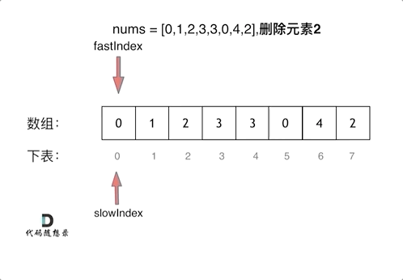

## 数组内容复习

1. 定义格式：数据类型[] 变量名 `int[] arr`
数据类型 变量名[] `int arr[]`

**数组是存放在连续内存空间上的相同类型数据的集合**

- 数组的下标是从零开始的
- 数组的内存空间地址是连续的
- 数组的元素不可以删除，只能覆盖

  **2.  动态初始化**：数据类型[] 变量名 = new 数据类型[数组长度]；

`Int[] arr = new int[3];`    new:为数组申请内存空间

**静态初始化：**初始化时指定每个数组元素的初始值，有系统决定组长度

****格式：数据类型[] 变量名={数据1，数据2，数据3.。。。}

      `Int[] arr={1,2,3,,,}`

****数组初始化时，会为存储空间添加默认值0/0.00/null

1. 数组元素访问：
    
    变量访问方式：数组名[索引]
    
    索引的特征：从0开始；连续；每次加1
    
2. 内存分配：内存地址 数据
    
    栈内存：存储局部变量  局部变量：定义在方法中的变量arr，使用完就会消失
    
    堆内存：存储new出来的内容（实体、对象）
    
3. 常见问题：数组越界；空指针异常
4. 数组常见操作：获取最值：①定义一个变量用于保存最值；②取数组中第一个数据作为变量的初始值；③与数组中剩余的数据逐个比对；④打印结果

## ****704. 二分查找****

> 给定一个 `n`个元素有序的（升序）整型数组 `nums`和一个目标值 `target`，写一个函数搜索 `nums`中的 `target`，如果目标值存在返回下标，否则返回 `-1`。
> 

```java
输入: nums = [-1,0,3,5,9,12], target = 9
输出: 4
解释: 9 出现在 nums 中并且下标为 4
```

1. 二分查找原理：
    - 设置查找区间：low = 0；high= arr.length-1；
    - 若查找区间[low, high]不存在，则查找失败；否则转下一步骤
    - 取中间位mid = (low + high) / 2；比较 target 与 arr[mid]，有以下三种情况：
        
        - 若 target < arr[mid]，则high = mid - 1；查找在左半区间进行，转步骤2；
        - 若 target > arr[mid]，则low = mid + 1；查找在右半区间进行，转步骤2；
        - 若 target = arr[mid]，则查找成功，返回 mid 值；
        

```java
public int BinarySearch(int[] numbers,int target){
		int low=0;
		int height=numbers.length-1;
    int index=0;
    while(low<=height){
		    int mid=(low+height)/2;
        if(numbers[mid]==target){
		        return mid;
        }else if(numbers[mid]>target){
            height=mid-1;
        }else if(numbers[mid]<target){
            low=mid+1;
        }
    }
    return -1;
  }
```

## **27. 移除元素**

> 给你一个数组 `nums` **和一个值 `val`，你需要 **[原地](https://baike.baidu.com/item/%E5%8E%9F%E5%9C%B0%E7%AE%97%E6%B3%95)** 移除所有数值等于 `val` **的元素，并返回移除后数组的新长度。不要使用额外的数组空间，你必须仅使用 `O(1)` 额外空间并 **[原地](https://baike.baidu.com/item/%E5%8E%9F%E5%9C%B0%E7%AE%97%E6%B3%95) 修改输入数组**。元素的顺序可以改变。你不需要考虑数组中超出新长度后面的元素。
> 

```java
输入：nums = [3,2,2,3], val = 3
输出：2, nums = [2,2]
解释：函数应该返回新的长度 2, 并且 nums 中的前两个元素均为 2。你不需要考虑数组中超出新长度后面的元素。例如，函数返回的新长度为 2 ，而 nums = [2,2,3,3] 或 nums = [2,2,0,0]，也会被视作正确答案。
```

1. 双指针法
    
    **通过一个快指针(fast)和慢指针(slow)在一个for循环下完成两个for循环的工作**
    

```java
public int RemoveElement(int[] arr,int val){
    int slow=0;
    for(int fast=0;fast<arr.length;fast++){
      if(arr[fast]!=val){
          arr[slow]=arr[fast];
          slow++;
      }
    }
    return slow;
}
```



总结：

1. 数组不可以删除，只能覆盖，所以对于数组中移除某元素可以利用**双指针**，快慢指针一起出发，当遇到目标值快指针向前走，将快指针遍历的值赋值给慢指针，最后返回慢指针。
2. 二分查找主要是判断中间值(mid)和目标值进行判断，逐渐缩小目标区域。
3. 对于数组的处理要切记索引从0开始，删除数据善用双指针。

## ****977.有序数组的平方****

> 给你一个按 **非递减顺序**排序的整数数组 `nums`，返回 **每个数字的平方**组成的新数组，要求也按 **非递减顺序**排序。
> 

```jsx
输入：nums = [-4,-1,0,3,10]
输出：[0,1,9,16,100]
解释：平方后，数组变为 [16,1,0,9,100]
排序后，数组变为 [0,1,9,16,100]
```

**思路1：平方后排序，排序的话第一反应考虑最简单的冒泡排序**

```java
class Solution {
    public int[] sortedSquares(int[] nums) {
        int[] NewArry=new int[nums.length];
        for(int i=0;i<nums.length;i++){
            NewArry[i]=nums[i]*nums[i];
        }
        //冒泡排序
        for(int i=0;i<NewArry.length;i++){
            for(int j=i+1;j<NewArry.length;j++){
                if(NewArry[i]>NewArry[j]){
                    int temp=NewArry[j];
                    NewArry[j]=NewArry[i];
                    NewArry[i]=temp;
                }
            }
        }
        return NewArry;
    }
}
```

平方的过程很简单，遍历数组，给数据进行平方

冒泡排序的基本原理：

- 比较相邻的元素，如果前一个元素比后一个元素大，则交换位置
- 对每一对相邻元素做同样的工作，从开始第一对元素到结尾第一对元素，最终最后位置即为最大值。

该思路的缺点，冒泡排序需要双层1for循环，算法时间复杂度为O(N^2)，适用于排序数量过少的时候，所以较浪费时间。

**思路2：使用双指针**

Day1进行过双指针的训练，但是看到这道题还是没有想起如何运用，看了部分解析之后明白了输入数组是有序的，平方之后也可以找到一定的规律，从左边和右边分别出发对比提高效率。

```java
class Solution {
    public int[] sortedSquares(int[] nums) {
        int[] NewArry=new int[nums.length];
        int j=nums.length-1;
        int i=0;
        int index=nums.length-1;
        while(i<=j){
            if(nums[i]*nums[i]<=nums[j]*nums[j]){
                NewArry[index--]=nums[j]*nums[j];
                j--;
            }else{
                NewArry[index--]=nums[i]*nums[i];
                i++;
            }
        }
        return NewArry;
    }
}
```

定义一个新数组NewArry，和nums数组一样的大小，让index指向NewArry数组终止位置。

如果`nums[i]*nums[i]<=nums[j]*nums[j]` 那么`NewArry[index--]=nums[j]*nums[j]`，并且让`j--`

如果`nums[i]*nums[i]>nums[j]*nums[j]` 那么`NewArry[index--]=nums[i]*nums[i]`，并且让`i++` 

该算法的的时间复杂度为O(n)

## ****209.长度最小的子数组****

> 给定一个含有 `n` ****个正整数的数组和一个正整数 `target` **。**找出该数组中满足其和 ****`≥ target` ****的长度最小的 **连续子数组** `[numsl, numsl+1, ..., numsr-1, numsr]` ，并返回其长度**。**如果不存在符合条件的子数组，返回 `0` 。
> 

```java
输入：target = 7, nums = [2,3,1,2,4,3]
输出：2
解释：子数组 [4,3] 是该条件下的长度最小的子数组。
```

该题的思路也是双指针的一个扩展，刚开始做没办法确定结束的指针怎么处理，于是看了解析才有了思路。

**滑动窗口：不断的调节子序列的起始位置和终止位置，从而得出我们要想的结果。**

1、设置左右两个指针

2、又指针遍历数组，并将遍历到的数据相加

若while(sum≥target)（等号的必要性是为了确定最短子序列），移动左指针，并将左指针遍历到的数据减去在进行循环判断

3、最终找到最短子序列

```java
class Solution {
    public int minSubArrayLen(int target, int[] nums) {
        int left=0;
        int sum=0;
        int reslut=Integer.MAX_VALUE;
        for(int right=0;right<nums.length;right++){
            sum+=nums[right];
            while(sum>=target){
                reslut=Math.min(reslut,right-left+1);
                sum-=nums[left];
                left++;
            }
        }
        return reslut==Integer.MAX_VALUE?0:reslut;
    }
}
```

刚开始不理解`reslut=Integer.MAX_VALUE`的必要性，到了后续才知道都是为了后续的比较，使用`Math.min`

### **59. 螺旋矩阵 II**

> 给你一个正整数 `n`，生成一个包含 `1`到 `n2`所有元素，且元素按顺时针顺序螺旋排列的 `n x n` 正方形矩阵 `matrix` 。
> 

```java
输入：n = 3
输出：[[1,2,3],[8,9,4],[7,6,5]]
```

这道题看似复杂，但并不需要复杂的推导只需要按照循环逐步去解决

1. 上侧的从左到右 处理行（start，n-loop）；列++
2. 右侧的从上到下 处理列（start，n-loop）;  行++
3. 下侧的从右到左 处理行（接上侧最后的一列，loop）；列—
4. 左侧的从下到上 处理行（loop，2中最后处理的一行）；行—

```java
class Solution {
    public int[][] generateMatrix(int n) {
        int loop=0; //循环次数
        int start=0;
        int[][] NewArray=new int[n][n];
        int i,j;
        int count=1;
        while(loop++<n/2){
            //1.上面从左到右
            for(j=start;j<n-loop;j++){
                NewArray[start][j]=count++;
            }
            //2.右侧从上到下
            for(i=start;i<n-loop;i++){
                NewArray[i][j]=count++;
            }
            //3.下面从右到左
            for(;j>=loop;j--){
                NewArray[i][j]=count++;
            }
            //4.左边从下到上
            for(;i>=loop;i--){
                NewArray[i][j]=count++;
            }
            start++;
        }
        if(n%2==1){
            NewArray[start][start]=count;
        }
        return  NewArray;
    }
}
```

很多小细节点：

①这里循环次数是0所以一开始就要++

②当n是奇数的时候，最中间会出现一个最终累加的count需要记得添加

③行和列的变化不要搞错，可以画图让自己理清楚

④在循环之外定义了i,j所以1,2步循环结束后i,j是可以保存继续使用到3,4步骤

今日总结：难度比昨天的大了一些，但都是双指针的变形，切记将问题考虑复杂，需要简单化理解和处理，接下来不仅要完成每日题目，还要提高训练速度。


