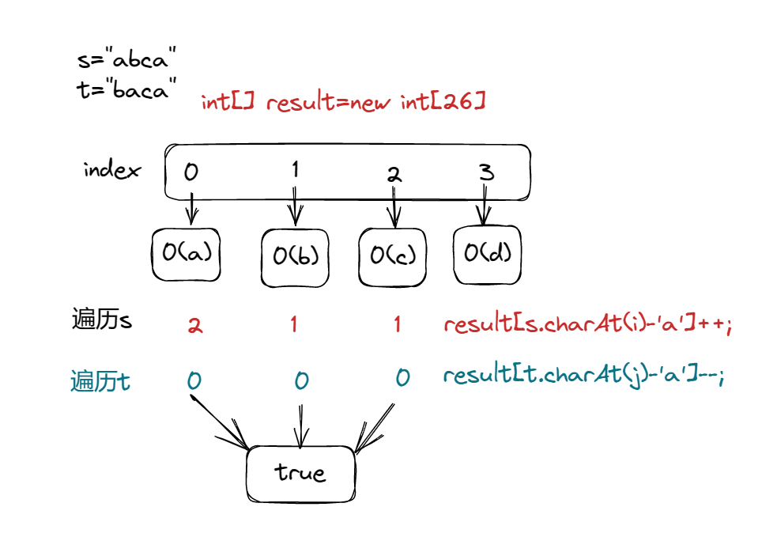
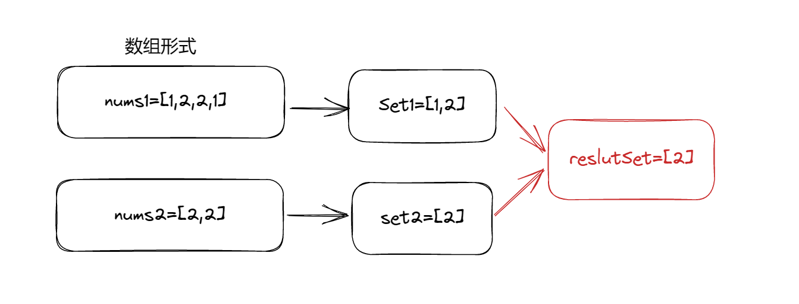
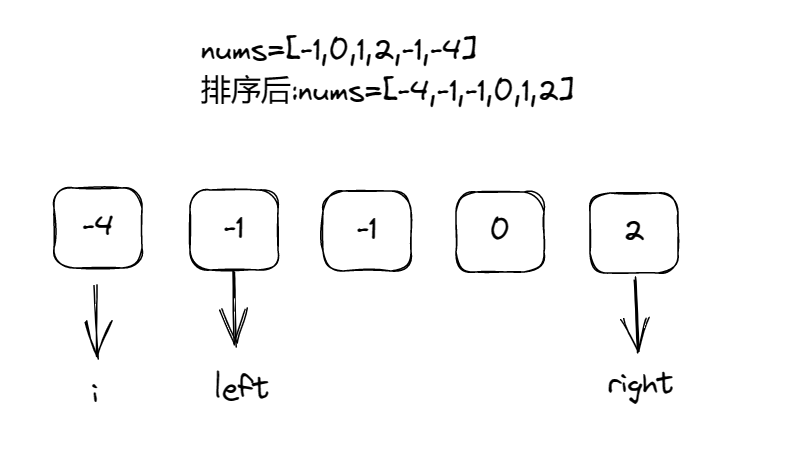

## ****哈希表理论基础****

哈希：又称散列，一般用于将一个分散的、杂乱的数据通过某个函数，映射到一个新的数据，而新数据往往更容易处理，比如新数据可能具有统一的长度，或者具有更小的范围，或者更紧凑，或者更方便比较等等，在java中体现为以下API：

```java
HashMap：键不重复，值可重复；允许key和value为空；
HashTable：键不重复，值可重复；不允许key和value为空；
HashSet：排列无序，不可重复；存取速度快；内部为HashMap；
```

根据哈希算法的思想，最基础的数据结构之一——数组也可用作HashSet或HashMap等。在其它条件相同时，用数组作为哈希表的效率往往会更高。

**当我们遇到了要快速判断一个元素是否出现集合里的时候，就要考虑哈希法**

但是哈希法也是**牺牲了空间换取了时间**，因为我们要使用额外的数组，set或者是map来存放数据，才能实现快速的查找。

如果在做面试题目的时候遇到需要判断一个元素是否出现过的场景也应该第一时间想到哈希法！

## **242. 有效的字母异位词**

> 给定两个字符串 *`s`*和 *`t`*，编写一个函数来判断 *`t`*是否是 *`s`* 的字母异位词。
> 

```java
输入: s = "anagram", t = "nagaram"
输出: true
```



```java
class Solution {
    public boolean isAnagram(String s, String t) {
        int[] result=new int[26];
        for(int i=0;i<s.length();i++){
            result[s.charAt(i)-'a']++;
        }
        for(int j=0;j<t.length();j++){
            result[t.charAt(j)-'a']--;
        }
        for(int count:result){
            if(count!=0){
                return false;
            }
        }
        return true;

    }
}
```

1. 定义字母的数组，26个字母
2. 将两个字符串的字母全部遍历到数组当中，一个字符串做++操作，一个字符串做 --操作
3. 判断数组当中的是否全部为零，全部为零返回true，否则返回false

## **349. 两个数组的交集**

> 给定两个数组 `nums1`和 `nums2`，返回 *它们的交集*。输出结果中的每个元素一定是 **唯一**的。我们可以 **不考虑输出结果的顺序**。
> 

```java
输入：nums1 = [1,2,2,1], nums2 = [2,2]
输出：[2]
```



当两个数组当中存在重复的元素，但是要求输出唯一元素，可以巧用Set值不重复的特性，去消去一个数组当中重复的元素。

```java
class Solution {
    public int[] intersection(int[] nums1, int[] nums2) {
        //1.判断数组为空的情况
        if(nums1==null||nums1.length==0||nums2==null||nums2.length==0){
            return new int[0];
        }
        //2.创建两个空的HashSet,一个用于存储遍历的nums1，一个用来存储结果
        Set<Integer> numSet=new HashSet<>();
        Set<Integer> reslut=new HashSet<>();
        //3.将数组nums1添加到num1Set哈希表中
        for(int i:nums1){
            numSet.add(i);
        }
        //4.遍历nums2并判断是否包含在numSet里面，若果包含将i添加到reslut哈希表当中
        for(int i:nums2){
            if(numSet.contains(i)){
                reslut.add(i);
            }
        }
        //5.返回的结果是哈希表，需要转成数组才可
        return reslut.stream().mapToInt(x->x).toArray();

    }
}
```

**哈希表类contains()方法：**

contains()方法用于检查是否有任何键映射到给定值元素(val_ele)中  `numSet.contains(i)`

注意：最后得到的result是哈希表，需要将哈希表转换为int[]数组形式：

`reslut.stream().mapToInt(x->x).toArray();`

## **202. 快乐数**

> 编写一个算法来判断一个数 `n` 是不是快乐数。
> 
> 
> **「快乐数」** 定义为：
> 
> - 对于一个正整数，每一次将该数替换为它每个位置上的数字的平方和。
> - 然后重复这个过程直到这个数变为 1，也可能是 **无限循环** 但始终变不到 1。
> - 如果这个过程 **结果为** 1，那么这个数就是快乐数。

```java
输入：n = 19
输出：true
解释：
12 + 92 = 82
82 + 22 = 68
62 + 82 = 100
12 + 02 + 02 = 1
```

这道题的核心来判断这个sum是否重复出现，如果重复了就是return false， 否则一直找到sum为1为止。所以可以提前定义一个函数进行求和的操作，然后while循环里面一只调用。

```java
class Solution {
    public boolean isHappy(int n) {
        Set<Integer> reslut=new HashSet<>();
        while(n!=1&&!reslut.contains(n)){
            reslut.add(n);
            n=getSum(n);
        }
        return n==1;
    }
//求和
    public int getSum(int n){
        int sum=0;
        while(n>0){
            sum+=(n%10)*(n%10);
            n=n/10;
        }
        return sum;
    }
}
```

这里的循环条件是`while(n!=1&&!reslut.contains(n))`  

1. `n!=1`是为了保证输入的不是快乐数，否则不需要判断

2. `!reslut.contains(n)` 判断哈希表中是否重复出现了计算玩的n否则，就会重复循环(即这个数不可能是快乐数，可以直接返回，避免死循环)

## **1. 两数之和**

> 给定一个整数数组 `nums`和一个整数目标值 `target`，请你在该数组中找出 **和为目标值** *`target`*
的那 **两个**整数，并返回它们的数组下标。
> 

```java
输入：nums = [2,7,11,15], target = 9
输出：[0,1]
解释：因为 nums[0] + nums[1] == 9 ，返回 [0, 1] 。
```

这道题不仅要求找到值，还要求返回数组下表，所以需要使用hashmap

```java
class Solution {
    public int[] twoSum(int[] nums, int target) {
        Map<Integer,Integer> map=new HashMap<>();
        int[] New=new int[2];
        if(nums==null||nums.length==0){
            return New;
        }
        for(int i=0;i<nums.length;i++){
            int temp=target-nums[i];
            if(map.containsKey(temp)){
                New[0]=i;
                New[1]=map.get(temp);
                break;
            }
            map.put(nums[i],i);
        }
        return New;
    }
}
```

**Java HashMap containsKey() 方法**

containsKey() 方法检查 hashMap 中是否存在指定的 key 对应的映射关系。

containsKey() 方法的语法为：`hashmap.containsKey(Object key)`

今日小结：

1. 哈希表的应用情况：要快速判断一个元素是否出现集合里的时候，就要考虑哈希法
2. 要求返回结果不重复，并且只需要获取值时可以使用HashSet
3. 要求返回结果既要考虑到值又要考虑到索引时，需要考虑HashMap的键值对映射

## **454. 四数相加 II**

> 给你四个整数数组 `nums1`、`nums2`、`nums3` 和 `nums4`，数组长度都是 `n`，请你计算有多少个元组 `(i, j, k, l)`能满足：
> 
> - `0 <= i, j, k, l < n`
> - `nums1[i] + nums2[j] + nums3[k] + nums4[l] == 0`

```java
输入：nums1 = [1,2], nums2 = [-2,-1], nums3 = [-1,2], nums4 = [0,2]
输出：2
解释：
两个元组如下：
1. (0, 0, 0, 1) -> nums1[0] + nums2[0] + nums3[0] + nums4[1] = 1 + (-2) + (-1) + 2 = 0
2. (1, 1, 0, 0) -> nums1[1] + nums2[1] + nums3[0] + nums4[0] = 2 + (-1) + (-1) + 0 = 0
```

解题步骤：

1. 定义一个`HashMap`，其中key存储`nums1[i] + nums2[j]`的值，value存储相加之和出现的次数
2. 遍历nums1和nums2数组，如果map里面已经包含该值让value+1，否则value设置为1
3. 遍历nums3和nums4数组，如果map包含0-两数组之和，即为要求的次数，一直遍历完成

```java
class Solution {
    public int fourSumCount(int[] nums1, int[] nums2, int[] nums3, int[] nums4) {
        //定义哈希表，key为两个数组元素之和，value为之和出现的次数
        Map<Integer,Integer> map=new HashMap<>();
        int result=0;
        //遍历nums1和nums2数组，如果map里面已经包含让value+1，否则value设置为1
        for(int i:nums1){
            for(int j:nums2){
                int temp=i+j;
                if(map.containsKey(temp)){
                    map.put(temp,map.get(temp)+1);
                }else{
                    map.put(temp,1);
                }
            }
        }

        //遍历nums3和nums4数组，如果map包含0-两数组之和，即为要求的次数，一直遍历完成
        for(int i:nums3){
            for(int j:nums4){
                int temp=i+j;
                if(map.containsKey(0-temp)){
                    result+=map.get(0-temp);
                }
            }
        }
        return result;
    }
}
```

该题要求使用HashMap，需要搞清楚键值对的值分别是什么，该题当中键：两数相加的和，值：相加之和出现的次数（次数也需要巧妙处理）

## **383. 赎金信**

> 给你两个字符串：`ransomNote` 和 `magazine` ，判断 `ransomNote` 能不能由 `magazine` 里面的字符构成。如果可以，返回 `true` ；否则返回 `false` 。
> 
> 
> `magazine` 中的每个字符只能在 `ransomNote` 中使用一次。
> 

```java
输入：ransomNote = "a", magazine = "b"
输出：false
```

本题与（242.有效的字母异位词）类似

1. 设置一个数组`int[] record=new int[26];`
2. 遍历两个字符串，添加到record内
3. 如果record内出现小于0的数，则为false，反之为true

```java
class Solution {
    public boolean canConstruct(String ransomNote, String magazine) {
        int[] record=new int[26];
        for(int i=0;i<magazine.length();i++){
            record[magazine.charAt(i)-'a']++;
        }

        for(int i=0;i<ransomNote.length();i++){
            record[ransomNote.charAt(i)-'a']--;
        }
        for(int i:record){
            if(i<0){
                return false;
            }
        }
        return true;
    }
}
```

## **15. 三数之和**

> 给你一个整数数组 `nums` ，判断是否存在三元组 `[nums[i], nums[j], nums[k]]` 满足 `i != j`、`i != k` 且 `j != k` ，同时还满足 `nums[i] + nums[j] + nums[k] == 0` 。请你返回所有和为 `0` 且不重复的三元组。 **注意：**答案中不可以包含重复的三元组。
> 

```java
输入：nums = [-1,0,1,2,-1,-4]
输出：[[-1,-1,2],[-1,0,1]]
解释：
nums[0] + nums[1] + nums[2] = (-1) + 0 + 1 = 0 。
nums[1] + nums[2] + nums[4] = 0 + 1 + (-1) = 0 。
nums[0] + nums[3] + nums[4] = (-1) + 2 + (-1) = 0 。
不同的三元组是 [-1,0,1] 和 [-1,-1,2] 。
注意，输出的顺序和三元组的顺序并不重要。
```

细节决定成败——**双指针**



解题步骤：

1. 将数组排序
2. 遍历数组，并确定指针i，left=i+1，right=nums.length-1;
3. if(sums[i]+sums[left]+sums[right]>0)  right--;
4. if(sums[i]+sums[left]+sums[right]<0)  left++;
5. if(sums[i]+sums[left]+sums[right]=0)  将三个元素存储到reslut数组当中
6. 对a进行去重， sums[i]==sums[i-1]时，跳出一次循环
7. 对b和c进行去重sums[left]==sums[left+1]时left++，sums[right]==sums[right-1]时right--

```java
class Solution {
    public List<List<Integer>> threeSum(int[] sums) {
       List<List<Integer>> reslut=new ArrayList<>();
        Arrays.sort(sums);
        for(int i=0;i<sums.length;i++){
            if(sums[i]>0){
                return reslut;
            }
            if(i>0&&sums[i]==sums[i-1]){
                continue;
            }
            int left=i+1;
            int right=sums.length-1;
            while(left<right){
                if(sums[i]+sums[left]+sums[right]>0){
                    right--;
                }else if(sums[i]+sums[left]+sums[right]<0){
                    left++;
                }else{
                    reslut.add(Arrays.asList(sums[i],sums[left],sums[right]));
                    while(left<right&&sums[left]==sums[left+1]){
                        left++;
                    }
                    while(left<right&&sums[right]==sums[right-1]){
                        right--;
                    }
                    right--;
                    left++;
                }
            }
        }
        return reslut;

    }
}
```

## **18. 四数之和**

> 给你一个由 `n` 个整数组成的数组 `nums` ，和一个目标值 `target` 。请你找出并返回满足下述全部条件且**不重复**的四元组 `[nums[a], nums[b], nums[c], nums[d]]` （若两个四元组元素一一对应，则认为两个四元组重复）：
> 
> - `0 <= a, b, c, d < n`
> - `a`、`b`、`c` 和 `d` **互不相同**
> - `nums[a] + nums[b] + nums[c] + nums[d] == target`

```java
输入：nums = [1,0,-1,0,-2,2], target = 0
输出：[[-2,-1,1,2],[-2,0,0,2],[-1,0,0,1]]
```

这道题和15.三数之和类似，只需要外面再嵌套一层for循环，难点仍然在于去重

1. 对nums[i]进行去重：`i>0&&nums[i]==nums[i-1]` 
2. 对nums[j]进行去重：`j>i+1&&nums[j]==nums[j-1]`  
3. 对nums[right]进行去重：`while(left<right&&nums[right]==nums[right-1]) right--;` 
4. 对nums[left]进行去重：`while(left<right&&nums[left]==nums[left+1]) left++;`

```java
class Solution {
    public List<List<Integer>> fourSum(int[] nums, int target) {
        List<List<Integer>> reslut=new ArrayList<>();
        Arrays.sort(nums);
        for(int i=0;i<nums.length;i++){
            if(nums[i]>target&&(nums[i]>0||target>0)){
                return reslut;
            }
            //nums[i]去重
            if(i>0&&nums[i]==nums[i-1]){
                continue;
            }
            for(int j=i+1;j<nums.length;j++){
                //nums[j]去重
                if(j>i+1&&nums[j]==nums[j-1]){
                    continue;
                }
                int left=j+1;
                int right=nums.length-1;
                while(left<right){
                    int sum=nums[i]+nums[j]+nums[left]+nums[right];
                    if(sum>target){
                        right--;
                    }else if(sum<target){
                        left++;
                    }else{
                        reslut.add(Arrays.asList(nums[i],nums[j],nums[left],nums[right]));
                        //nums[left]去重
                        while(left<right&&nums[left]==nums[left+1]) left++;
                        //nums[right]去重
                        while(left<right&&nums[right]==nums[right-1]) right--;
                        left++;
                        right--;
                    }
                }
            }
        }
        return reslut;

    }
}
```

