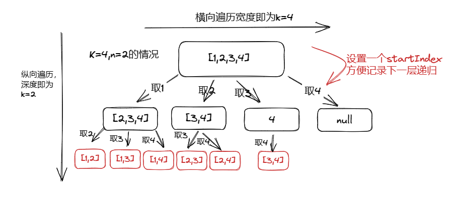

## 回溯法

回溯法又称为回溯搜索法，是一种搜索方式

回溯的本质是穷举，所以回溯法的效率不是很高，想要提高回溯法的效率，可以加一些剪枝操作

- 回溯法解决的问题
    
    组合问题：N个数字里面按照一定规则找出k个**数的集合(不强调元素顺序——无序)**
    
    切割问题：一个字符串按照一定的规则有几种**切割方式**
    
    子集问题：一个N个数的集合里有多少**符合条件的子集**
    
    排列问题：N个数按一定规则全排序，有几种**排序方式(强调元素顺序—— 有序)**
    
    棋盘问题：N皇后，解数独等
    
- 回溯法模板
    
    返回值及参数：返回值一般为void  `void backtracking(参数)`
    
    终止条件:
    
    ```java
    if(终止条件){
    	存放结果;
    	return;
    }
    ```
    
    回溯搜索的遍历过程：
    
    回溯法一般是在集合中递归搜索，集合的大小构成了树的宽度，递归的深度构成的树的深度
    
    ```java
    for(选择：本层集合中元素(树中节点孩子的数量就是集合的大小)){
    	处理结点；
    	backtracking(路径，选择列表)//递归
    	回溯，撤销处理结果
    }
    ```
    
    for循环是横向遍历，递归就是纵向遍历
    
    ```java
    //回溯算法末班框架
    void backtracking(参数) {
        if (终止条件) {
            存放结果;
            return;
        }
    
        for (选择：本层集合中元素（树中节点孩子的数量就是集合的大小）) {
            处理节点;
            backtracking(路径，选择列表); // 递归
            回溯，撤销处理结果
        }
    }
    ```
    
    ## **77. 组合**
    
    > 给定两个整数 `n` 和 `k`，返回范围 `[1, n]` 中所有可能的 `k` 个数的组合。
    > 
    > 
    > 你可以按 **任何顺序** 返回答案。
    > 
    
    ```java
    输入：n = 4, k = 2
    输出：
    [
      [2,4],
      [3,4],
      [2,3],
      [1,2],
      [1,3],
      [1,4],
    ]
    ```
    
    
    
    回溯模板：
    
    1. 参数和返回值，返回值一般为void，参数为n(宽度),k(深度)，以及startIndex(用来记录下次一递归开始的搜索位置)
    2. 终止条件，path.size()==k  path这个数组的大小如果达到k，说明我们找到了一个子集大小为k的组合了，我们就可以将path添加到reslut的集合当中
    3. 回溯搜索遍历过程
        
        ①处理节点：将i添加到path当中
        
        ②递归
        
        ③回溯 path.remove(path.size()-1);
        
        但是这里有个注意点：循环当中i的开始值是传进来的参数，但是终止运用了**剪枝优化**，具体优化过程如下：
        
        ①已经选择了的元素个数:path.size()
        
        ②还需要选择的元素个数：k-path.size()
        
        ③集合当中存在多余的选取元素吗?n-(k-path.size())+1(这里的加一是因为需要包含起始位置)
        
    
    ```java
    class Solution {
        List<Integer> path=new ArrayList<>();
        List<List<Integer>> reslut=new ArrayList<>();
        public List<List<Integer>> combine(int n, int k) {
            combineBack(n,k,1);
            return reslut;
        }
        public void combineBack(int n,int k,int startIndex){
            //终止条件
            if(path.size()==k){
                reslut.add(new ArrayList<>(path));
                return;
            }
            //回溯搜索遍历过程（这里i的终止处运用了剪枝）
            for(int i=startIndex;i<=n-(k-path.size())+1;i++){
                //处理结点
                path.add(i);
                //递归
                combineBack(n,k,i+1);
                //回溯
                path.remove(path.size()-1);
            }
        }
    }
    ```

## **216. 组合总和 III**

> 找出所有相加之和为 `n` **的 `k` ****个数的组合，且满足下列条件：
> 
> - 只使用数字1到9
> - 每个数字 **最多使用一次**
> 
> 返回 *所有可能的有效组合的列表* 。该列表不能包含相同的组合两次，组合可以以任何顺序返回。
> 

```java
输入: k = 3, n = 7
输出: [[1,2,4]]
解释:
1 + 2 + 4 = 7
没有其他符合的组合了。
```

解题思路：

1. 确定参数和返回值：返回值一般是void，参数为n，targesum，自定义sum，startIndex
2. 终止条件，首先path.size()==k即可返回，其次需要sum==targetsum，将path添加到reslut当中
3. 回溯搜索的遍历过程
    
    处理节点：将遍历的i添加到path当中，将sum+i
    
    递归处理
    
    回溯处理：将path回溯，将sum-i
    
    其中for循环的开始为startIndex，结束需要利用剪枝9-(k-path.size())+1（详细解释可以参考组合那到题目）
    

```java
class Solution {
    List<Integer> path=new ArrayList<>();
    List<List<Integer>> reslut=new ArrayList<>();
    int sum=0;
    public List<List<Integer>> combinationSum3(int k, int n) {
        trackbacking(k,n,sum,1);
        return reslut;
    }

    public void trackbacking(int k,int targetsum,int sum,int startIndex){
        if(sum>targetsum){
            return;
        }
        if(path.size()==k){
            if(sum==targetsum){
                reslut.add(new ArrayList<>(path));
            }
            return;
        }

        for(int i=startIndex;i<=9-(k-path.size())+1;i++){
            path.add(i);
            sum+=i;
            trackbacking(k,targetsum,sum,i+1);
            path.remove(path.size()-1);
            sum-=i;
        }
    }
}
```

## **17. 电话号码的字母组合**

> 给定一个仅包含数字 `2-9` 的字符串，返回所有它能表示的字母组合。答案可以按 **任意顺序** 返回。
> 
> 
> 给出数字到字母的映射如下（与电话按键相同）。注意 1 不对应任何字母。
> 

```java
输入：digits = "23"
输出：["ad","ae","af","bd","be","bf","cd","ce","cf"]
```

首先数字和字母的映射关系，我们可以采用字符数组去存储

 `String[] numString = {"", "", "abc", "def", "ghi", "jkl", "mno", "pqrs", "tuv", "wxyz"};` 

整体回溯解题思路：

1. 确定参数和返回值：返回值void，参数：digits，字符数组，定义一个num用来存储digits中分离出来的单个数字
2. 确定终止条件，num==digits.length()，添加结果并返回
3. 回溯搜索的遍历过程
    
    处理结点：找到numString中所对应数字下标的字符串，for循环从[0，str的长度]
    
    递归处理
    
    回溯处理：sb.deleteCharAt(sb.length()-1);
    

```java
class Solution {
    List<String> reslut=new ArrayList<>();
    StringBuilder sb=new StringBuilder();
    public List<String> letterCombinations(String digits) {
        if(digits==null || digits.length()==0){
            return reslut;
        }
        String[] numString = {"", "", "abc", "def", "ghi", "jkl", "mno", "pqrs", "tuv", "wxyz"};
        letter(digits,numString,0);
        return reslut;
    }
    public void letter(String digits,String[] numString,int num){
        if(num==digits.length()){
            reslut.add(sb.toString());
            return;
        }
        String str=numString[digits.charAt(num)-'0'];
        for(int i=0;i<str.length();i++){
            sb.append(str.charAt(i));
            letter(digits,numString,num+1);
            sb.deleteCharAt(sb.length()-1);
        }
    }
}
```

## **39. 组合总和**

> 给你一个 **无重复元素**的整数数组 `candidates`和一个目标整数 `target`，找出 `candidates`
 中可以使数字和为目标数 `target`的 所有 ****不同组合**，并以列表形式返回。你可以按 **任意顺序**
 返回这些组合。
> 

```java
输入：candidates = [2,3,6,7], target = 7
输出：[[2,2,3],[7]]
解释：
2 和 3 可以形成一组候选，2 + 2 + 3 = 7 。注意 2 可以使用多次。
7 也是一个候选， 7 = 7 。
仅有这两种组合。
```

本题没有数量要求，可以无限重复，但是有总和的限制，所以间接的也是有个数的限制。

回溯三部曲：

1. 确定参数和返回值：返回值为void，参数为数组candidates，目标和target，记录sum，选取开始的索引startIndex
2. 终止条件：`sum==target`将结果添加到relsut中返回
3. 单层搜索逻辑
    
    处理节点、递归、回溯
    
    其中剪枝处理，如果sum + candidates[i] > target就会不符合条件
    

```java
class Solution {
  List<List<Integer>> reslut=new ArrayList<>();
    List<Integer> res=new ArrayList<>();
    public List<List<Integer>> combinationSum(int[] candidates, int target) {
        Arrays.sort(candidates); // 先进行排序
        trackbacking(candidates,target,0,0);
        return reslut;
    }
    public void trackbacking(int[] candidates,int target,int sum,int startIndex){
        if(sum==target){
            reslut.add(new ArrayList<>(res));
            return;
        }
        for(int i=startIndex;i<candidates.length && sum + candidates[i] <= target;i++){
            res.add(candidates[i]);
            trackbacking(candidates,target,sum+candidates[i],i);
            res.remove(res.size()-1);
        }
    }
}
```

## **40. 组合总和 II**

> 给定一个候选人编号的集合 `candidates` 和一个目标数 `target` ，找出 `candidates` 中所有可以使数字和为 `target` 的组合。
> 
> 
> `candidates` 中的每个数字在每个组合中只能使用 **一次** 。
> 

```java
输入: candidates = [10,1,2,7,6,1,5], target = 8,
输出:
[
[1,1,6],
[1,2,5],
[1,7],
[2,6]
]
```

**集合（数组candidates）有重复元素，但还不能有重复的组合，**所以这道题的关键是去重

回溯三部曲：

1. 参数和返回值：返回值为void，参数为candidates，target，sum，startIndex
2. 递归终止条件：`sum==target` 
3. 单层搜索逻辑
    
    为了进行去重我们定义了一个boolean数组 used，首先将数组填充为false
    
    这里首先需要考虑去重`candidates[i]==candidates[i-1]&&!used[i-1]` 跳过本次循环
    
    处理节点：处理节点是需要将used[i]设置为true表明这个数出现过
    
    递归
    
    回溯：回溯需要将used[i]设置为false，在进行下一层处理
    

```java
class Solution {
    List<List<Integer>> reslut=new ArrayList<>();
    List<Integer> path=new ArrayList<>();
    boolean[] used;
    public List<List<Integer>> combinationSum2(int[] candidates, int target) {
        used = new boolean[candidates.length];
        Arrays.fill(used,false);
        Arrays.sort(candidates);
        trackbacking(candidates,target,0,0);
        return reslut;
    }
    public void trackbacking(int[] candidates,int target,int sum,int startIndex){
        if(sum==target){
            reslut.add(new ArrayList<>(path));
            return;
        }
        for(int i=startIndex;i<candidates.length&&sum + candidates[i] <= target;i++){
            if(i>0&&candidates[i]==candidates[i-1]&&!used[i-1]){
                continue;
            }
            used[i]=true;
            sum+=candidates[i];
            path.add(candidates[i]);
            trackbacking(candidates,target,sum,i+1);
            used[i]=false;
            path.remove(path.size()-1);
            sum-=candidates[i];
        }
    }
}
```

Arrays.fill(arrayname,value) 方法，用于数组填充

## **131. 分割回文串**

> 给你一个字符串 `s`，请你将 **`s` **分割成一些子串，使每个子串都是 **回文串** 。返回 `s` 所有可能的分割方案。
> 
> 
> **回文串** 是正着读和反着读都一样的字符串。
> 

```java
输入：s = "aab"
输出：[["a","a","b"],["aa","b"]]
```

组合问题：选取一个a之后，在bcdef中再去选取第二个，选取b之后在cdef中再选取第三个.....。

切割问题：切割一个a之后，在bcdef中再去切割第二段，切割b之后在cdef中再切割第三段.....。

回溯三部曲：

1. 参数和返回值：返回值为void，参数为字符串s，strtindex用来记录分割点
2. 终止条件：如果切割点strtindex>=s.length()
3. 单层搜索逻辑
    
    首先需要判断截取字符串是否为回文，如果为回文用substring截取字符串并添加到path当中
    
    回溯
    
    递归
    

判断是否为回文：只需两个指针，一个从起点开始遍历，一个从末尾开始遍历，如果字符不相等则为false，若相等则为true

```java
class Solution {
    List<List<String>> reslut=new ArrayList<>();
    List<String> path=new ArrayList<>();
    public List<List<String>> partition(String s) {
        trackbacking(s,0);
        return reslut;
    }
    public void trackbacking(String s,int starIndex){
        if(starIndex>=s.length()){
            reslut.add(new ArrayList<>(path));
            return;
        }
        for(int i=starIndex;i<s.length();i++){
            if(isPalindrome(s,starIndex,i)){
                String str=s.substring(starIndex,i+1);
                path.add(str);
            }else{
                continue;
            }
            trackbacking(s,i+1);
            path.remove(path.size()-1);
        }

    }

    //判断回文
    private boolean isPalindrome(String s,int startIndex,int endIndex){
        for(int i=startIndex,j=endIndex;i<j;i++,j--){
            if(s.charAt(i)!=s.charAt(j)){
                return false;
            }
        }
        return true;
    }
}
```

