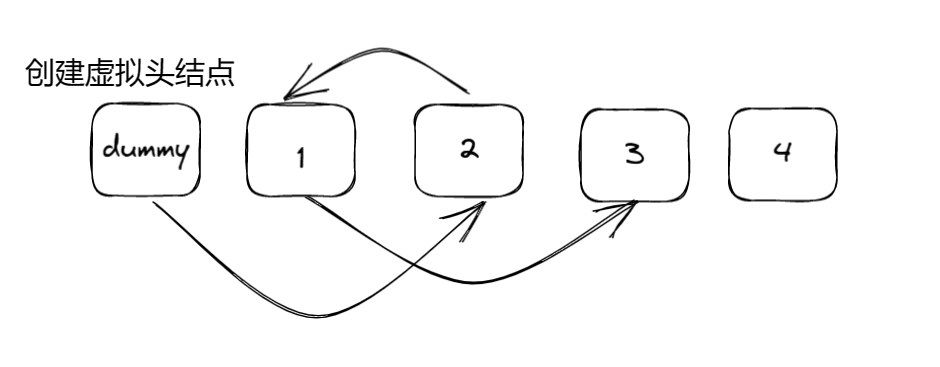
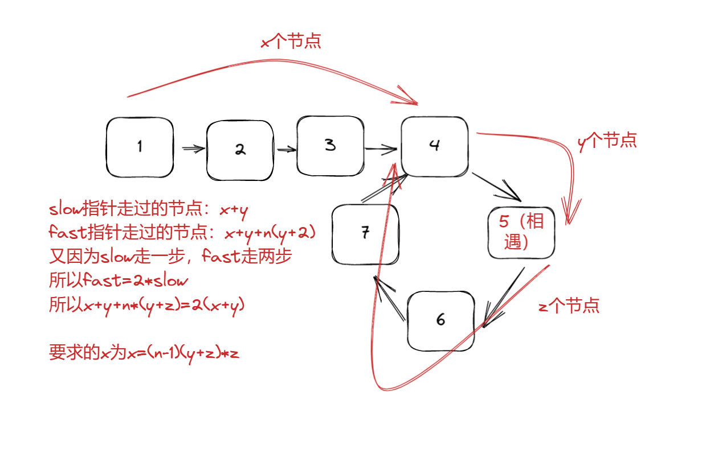

## 链表内容复习

- 链表的概念和结构

**链表：**链表是一种**物理存储结构上非连续**存储结构，数据元素的**逻辑顺序**是通过链表中的**引用链接**次序实现的。（通俗的说：就是由一个个节点组成，这些节点逻辑上连续，物理上不连续）

将链表类比于火车：

singleLinkedList ——火车车次（一整个火车or哪趟火车）

Node——车厢，具体储存元素的类，每个单链表的节点就是Node的一个对象

Node.head ；——当前链表的头节点（只要知道头节点就可以此访问链表中的所有节点）

int  size ；——当前链表的长度（节点个数），保存有效数据的个数

- 链表分为：单向链表、双向链表、循环链表

- 单向链表节点的定义(一定要会写，熟悉构造)

```java
public class ListNode {
    int val;
    ListNode next;
    ListNode(){}
    ListNode(int val){this.val=val;}
    ListNode(int val,ListNode next){this.val=val;this.next=next;}
}
```

- **链表的存储方式：**

**数组**是在内存中是连续分布的，但是链表在内存中可不是连续分布的。

**链表**是通过指针域的指针链接在内存中各个节点。所以链表中的节点在内存中不是连续分布的 ，而是散乱分布在内存中的某地址上，分配机制取决于操作系统的内存管理。

### ****203.移除链表元素****

> 给你一个链表的头节点 `head`和一个整数 `val`，请你删除链表中所有满足 `Node.val == val`的节点，并返回 **新的头节点**。
> 

```java
输入：head = [1,2,6,3,4,5,6], val = 6
输出：[1,2,3,4,5]
```

**思路1：不使用虚拟节点，直接操作**

```java
class Solution {
    public ListNode removeElements(ListNode head, int val) {
        //1.考虑头结点就是需要删除的值
        while(head!=null&&head.val==val){
            head=head.next;
        }
        //2.列表为空的话，直接退出
        if(head==null){
            return head;
        }
        //3.已经确定了head.val!=val
        ListNode pre=head;
        ListNode cur=head.next;
        while(cur!=null){
            if(cur.val==val){
                pre.next=cur.next;
            }else{
                pre=cur;
            }
            cur=cur.next;
        }
        return head;
    }
}
```

注意点：不适用虚拟头结点的话，需要注意判断head.val是否等于val。

**思路2：使用虚拟头结点**

```java
class Solution {
    public ListNode removeElements(ListNode head, int val) {
        if(head==null){
            return head;
        }
        ListNode dummy=new ListNode(-1,head);
        ListNode pre=dummy;
        ListNode cur=head;
        while(cur!=null){
            if(cur.val==val){
                pre.next=cur.next;
            }else{
                pre=cur;
            }
            cur=cur.next;
        }
        return dummy.next;
    }
}
```

两种思路效率差不多，但是使用虚拟头结点的话就不需要多余判断头结点的值是否等于val。

## **707. 设计链表**

> 在链表类中实现这些功能：
> 
> - get(index)：获取链表中第 `index` 个节点的值。如果索引无效，则返回`1`。
> - addAtHead(val)：在链表的第一个元素之前添加一个值为 `val` 的节点。插入后，新节点将成为链表的第一个节点。
> - addAtTail(val)：将值为 `val` 的节点追加到链表的最后一个元素。
> - addAtIndex(index,val)：在链表中的第 `index` 个节点之前添加值为 `val` 的节点。如果 `index` 等于链表的长度，则该节点将附加到链表的末尾。如果 `index` 大于链表长度，则不会插入节点。如果`index`小于0，则在头部插入节点。
> - deleteAtIndex(index)：如果索引 `index` 有效，则删除链表中的第 `index` 个节点。

```java
MyLinkedList linkedList = new MyLinkedList();
linkedList.addAtHead(1);
linkedList.addAtTail(3);
linkedList.addAtIndex(1,2);   //链表变为1-> 2-> 3
linkedList.get(1);            //返回2
linkedList.deleteAtIndex(1);  //现在链表是1-> 3
linkedList.get(1);            //返回3
```

**单向链表**

```java
class MyLinkedList {
    public MyLinkedList() {
        int size=0;
        ListNode head=new ListNode(0);

    }
    
    public int get(int index) {
        //如果index非法，返回-1
        if (index < 0 || index >= size) {
            return -1;
        }
        ListNode currentNode = head;
        //包含一个虚拟头节点，所以查找第 index+1 个节点
        for (int i = 0; i <= index; i++) {
            currentNode = currentNode.next;
        }
        return currentNode.val;
    }
    
    public void addAtHead(int val) {
        addAtIndex(0,val);
    }
    
    public void addAtTail(int val) {
         addAtIndex(size,val);
    }
    
  public void addAtIndex(int index, int val) {
        if(index>size){
            return;
        }
        if(index<0){
            index=0;
        }
        size++;
        //首先需要找到index之前的那个节点进行操作
        ListNode pre=head;
        for(int i=0;i<index;i++){
            pre=pre.next;
        }
        //找到节点之后进行传入，需要新建一个节点add
        ListNode add=new ListNode(val);
        add.next=pre.next;
        pre.next=add;
        
    }

    //如果索引 index 有效，则删除链表中的第 index 个节点。
    public void deleteAtIndex(int index) {
        //首先判断index是否有效
        if(index>=size||index<0){
            return;
        }
        size--;
        if(index==0){
            head=head.next;
            return;
        }
        //找到需要删除的点的前一个
        ListNode pre=head;
        for(int i=0;i<index;i++){
            pre=pre.next;
        }
        pre.next=pre.next.next;
    }
}
```

1. 获取索引index处的值
    
    利用for循环找到index处的链表，通过cur=cur.next;   循环结束后cur.val就是索引处的值
    
2. 在index之前添加链表
    
    和1类似，需要找到index-1处的节点进行添加处理
    
3. 删除index节点处的链表
    
    和1类似，结合203的移除元素
    

**双向链表(只做了简单了解——后续需要结合实际题目，感觉目前用到的较少)**

## ****206.反转链表****

> 给你单链表的头节点 `head`，请你反转链表，并返回反转后的链表。
> 

```java
输入：head = [1,2,3,4,5]
输出：[5,4,3,2,1]
```

```java
class Solution {
    public ListNode reverseList(ListNode head) {
        ListNode pre=null;
        ListNode cur=head;
        while(cur!=null){
            ListNode temp=cur.next;
            cur.next=pre;
            pre=cur;
            cur=temp;
        }
        return pre;
    }
}
```

链表的题重在理解，理解链表节点的走向，顺着理解去做题目就可以完成的很快速。

## **24. 两两交换链表中的节点**

> 给你一个链表，两两交换其中相邻的节点，并返回交换后链表的头节点。你必须在不修改节点内部的值的情况下完成本题（即，只能进行节点交换）。
> 

```jsx
输入：head = [1,2,3,4]
输出：[2,1,4,3]
```

通过设置虚拟头结点，个节点的指向如下



```jsx
class Solution {
    public ListNode swapPairs(ListNode head) {
        if(head==null||head.next==null){
            return head;
        }
        ListNode dummy=new ListNode(0,head);
        ListNode cur=dummy;
        while(cur.next!=null&&cur.next.next!=null){
            ListNode temp=cur.next.next.next;
            ListNode fristnode=cur.next;
            ListNode secondnode=cur.next.next;
            cur.next=secondnode;
            secondnode.next=fristnode;
            fristnode.next=temp;
            cur=fristnode;
        }
        return dummy.next;
    }
}
```

这里可以多设置几个temp等节点，可以防止在节点变换过程中发生的改变，这样更加方便快捷。

### **19. 删除链表的倒数第 N 个结点**

> 给你一个链表，删除链表的倒数第 `n` **个结点，并且返回链表的头结点。
> 

```jsx
输入：head = [1,2,3,4,5], n = 2
输出：[1,2,3,5]
```

**思路1：首先要确定列表的size，然后index=size-n，之后按照index索引去删除即可**

```jsx
class Solution {
    public ListNode removeNthFromEnd(ListNode head, int n) {
       //1.判断链表的长度size
        ListNode cur=head;
        ListNode temp=head;
        int size=0;
        while(cur!=null){
            size++;
            cur=cur.next;
        }
        int index=size-n;
        //删除第一个数headsize为2
        if(index==0){
            return head=head.next;
        }
        //head的size为1
        if(size==1&&n==1){
            return head=head.next;
        }

        for(int i=0;i<index-1;i++){
            temp=temp.next;
        }
        temp.next=temp.next.next;
        size--;
        return head;

    }
}
```

这个方法思考起来不难，但是有几处细节需要考虑到

**思路2：虚拟头结点+双指针**

```jsx
class Solution {
    public ListNode removeNthFromEnd(ListNode head, int n) {
      ListNode dummy=new ListNode(0,head);
        ListNode fastindex=dummy;
        ListNode lowindex=dummy;

        for(int i=0;i<n;i++){
            fastindex=fastindex.next;
        }
        while(fastindex.next!=null){
            lowindex=lowindex.next;
            fastindex=fastindex.next;
        }
        lowindex.next=lowindex.next.next;
        return dummy.next;

    }
}
```

1. 设置虚拟头结点dummy和快慢指针节点
2. 让快指针走n+1步
3. 再让快慢指针一同去走，当快指针走到最后一个节点即`fastindex.next==null` 时慢指针的后一个节点就是需要删除的
4. 删除慢指针的后一个节点即可

## ****面试题 02.07. 链表相交****

> 给你两个单链表的头节点 `headA` 和 `headB` ，请你找出并返回两个单链表相交的起始节点。如果两个链表没有交点，返回 `null`。
> 

```jsx
输入：intersectVal = 8, listA = [4,1,8,4,5], listB = [5,0,1,8,4,5], skipA = 2, skipB = 3
输出：Intersected at '8'
解释：相交节点的值为 8 （注意，如果两个链表相交则不能为 0）。
从各自的表头开始算起，链表 A 为 [4,1,8,4,5]，链表 B 为 [5,0,1,8,4,5]。
在 A 中，相交节点前有 2 个节点；在 B 中，相交节点前有 3 个节点。
```

这道题仍然是要求善用双指针的方法

```jsx
public class Solution {
    public ListNode getIntersectionNode(ListNode headA, ListNode headB) {
         ListNode tempA=headA;
        ListNode tempB=headB;
        int sizeA=0;
        int sizeB=0;
        //1.求headA的长度
        while(tempA!=null){
            tempA=tempA.next;
            sizeA++;
        }
        //2.求headB的长度
        while(tempB!=null){
            tempB=tempB.next;
            sizeB++;
        }
        //3.让curA称为最长链表的头
        if(sizeB>sizeA){
            int temp=sizeA;
            sizeA=sizeB;
            sizeB=temp;
            ListNode tempNode=headA;
            headA=headB;
            headB=tempNode;
        }
        //4.求长度差
        int gap=sizeA-sizeB;

        //5.两个链表处于相同节点出发
        while (gap-->0){
            headA=headA.next;
        }

        while (headA!=null){
            if(headA==headB){
                return headA;
            }
            headA=headA.next;
            headB=headB.next;
        }
        return null;
        
    }
}
```

1. 分别求出headA和headB链表的长度为sizeA和sizeB
2. 让链表headA为最长的链表，所以判断是否满足，不满足就交换链表和size大小
3. 求出sizeA和sizeB的长度差
4. 让headA先走gap步，让两个链表位于相同的出发点
5. 遍历剩下的链表节点并判断链表是否相同，相同返回headA，不同返回null

## ****142.环形链表II****

> 给定一个链表的头节点  `head`，返回链表开始入环的第一个节点。 *如果链表无环，则返回 `null`。*
> 

```jsx
输入：head = [3,2,0,-4], pos = 1
输出：返回索引为 1 的链表节点
解释：链表中有一个环，其尾部连接到第二个节点。
```

首先需要判断是否有环：

定义两个指针fast和slow，让fast每次走两个节点，slow每次走一个节点，如果有环则fast和slow在环内相遇

其次判断入环节点：

定义两个指针index1,index2让index1从相遇节点出发，index从头节点出发，每次走一步则index1,index会在入环处相遇



```jsx
public class Solution {
    public ListNode detectCycle(ListNode head) {
        ListNode fastNode=head;
        ListNode slowNode=head;
        while(fastNode!=null&&fastNode.next!=null){
            fastNode=fastNode.next.next;
            slowNode=slowNode.next;
            if(slowNode==fastNode){
                ListNode index1=fastNode;
                ListNode index2=head;
                while(index1!=index2){
                    index1=index1.next;
                    index2=index2.next;
                }
                return index1;
            }
        }
        return null;
    }
}
```