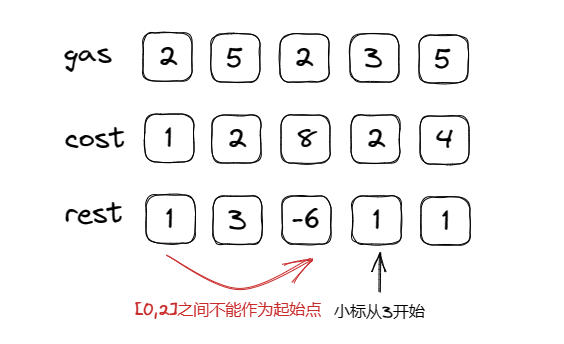

## 贪心算法理论

贪心算法的本质是选择每一阶段的局部最优，从而达到全局最优。

贪心一般解题步骤：

1. 将问题分为若干子问题
2. 找出适合的贪心策略
3. 求解每一个子问题的最优解
4. 将局部最优堆叠成全局最优

### **455. 分发饼干**

> 假设你是一位很棒的家长，想要给你的孩子们一些小饼干。但是，每个孩子最多只能给一块饼干。
> 
> 
> 对每个孩子 `i`，都有一个胃口值 `g[i]`，这是能让孩子们满足胃口的饼干的最小尺寸；并且每块饼干 `j`，都有一个尺寸 `s[j]` 。如果 `s[j] >= g[i]`，我们可以将这个饼干 `j` 分配给孩子 `i` ，这个孩子会得到满足。你的目标是尽可能满足越多数量的孩子，并输出这个最大数值。
> 

```jsx
输入: g = [1,2,3], s = [1,1]
输出: 1
解释: 
你有三个孩子和两块小饼干，3个孩子的胃口值分别是：1,2,3。
虽然你有两块小饼干，由于他们的尺寸都是1，你只能让胃口值是1的孩子满足。
所以你应该输出1。
```

```java
class Solution {
    public int findContentChildren(int[] g, int[] s) {
        Arrays.sort(g);
        Arrays.sort(s);
        int count=0;
        int start=s.length-1;
				//从最大的胃口值开始遍历，优先满足胃口大的孩子
        for(int i=g.length-1;i>=0;i--){
            if(start>=0&&g[i]<=s[start]){
                start--;
                count++;
            }
        }
        return count;
    }
}
```

## **376. 摆动序列**

> 如果连续数字之间的差严格地在正数和负数之间交替，则数字序列称为 **摆动序列 。**第一个差（如果存在的话）可能是正数或负数。仅有一个元素或者含两个不等元素的序列也视作摆动序列。
> 
> - 例如， `[1, 7, 4, 9, 2, 5]` 是一个 **摆动序列** ，因为差值 `(6, -3, 5, -7, 3)` 是正负交替出现的。
> - 相反，`[1, 4, 7, 2, 5]` 和 `[1, 7, 4, 5, 5]` 不是摆动序列，第一个序列是因为它的前两个差值都是正数，第二个序列是因为它的最后一个差值为零。
> 
> **子序列** 可以通过从原始序列中删除一些（也可以不删除）元素来获得，剩下的元素保持其原始顺序。
> 
> 给你一个整数数组 `nums` ，返回 `nums` 中作为 **摆动序列** 的 **最长子序列的长度** 。
> 

```java
输入：nums = [1,7,4,9,2,5]
输出：6
解释：整个序列均为摆动序列，各元素之间的差值为 (6, -3, 5, -7, 3) 。
```

这道题最初想复杂了，考虑了回溯求解子序列求子集问题再去判断，用了很多时间，后面发现了简单的解题思路：

1. 定义一个前一项的插值，和现在的插值
2. 遍历数组，判断插值的情况`curdiff>0&&prediff<=0||curdiff<0&&prediff>=0` 
3. 需要将`prediff=curdiff`

```java
class Solution {
   public int wiggleMaxLength(int[] nums) {
        if(nums.length<=1){
            return nums.length;
        }
        int prediff=0;
        int curdiff=0;
        int count=1;
        for(int i=1;i<nums.length;i++){
            curdiff=nums[i]-nums[i-1];
            if(curdiff>0&&prediff<=0||curdiff<0&&prediff>=0){
                count++;
                prediff=curdiff;
            }
        }
        return count;
    }
}
```

## **53. 最大子数组和**

> 给你一个整数数组 `nums` ，请你找出一个具有最大和的连续子数组（子数组最少包含一个元素），返回其最大和。
> 
> 
> **子数组** 是数组中的一个连续部分。
> 

```java
输入：nums = [-2,1,-3,4,-1,2,1,-5,4]
输出：6
解释：连续子数组 [4,-1,2,1] 的和最大，为 6 。
```

这道题没什么难点，但是由于小技巧，一直累加nums里面的值，但是当`count≤0`时就会拉低总和，所以可以将其设置为0，即从新开始累加

```java
class Solution {
    public int maxSubArray(int[] nums) {
        if(nums.length==1){
            return nums[0];
        }
        int count=0;
        int sum=Integer.MIN_VALUE;
        for(int i=0;i<nums.length;i++){
            count+=nums[i];
            sum=Math.max(sum,count);
            if(count<=0){
                count=0;
            }
        }
        return sum;
    }
}
```

## **122. 买卖股票的最佳时机 II**

> 给你一个整数数组 `prices` ，其中 `prices[i]` 表示某支股票第 `i` 天的价格。
> 
> 
> 在每一天，你可以决定是否购买和/或出售股票。你在任何时候 **最多** 只能持有 **一股** 股票。你也可以先购买，然后在 **同一天** 出售。
> 
> 返回 *你能获得的 **最大** 利润* 。
> 

```jsx
输入：prices = [7,1,5,3,6,4]
输出：7
解释：在第 2 天（股票价格 = 1）的时候买入，在第 3 天（股票价格 = 5）的时候卖出, 这笔交易所能获得利润 = 5 - 1 = 4 。
     随后，在第 4 天（股票价格 = 3）的时候买入，在第 5 天（股票价格 = 6）的时候卖出, 这笔交易所能获得利润 = 6 - 3 = 3 。
     总利润为 4 + 3 = 7 。
```

本题我们需要考虑到，我们只需要正利润区间，而不需要关注最终利润

每天的利润率可以考虑为：`prices[i] - prices[i - 1]`

```jsx
class Solution {
    public int maxProfit(int[] prices) {
        int reslut=0;
        for(int i=1;i<prices.length;i++){
            reslut+=Math.max(0,prices[i]-prices[i-1]);
        }
        return reslut;

    }
}
```

## **55. 跳跃游戏**

> 给定一个非负整数数组 `nums` ，你最初位于数组的 **第一个下标** 。
> 
> 
> 数组中的每个元素代表你在该位置可以跳跃的最大长度。
> 
> 判断你是否能够到达最后一个下标。
> 

```jsx
输入：nums = [2,3,1,1,4]
输出：true
解释：可以先跳 1 步，从下标 0 到达下标 1, 然后再从下标 1 跳 3 步到达最后一个下标。
```

贪心算法局部最优解：每次取最大跳跃步数（取最大覆盖范围）

整体最优解：最后得到整体最大覆盖范围，看是否能到终点

这道题需要考虑的不是跳几步，而是跳跃的覆盖范围

```jsx
class Solution {
    public boolean canJump(int[] nums) {
        if(nums.length==1){
            return true;
        }
        int coverange=0;
        for(int i=0;i<=coverange;i++){
            coverange=Math.max(coverange,i+nums[i]);
            if(coverange>=nums.length-1){
                return true;
            }
        }
        return false;
    }
}
```

## **45. 跳跃游戏 II**

> 给定一个长度为 `n` 的 **0 索引**整数数组 `nums`。初始位置为 `nums[0]`。
> 
> 
> 每个元素 `nums[i]` 表示从索引 `i` 向前跳转的最大长度。换句话说，如果你在 `nums[i]` 处，你可以跳转到任意 `nums[i + j]` 处:
> 
> - `0 <= j <= nums[i]`
> - `i + j < n`
> 
> 返回到达 `nums[n - 1]` 的最小跳跃次数。生成的测试用例可以到达 `nums[n - 1]`。
> 

```jsx
输入: nums = [2,3,1,1,4]
输出: 2
解释: 跳到最后一个位置的最小跳跃数是 2。
     从下标为 0 跳到下标为 1 的位置，跳 1 步，然后跳 3 步到达数组的最后一个位置。
```

让第一步尽可能的多走，走最大距离，然后再走最后一步就可以到达最后位置

解题思路：

1. 定义最大距离，当前距离和count值
2. 循环nums数组，每次计算最大距离
    
    如果最大距离大于等于`nums.length-1`   说明最后这一步就可以到到达终点，所以count+1然后break跳出循环
    
    如果i==当前距离。让当前距离赋值最大距离，count++
    

```jsx
class Solution {
    public int jump(int[] nums) {
        if(nums==null||nums.length==0||nums.length==1){
            return 0;
        }
        int curdisatnce=0;
        int maxdistance=0;
        int count=0;
        for(int i=0;i<nums.length;i++){
            maxdistance=Math.max(maxdistance,i+nums[i]);
            if(maxdistance>=nums.length-1){
                count++;
                break;
            }
            if(i==curdisatnce){
                curdisatnce=maxdistance;
                count++;
            }
        }
        return count;

    }
}
```

## **1005. K 次取反后最大化的数组和**

> 给你一个整数数组 `nums` 和一个整数 `k` ，按以下方法修改该数组：
> 
> - 选择某个下标 `i` 并将 `nums[i]` 替换为 `nums[i]` 。
> 
> 重复这个过程恰好 `k` 次。可以多次选择同一个下标 `i` 。
> 
> 以这种方式修改数组后，返回数组 **可能的最大和** 。
> 

```jsx
输入：nums = [4,2,3], k = 1
输出：5
解释：选择下标 1 ，nums 变为 [4,-2,3] 。
```

解题思路：

1. 将数组按照绝对值得从大到小排序
2. 遍历数组，如果nums[i]<0并且k>0时让nums[i]=-nums[i];并k—；
3. 遍历结束如果k依然大于0，则反转数组中最小的元素为负数，让k值用完
4. 求和

```java
class Solution {
    public int largestSumAfterKNegations(int[] nums, int k) {
         nums= IntStream.of(nums).boxed().sorted((o1,o2)-> Math.abs(o2)-Math.abs(o1)).mapToInt(Integer::intValue).toArray();
        for(int i=0;i<nums.length;i++){
            if(nums[i]<0&&k>0){
                nums[i]=-nums[i];
                k--;
            }
        }
        if(k%2==1) nums[nums.length-1]=-nums[nums.length-1];
        return Arrays.stream(nums).sum();
    }
}
```

## **134. 加油站**

> 在一条环路上有 `n` 个加油站，其中第 `i` 个加油站有汽油 `gas[i]` **升。
> 
> 
> 你有一辆油箱容量无限的的汽车，从第 **`i` **个加油站开往第 **`i+1` **个加油站需要消耗汽油 `cost[i]` **升。你从其中的一个加油站出发，开始时油箱为空。
> 
> 给定两个整数数组 `gas` 和 `cost` ，如果你可以绕环路行驶一周，则返回出发时加油站的编号，否则返回 `-1` 。如果存在解，则 **保证** 它是 **唯一** 的。
> 

```java
输入: gas = [1,2,3,4,5], cost = [3,4,5,1,2]
输出: 3
解释:
从 3 号加油站(索引为 3 处)出发，可获得 4 升汽油。此时油箱有 = 0 + 4 = 4 升汽油
开往 4 号加油站，此时油箱有 4 - 1 + 5 = 8 升汽油
开往 0 号加油站，此时油箱有 8 - 2 + 1 = 7 升汽油
开往 1 号加油站，此时油箱有 7 - 3 + 2 = 6 升汽油
开往 2 号加油站，此时油箱有 6 - 4 + 3 = 5 升汽油
开往 3 号加油站，你需要消耗 5 升汽油，正好足够你返回到 3 号加油站。
因此，3 可为起始索引。
```

解题思路：

1. 总油量减去总消耗大于0则一定可以跑完一圈，反之小于0则返回-1
2. 每个加油站的余量rest[i]=gas[i]-cost[i]
3. i从0开始累加rest[i]，累加和为curtotal，当curtotal<0时说明[0,i]区间不能作为起始位置，所以将i+1作为起始位置，curtotal从0开始计算。



```java
class Solution {
    public int canCompleteCircuit(int[] gas, int[] cost) {
        int curtotal=0;
        int sumtotal=0;
        int index=0;
        for(int i=0;i<gas.length;i++){
            curtotal+=gas[i]-cost[i];
            sumtotal+=gas[i]-cost[i];
            if(curtotal<0){
                index=i+1;
                curtotal=0;
            }
        }
        if(sumtotal<0) return -1;
        return index;
    }
}
```

## **135. 分发糖果**

> `n` 个孩子站成一排。给你一个整数数组 `ratings` 表示每个孩子的评分。
> 
> 
> 你需要按照以下要求，给这些孩子分发糖果：
> 
> - 每个孩子至少分配到 `1` 个糖果。
> - 相邻两个孩子评分更高的孩子会获得更多的糖果。
> 
> 请你给每个孩子分发糖果，计算并返回需要准备的 **最少糖果数目** 。
> 

```java
输入：ratings = [1,0,2]
输出：5
解释：你可以分别给第一个、第二个、第三个孩子分发 2、1、2 颗糖果。
```

本题采用了两次贪心的策略：

1. 从左到右遍历，只比较右边孩子评分比左边大的情况。
2. 从右到左遍历，只比较左边孩子评分比右边大的情况。

从局部最优推出了全局最优，即：相邻的孩子中，评分高的孩子获得更多的糖果。

解题思路：

1. 定义一个空数组用来存储每个人分的糖果数量
2. 首先从左到右遍历，`ratings[i]>ratings[i-1]` 令`count[i]=count[i-1]+1` 
3. 从右向左遍历，当`ratings[i]>ratings[i+1]` 时`count[i]=Math.max(count[i],count[i+1]+1);` 
4. 最后求和


```java
class Solution {
    public int candy(int[] ratings) {
        int len=ratings.length;
        int[] count=new int[len];
        count[0]=1;
        //从前向后
        for(int i=1;i<len;i++){
            if(ratings[i]>ratings[i-1]){
                count[i]=count[i-1]+1;
            }else{
                count[i]=1;
            }
        }
        //从后向前
        for(int i=len-2;i>=0;i--){
            if(ratings[i]>ratings[i+1]){
                count[i]=Math.max(count[i],count[i+1]+1);
            }
        }
        int reslut=0;
        for(int i:count){
            reslut+=i;
        }
        return reslut;
    }
}
```