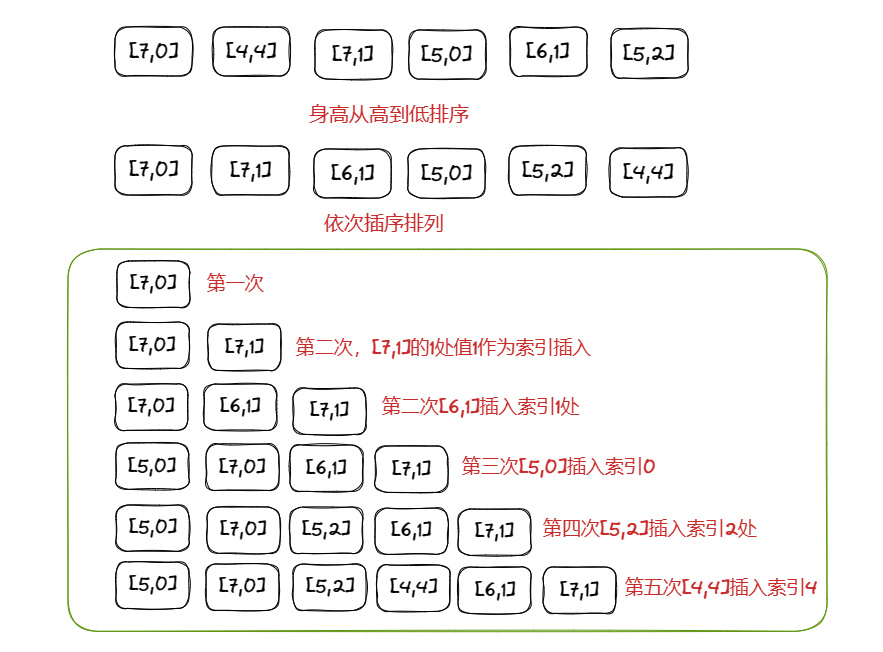

## **860. 柠檬水找零**

> 在柠檬水摊上，每一杯柠檬水的售价为 `5` 美元。顾客排队购买你的产品，（按账单 `bills` 支付的顺序）一次购买一杯。
> 
> 
> 每位顾客只买一杯柠檬水，然后向你付 `5` 美元、`10` 美元或 `20` 美元。你必须给每个顾客正确找零，也就是说净交易是每位顾客向你支付 `5` 美元。
> 
> 注意，一开始你手头没有任何零钱。
> 
> 给你一个整数数组 `bills` ，其中 `bills[i]` 是第 `i` 位顾客付的账。如果你能给每位顾客正确找零，返回 `true` ，否则返回 `false` 。
> 

```java
输入：bills = [5,5,5,10,20]
输出：true
解释：
前 3 位顾客那里，我们按顺序收取 3 张 5 美元的钞票。
第 4 位顾客那里，我们收取一张 10 美元的钞票，并返还 5 美元。
第 5 位顾客那里，我们找还一张 10 美元的钞票和一张 5 美元的钞票。
由于所有客户都得到了正确的找零，所以我们输出 true。
```

分析题目的三种情况：

1. 收到5美元，`five++`；
2. 收到10美元，`five--`；
3. 收到20美元
    
    `five--`，`ten--` ；
    
    `five-3;`
    

所以5美元的用途更多，在20美元找零的时候尽可能先消耗调10美元，在消耗5美元

```java
class Solution {
    public boolean lemonadeChange(int[] bills) {
        int five=0;
        int ten=0;
        int twenty=0;
        for(int i:bills){
            if(i==5){
                five++;
            }
            if(i==10){
                if(five>0){
                    five--;
                    ten++;
                }else{
                    return false;
                }
            }
            if(i==20){
                if(ten>0&&five>0){
                    ten--;
                    five--;
                    twenty++;
                }else if(five>=3){
                    five-=3;
                    twenty++;
                }else{
                    return false;
                }
            }
        }
        return true;

    }
}
```

## **406. 根据身高重建队列**

> 假设有打乱顺序的一群人站成一个队列，数组 `people` 表示队列中一些人的属性（不一定按顺序）。每个 `people[i] = [hi, ki]` 表示第 `i` 个人的身高为 `hi` ，前面 **正好** 有 `ki` 个身高大于或等于 `hi` 的人。
> 
> 
> 请你重新构造并返回输入数组 `people` 所表示的队列。返回的队列应该格式化为数组 `queue` ，其中 `queue[j] = [hj, kj]` 是队列中第 `j` 个人的属性（`queue[0]` 是排在队列前面的人）。
> 

```java
输入：people = [[7,0],[4,4],[7,1],[5,0],[6,1],[5,2]]
输出：[[5,0],[7,0],[5,2],[6,1],[4,4],[7,1]]
解释：
编号为 0 的人身高为 5 ，没有身高更高或者相同的人排在他前面。
编号为 1 的人身高为 7 ，没有身高更高或者相同的人排在他前面。
编号为 2 的人身高为 5 ，有 2 个身高更高或者相同的人排在他前面，即编号为 0 和 1 的人。
编号为 3 的人身高为 6 ，有 1 个身高更高或者相同的人排在他前面，即编号为 1 的人。
编号为 4 的人身高为 4 ，有 4 个身高更高或者相同的人排在他前面，即编号为 0、1、2、3 的人。
编号为 5 的人身高为 7 ，有 1 个身高更高或者相同的人排在他前面，即编号为 1 的人。
因此 [[5,0],[7,0],[5,2],[6,1],[4,4],[7,1]] 是重新构造后的队列。
```

首先考虑身高从高到低排序

其次按照k的大小作为索引进行插入



```java
class Solution {
    public int[][] reconstructQueue(int[][] people) {
        Arrays.sort(people,(a,b)->{
            if(a[0]==b[0]){
                return a[1]-b[1];   //如果相同k小的排在前面
            }
            return b[0]-a[0];    //从大到小排序
        });

        LinkedList<int[]> que=new LinkedList<>();
        //按照k的大小对数组进行插入排序
        for(int[] p:people){
            que.add(p[1],p);
        }
        return que.toArray(new int[people.length][]);

    }
}
```

## **452. 用最少数量的箭引爆气球**

> 有一些球形气球贴在一堵用 XY 平面表示的墙面上。墙面上的气球记录在整数数组 `points` ，其中`points[i] = [xstart, xend]` 表示水平直径在 `xstart` 和 `xend`之间的气球。你不知道气球的确切 y 坐标。
> 
> 
> 一支弓箭可以沿着 x 轴从不同点 **完全垂直** 地射出。在坐标 `x` 处射出一支箭，若有一个气球的直径的开始和结束坐标为 `xstart`，`xend`， 且满足  `xstart ≤ x ≤ xend`，则该气球会被 **引爆** 。可以射出的弓箭的数量 **没有限制** 。 弓箭一旦被射出之后，可以无限地前进。
> 
> 给你一个数组 `points` ，*返回引爆所有气球所必须射出的 **最小** 弓箭数* 。
> 

```java
输入：points = [[10,16],[2,8],[1,6],[7,12]]
输出：2
解释：气球可以用2支箭来爆破:
-在x = 6处射出箭，击破气球[2,8]和[1,6]。
-在x = 11处发射箭，击破气球[10,16]和[7,12]。
```

重叠处一起射所用的最少

所以我们将数组按照第一位进行排序，去判断重叠区域

解题思路：

1. 首先进行排序，按照第一位
2. 循环遍历数组，如果`points[i][0]>points[i-1][1]` 说明连个区间不挨着，就要射一箭。否则两个区间不是挨着的，求出最小右边界

```java
class Solution {
    public int findMinArrowShots(int[][] points) {
        //按照第一位排序
        Arrays.sort(points,(a,b)-> Integer.compare(a[0],b[0]));
        int count=1;
        for(int i=1;i<points.length;i++){
            if(points[i][0]>points[i-1][1]){
                //两个区间不挨着，count++；
                count++;
            }else{
                //两个区间挨着，就找出最小右边界
                points[i][1]=Math.min(points[i][1],points[i-1][1]);
            }
        }
        return count;
    }
}
```

## **435. 无重叠区间**

> 给定一个区间的集合 `intervals`，其中 `intervals[i] = [starti, endi]`。返回需要移除区间的最小数量，使剩余区间互不重叠 。
> 

```jsx
输入: intervals = [[1,2],[2,3],[3,4],[1,3]]
输出: 1
解释: 移除 [1,3] 后，剩下的区间没有重叠。
```

这道题需要我们求重叠区间，然后记录重叠区间就可以了

解题思路：

1. 设置count用来记录重叠区间
2. 将数组按照左边从小到大进行排序
3. 如果`intervals[i][0]<intervals[i-1][1]` 说明i数组和i-1数组重叠，将`count++` 记录重叠区间，然后保留最小右边界

```java
class Solution {
    public int eraseOverlapIntervals(int[][] intervals) {
        int count=0;
        Arrays.sort(intervals,(a,b)->Integer.compare(a[0],b[0]));
        for(int i=1;i<intervals.length;i++){
            if(intervals[i][0]<intervals[i-1][1]){  //重叠情况
                count++;
                intervals[i][1]=Math.min(intervals[i][1],intervals[i-1][1]);
            }
        }
        return count;
    }
}
```

## **763. 划分字母区间**

> 给你一个字符串 `s` 。我们要把这个字符串划分为尽可能多的片段，同一字母最多出现在一个片段中。
> 
> 
> 注意，划分结果需要满足：将所有划分结果按顺序连接，得到的字符串仍然是 `s` 。
> 
> 返回一个表示每个字符串片段的长度的列表。
> 

```java
输入：s = "ababcbacadefegdehijhklij"
输出：[9,7,8]
解释：
划分结果为 "ababcbaca"、"defegde"、"hijhklij" 。
每个字母最多出现在一个片段中。
像 "ababcbacadefegde", "hijhklij" 这样的划分是错误的，因为划分的片段数较少。
```

这道题的关键是找到分割点

解题思路：

1. 设置一个长度为27的数组，26个字母
2. 遍历字符串，将每个字符最后出现的位置记录到数组当中`hash[s.charAt(i)-'a']=i;` 
3. 字母的最远下标就是分割点，可以记录下来，并需要一个left结点定义开始分割的起点`right=Math.max(right,hash[s.charAt(i)-'a']);` 

```java
class Solution {
    public List<Integer> partitionLabels(String s) {
        List<Integer> reslut=new ArrayList<>();
        int[] hash=new int[27];
        //将每个字符最后出现的位置
        for(int i=0;i<s.length();i++){
            hash[s.charAt(i)-'a']=i;
        }
        int left=0;
        int right=0;
        for(int i=0;i<s.length();i++){
            right=Math.max(right,hash[s.charAt(i)-'a']);
            if(i==right){  //找到分割点
                reslut.add(right-left+1);
                left=i+1;
            }
        }
        return reslut;
    }
}
```

## **56. 合并区间**

> 以数组 `intervals`表示若干个区间的集合，其中单个区间为 `intervals[i] = [starti, endi]`。请你合并所有重叠的区间，并返回一个不重叠的区间数组，该数组需恰好覆盖输入中的所有区间。
> 

```java
输入：intervals = [[1,3],[2,6],[8,10],[15,18]]
输出：[[1,6],[8,10],[15,18]]
解释：区间 [1,3] 和 [2,6] 重叠, 将它们合并为 [1,6].
```

这道题的思路比较简单，就是需要找到重叠区间，然后将前一个区间的左区间，后后一个区间的右区间相连接构成结果，但是实际操作起来还是有些许复杂。

解题思路：

1. 定义一个list用来添加结果，后续还需要转换成int[][]输出
2. 将数组按照左边从小到大排序
3. 定义左边界和右边界，之后循环就可以从1开始
4. 遍历数组
    
    如果发现数组是重合的即`intervals[i][0]≤intervals[i-1][1]` 我们需要去更新最大的右边界`right=Math.max(right,intervals[i][1]);` 
    
    如果发现数组接下来是不重叠，我们需要将前面求出的最小左边界和最大右边界添加到结果当中
    
    然后更新左边界和右边界
    
5. 将剩余的数组添加到结果当中
6. 最后需要将list转换为数组进行返回  `reslut.toArray(new int[reslut.size()][]);`

```java
class Solution {
    public int[][] merge(int[][] intervals) {
        List<int[]> reslut=new ArrayList<>();
        //排序
        Arrays.sort(intervals,(a,b)->Integer.compare(a[0],b[0]));
        int start=intervals[0][0];   //左边界
        int right=intervals[0][1];   //右边界
        for(int i=1;i<intervals.length;i++){
            if(intervals[i][0]>right){     //返现区间没有继续重叠相连
                reslut.add(new int[]{start,right});   //按照最大左边界和右边界将其添加到结果中
                start=intervals[i][0];   //更新左边界和右边界
                right=intervals[i][1];
            }else{   //发现区间重合去更新最大右边界
                right=Math.max(right,intervals[i][1]);
            }
        }
        reslut.add(new int[]{start,right});    //把最后剩余的添加进来
        return reslut.toArray(new int[reslut.size()][]);

    }
}
```

## **738. 单调递增的数字**

> 当且仅当每个相邻位数上的数字 `x` 和 `y` 满足 `x <= y` 时，我们称这个整数是**单调递增**的。
> 
> 
> 给定一个整数 `n` ，返回 *小于或等于 `n` 的最大数字，且数字呈 **单调递增*** 。
> 

```java
输入: n = 10
输出: 9
```

这道题只需要意识到，当str[i-1]>str[i]的时候需要将str[i-1]减一操作，之后将str[i]变为9

解题思路：

1. 首先将n转为字符串数组
2. 定义一个flag用来记录需要变为9的起点
3. 从后向前遍历字符串数组
    
    当`str[i-1]>str[i]` 时更新flag值，并将`str[i-1]--;` 
    
4. 从flag开始循环到数组的最后将其数字变为9
5. 将数组转为整数

```java
class Solution {
    public int monotoneIncreasingDigits(int n) {
        String s= String.valueOf(n);
        char[] str=s.toCharArray();
        int len=str.length;
        int flag=len;
        for(int i=len-1;i>0;i--){
            if(str[i-1]>str[i]){
                flag=i;
                str[i-1]--;
            }
        }
        for(int i=flag;i<len;i++){
            str[i]='9';
        }
        return Integer.parseInt(String.valueOf(str));
    }
}
```

## **409. 最长回文串**

> 给定一个包含大写字母和小写字母的字符串 `s` ，返回 *通过这些字母构造成的 **最长的回文串*** 。
> 
> 
> 在构造过程中，请注意 **区分大小写** 。比如 `"Aa"` 不能当做一个回文字符串。
> 

```java
输入:s = "abccccdd"
输出:7
解释:
我们可以构造的最长的回文串是"dccaccd", 它的长度是 7。
```

这道题不需要考虑是否是回文字符，只需要考虑到字符出现的个数就可以了，如果出现偶数那一定可以，如果是奇数减一即可。

解题思路：

1. 定义一个数组用来存放字符出现的次数，考虑有大小写所以尽可能大一点
2. 将字符串转为字符数组，并定义一个变量用来保存最长个数
3. 遍历字符数组，存放其出现的个数
4. 遍历数组用来确定最长大小，如果是偶数直接加进去，如果是奇数需要减一相加，但是循环的外层我们还需要再加上一个可以放到最中间。
5. 返回结果

```java
class Solution {
    public int longestPalindrome(String s) {
        int[] count=new int[128];
        int maxLength=0;
        char[] str=s.toCharArray();
        for(char c:str){
            count[c]++;
        }
        Boolean flag=false;
        for(int i:count){
            if(i%2==0){
                maxLength+=i;
            }else{
                maxLength+=(i-1);
                flag=true;
            }
        }
        if(flag){
            maxLength++;
        }
        return maxLength;
    }
}
```
