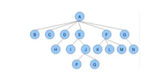
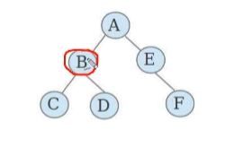
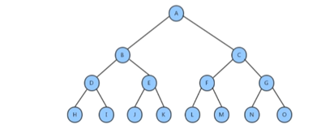
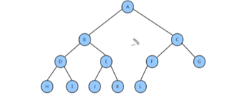

## 二叉树理论基础

- 树的基本定义

树是由n个有限节点组成一个具有层次关系的集合



树具有的特点：

- 每个结点有零个或多个结点
- 没有父节点的结点为根结点
- 每一个非根结点只有一个父节点
- 每个结点及其后代结点整体上可以看做是一棵树，称为当前节点的父节点的一个子树
- 树的相关术语

结点的度：一个节点含有子树的个数

叶节点：度为0的结点称为叶节点，也叫终端节点

分支节点：度不为0的结点

结点的层次：从根节点开始，根节点的层次为1，根后的结点层次为2。。

节点的层序编号：将树种的结点，按照从上层到下层，同层从左到右的次序排成一个线性序列

树的度：树中结点的度的最大值

树的高度：树中结点的最大层次

森林：m个互不相交的树的集合，将一颗非空树的根节点删去，树就变成了一个森林；给森林增加一个统一的根节点，森林就变成了一棵树

孩子结点：一个结点的直接后续结点

双亲结点：一个结点的直接前驱

- 二叉树

二叉树的度不超过2



满二叉树：每一层的结点树都达到最大值，则这个二叉树就是满二叉树



完全二叉树：叶节点只能出现在最下层和次下层，并且最下面一层的节点都集中在改成最左边的若干位置



•  二叉查找树的创建

插入put()：

如果新结点的key小于当前结点的key，则继续找当前结点的左子结点

如果新结点的key大于当前结点的key，则继续找当前结点的右子结点

如果新结点的key等于当前结点的key，则树中已存在，替换value

查询get()：

如果查询的key小于当前结点的key，则继续找到当前结点的左子结点

如果查询的key大于当前结点的key，则继续找到当前结点的右子结点

如果查询的key等于当前结点的key，则树中返回当前结点的value

删除delete()：

- 找到被删除结点
- 找到被删除结点右子树中的最小节点minNode
- 删除右子结点的左子树称为最小节点minNode的左子树，让被删除的右子树称为最小结点minNode的右子树
- 让被删除结点的父节点指向最小结点minNode

•  二叉树的基础遍历（深度优先）

- 前序遍历

先访问结点，然后访问左子树，最后访问右子树

- 中序遍历

先访问左子树，中间访问根节点，最后访问右节点

- 后序遍历

先访问左子树，在访问右子树，最后访问根节点

- 层序遍历（广度优先）

从根节点开始，依次向下，获取每一层所有结点的值（从上到下，从左到右）

- 二叉树最大深度问题

给定一棵树，计算树的最大深度

一棵深度（按根节点深度为1）为k的二叉树最多可以有 2^k - 1 个节点

- 二叉树的定义
    
    ```java
    public class TreeNode {
        int val;
      	TreeNode left;
      	TreeNode right;
      	TreeNode() {}
      	TreeNode(int val) { this.val = val; }
      	TreeNode(int val, TreeNode left, TreeNode right) {
        		this.val = val;
        		this.left = left;
        		this.right = right;
      	}
    }
    ```
    

## 二叉树的递归遍历

### **144. 二叉树的前序遍历**

> 给你二叉树的根节点 `root`，返回它节点值的 **前序** **遍历。
> 

```java
输入：root = [1,null,2,3]
输出：[1,2,3]
```

前序遍历：中左右

```java
class Solution {
    public List<Integer> preorderTraversal(TreeNode root) {
        List<Integer> result=new ArrayList<>();
        preorder(root,result);
        return result;
    }

    public void preorder(TreeNode root,List<Integer> reslut){
        if(root==null){
            return;
        }
        reslut.add(root.val);
        preorder(root.left,reslut);
        preorder(root.right,reslut);
    }
}
```

**递归三要素：**

1. **确定递归函数的参数和返回值：** 确定哪些参数是递归的过程中需要处理的，那么就在递归函数里加上这个参数， 并且还要明确每次递归的返回值是什么进而确定递归函数的返回类型。
2. **确定终止条件：** 写完了递归算法, 运行的时候，经常会遇到栈溢出的错误，就是没写终止条件或者终止条件写的不对，操作系统也是用一个栈的结构来保存每一层递归的信息，如果递归没有终止，操作系统的内存栈必然就会溢出。
3. **确定单层递归的逻辑：** 确定每一层递归需要处理的信息。在这里也就会重复调用自己来实现递归的过程。

### **145. 二叉树的后序遍历**

> 给你一棵二叉树的根节点 `root`，返回其节点值的 **后序遍历** 。
> 

```java
输入：root = [1,null,2,3]
输出：[3,2,1]
```

后序遍历：左右中

```java
class Solution {
    public List<Integer> postorderTraversal(TreeNode root) {
        List<Integer> reslut=new ArrayList<>();
        postorder(root,reslut);
        return reslut;
    }
    public void postorder(TreeNode root,List<Integer> reslut){
        if(root==null){
            return;
        }
        postorder(root.left,reslut);
        postorder(root.right,reslut);
        reslut.add(root.val);
    }
}
```

### **94. 二叉树的中序遍历**

> 给定一个二叉树的根节点 `root`，返回 *它的 **中序** 遍历*
> 

```java
输入：root = [1,null,2,3]
输出：[1,3,2]
```

中序遍历左中右

```java
class Solution {
    public List<Integer> inorderTraversal(TreeNode root) {
        List<Integer> reslut=new ArrayList<>();
        inorder(root,reslut);
        return reslut;
    }
    public void inorder(TreeNode root,List<Integer> reslut){
        if(root==null){
            return;
        }
        inorder(root.left,reslut);
        reslut.add(root.val);
        inorder(root.right,reslut);
    }
}
```

## 二叉树的迭代遍历

### **144. 二叉树的前序遍历**

入栈顺序：中——右——左

```java
class Solution {
    public List<Integer> preorderTraversal(TreeNode root) {
        List<Integer> result = new ArrayList<>();
        if (root == null){
            return result;
        }
        Stack<TreeNode> stack = new Stack<>();
        stack.push(root);
        while (!stack.isEmpty()){
            TreeNode node = stack.pop();
            result.add(node.val);
            if (node.right != null){
                stack.push(node.right);
            }
            if (node.left != null){
                stack.push(node.left);
            }
        }
        return result;
    }
}
```

### **145. 二叉树的后序遍历**

后序遍历和前序遍历类似，入栈顺序：中——左——右，出栈顺序：中——右——左(反转即可)

```java
class Solution {
    public List<Integer> postorderTraversal(TreeNode root) {
        List<Integer> result = new ArrayList<>();
        if (root == null){
            return result;
        }
        Stack<TreeNode> stack = new Stack<>();
        stack.push(root);
        while (!stack.isEmpty()){
            TreeNode node = stack.pop();
            result.add(node.val);
            if (node.left != null){
                stack.push(node.left);
            }
            if (node.right != null){
                stack.push(node.right);
            }
        }
        Collections.reverse(result);
        return result;
    }
}
```

### **94. 二叉树的中序遍历**

入栈顺序：左——右

```java
class Solution {
    public List<Integer> inorderTraversal(TreeNode root) {
        List<Integer> result = new ArrayList<>();
        if (root == null){
            return result;
        }
        Stack<TreeNode> stack = new Stack<>();
        TreeNode cur = root;
        while (cur != null || !stack.isEmpty()){
           if (cur != null){
               stack.push(cur);
               cur = cur.left;
           }else{
               cur = stack.pop();
               result.add(cur.val);
               cur = cur.right;
           }
        }
        return result;
    }
}
```

## 二叉树的统一迭代(简单了解)

要处理的节点放入栈之后，紧接着放入一个空指针作为标记


## **102. 二叉树的层序遍历**

> 给你二叉树的根节点 `root`，返回其节点值的 **层序遍历**。 （即逐层地，从左到右访问所有节点）。
> 

```java
输入：root = [3,9,20,null,null,15,7]
输出：[[3],[9,20],[15,7]]
```

对于二叉树的层序遍历，需要借用一个辅助数据结构即队列来实现，队列先进先出，符合一层一层遍历的逻辑，而用栈先进后出适合模拟深度优先遍历也就是递归的逻辑。

解题思路：

1. 定义一个二维列表用来存储最终结果
2. 定义队列
3. 将root添加到队列当中
4. 如果队列不为空，设置一个一维列表用来存储二叉树每一层的遍历结果，计算二叉树的层数，每一层分别去遍历，从左往右

```java
class Solution {
    public List<List<Integer>> levelOrder(TreeNode root) {
        List<List<Integer>> reslut=new ArrayList<>();
        Deque<TreeNode> que=new LinkedList<>();
        if(root==null){
            return reslut;
        }
        que.offer(root);
        while(!que.isEmpty()){
            List<Integer> res=new ArrayList<>();
            int size=que.size();
            while(size>0){
                TreeNode node=que.poll();
                res.add(node.val);
                if(node.left!=null){
                    que.offer(node.left);
                }
                if(node.right!=null){
                    que.offer(node.right);
                }
                size--;
            }
            reslut.add(res);
        }
        return reslut;

    }
}
```

## **107. 二叉树的层序遍历 II**

> 给你二叉树的根节点 `root`，返回其节点值 **自底向上的层序遍历**。 （即按从叶子节点所在层到根节点所在的层，逐层从左向右遍历）
> 

```java
输入：root = [3,9,20,null,null,15,7]
输出：[[15,7],[9,20],[3]]
```

107和102类似，思路可以使将结果保存到链表当中，依旧按照层序遍历，但是每一层的结果都加到链表的最前面

`LinkedList<List<Integer>> result=new LinkedList<>();`

```java
class Solution {
    public List<List<Integer>> levelOrderBottom(TreeNode root) {
        LinkedList<List<Integer>> result=new LinkedList<>();
        Deque<TreeNode> deq=new LinkedList<>();
        if(root==null){
            return result;
        }
        deq.offer(root);
        while(!deq.isEmpty()){
            List<Integer> res=new ArrayList<>();
            int size=deq.size();
            for(int i=0;i<size;i++){
                TreeNode node=deq.poll();
                res.add(node.val);
                if(node.left!=null){
                    deq.offer(node.left);
                }
                if(node.right!=null){
                    deq.offer(node.right);
                }
            }
            result.addFirst(res);
        }
        return result;

    }
}
```

## **199. 二叉树的右视图**

> 给定一个二叉树的 **根节点** `root`，想象自己站在它的右侧，按照从顶部到底部的顺序，返回从右侧所能看到的节点值。
> 

```java
输入: [1,2,3,null,5,null,4]
输出: [1,3,4]
```

这道题主要要判断每一层的最后一个元素，将其添加到结果列表当中

```java
class Solution {
    public List<Integer> rightSideView(TreeNode root) {
        List<Integer> reslut=new ArrayList<>();
        Deque<TreeNode> deq=new LinkedList<>();
        if(root==null){
            return reslut;
        }
        deq.offer(root);
        while(!deq.isEmpty()){
            int size=deq.size();
            while(size>0){
                TreeNode node=deq.poll();
                if(node.left!=null){
                    deq.offer(node.left);
                }
                if(node.right!=null){
                    deq.offer(node.right);
                }
                if(size==1){
                    reslut.add(node.val);
                }
                size--;
            }
        }
        return reslut;

    }
}
```

## **637. 二叉树的层平均值**

> 给定一个非空二叉树的根节点 `root` , 以数组的形式返回每一层节点的平均值。与实际答案相差 `10-5`以内的答案可以被接受。
> 

```java
输入：root = [3,9,20,null,null,15,7]
输出：[3.00000,14.50000,11.00000]
```

将每一层的元素均相加，但是这里要注意除的size需要提前备份，不然每次while循环在减少

```java
class Solution {
    public List<Double> averageOfLevels(TreeNode root) {
        List<Double> reslut=new ArrayList<>();
        Deque<TreeNode> deq=new LinkedList<>();
        if(root==null){
            return reslut;
        }
        deq.offer(root);
        while(!deq.isEmpty()){
            int size=deq.size();
            int len=size;
            double temp=0.0;
            while(len-->0){
                TreeNode node=deq.poll();
                temp+=node.val;
                if(node.left!=null){
                    deq.offer(node.left);
                }
                if(node.right!=null){
                    deq.offer(node.right);
                }
            }
            reslut.add(temp/size);
        }
        return reslut;
    }
}
```

## **429. N 叉树的层序遍历**

> 给定一个 N 叉树，返回其节点值的*层序遍历*。（即从左到右，逐层遍历）。
> 
> 
> 树的序列化输入是用层序遍历，每组子节点都由 null 值分隔（参见示例）。
> 

```java
输入：root = [1,null,3,2,4,null,5,6]
输出：[[1],[3,2,4],[5,6]]
```

这道题的不同点在于，每个结点有N个子结点，所以需要遍历结点里面的所有子结点

```java
class Solution {
    public List<List<Integer>> levelOrder(Node root) {
        List<List<Integer>> reslut=new ArrayList<>();
        Deque<Node> que=new LinkedList<>();
        if(root==null){
            return reslut;
        }
        que.offer(root);
        while(!que.isEmpty()){
            List<Integer> res=new ArrayList<>();
            int size=que.size();
            while(size-->0){
                Node cur=que.poll();
                res.add(cur.val);
                for(Node next:cur.children){
                    que.offer(next);
                }

            }
            reslut.add(res);
        }
        return reslut;
        
    }
}
```

## ****515.在每个树行中找最大值****

> 给定一棵二叉树的根节点 `root`，请找出该二叉树中每一层的最大值。
> 

```java
输入: root = [1,3,2,5,3,null,9]
输出: [1,3,9]
```

```java
class Solution {
    public List<Integer> largestValues(TreeNode root) {
        List<Integer> reslut=new ArrayList<>();
        Deque<TreeNode> que=new LinkedList<>();
        if(root==null){
            return reslut;
        }
        que.offer(root);
        while(!que.isEmpty()){
            int size=que.size();
            int max=que.getFirst().val;
            while(size-->0){
                TreeNode node=que.poll();
                max=Math.max(max,node.val);
                if(node.left!=null){
                    que.offer(node.left);
                }
                if(node.right!=null){
                    que.offer(node.right);
                }
            }
            reslut.add(max);
        }
        return reslut;
    }
}
```

## ****104.二叉树的最大深度****

> 给定一个二叉树，找出其最大深度。
> 
> 
> 二叉树的深度为根节点到最远叶子节点的最长路径上的节点数。
> 

```java
class Solution {
    public int maxDepth(TreeNode root) {
        Deque<TreeNode> que=new LinkedList<>();
        if(root==null){
            return 0;
        }
        que.offer(root);
        int depth=0;
        while(!que.isEmpty()){
            int size=que.size();
            while(size-->0){
                TreeNode node=que.poll();
                if(node.left!=null){
                    que.offer(node.left);
                }
                if(node.right!=null){
                    que.offer(node.right);
                }
            }
              depth++;
            
        }
        return depth;
    }
}
```

## **111. 二叉树的最小深度**

> 给定一个二叉树，找出其最小深度。
> 
> 
> 最小深度是从根节点到最近叶子节点的最短路径上的节点数量。
> 

```java
输入：root = [3,9,20,null,null,15,7]
输出：2
```

和求最大深度相比，最小深度需要判断node的左右节点均为空。

```java
class Solution {
    public int minDepth(TreeNode root) {
        Deque<TreeNode> que=new LinkedList<>();
        if(root==null){
            return 0;
        }
        que.offer(root);
        int depth=0;
        while(!que.isEmpty()){
            int size=que.size();
            depth++;
            while(size-->0){
                TreeNode node=que.poll();
                if(node.left==null&&node.right==null){
                    return depth;
                }
                if(node.left!=null){
                    que.offer(node.left);
                }
                if(node.right!=null){
                    que.offer(node.right);
                }
            }
        }
        return depth;

    }
}
```

## **116. 填充每个节点的下一个右侧节点指针**

> 给定一个 **完美二叉树** ，其所有叶子节点都在同一层，每个父节点都有两个子节点。
> 
> 
> 填充它的每个 next 指针，让这个指针指向其下一个右侧节点。如果找不到下一个右侧节点，则将 next 指针设置为 `NULL`。
> 
> 初始状态下，所有 next 指针都被设置为 `NULL`。
> 

```java
输入：root = [1,2,3,4,5,6,7]
输出：[1,#,2,3,#,4,5,6,7,#]
```

在遍历的过程中修改每个节点的 next\text{next}next 指针，同时拓展下一层的新队列。

```java
class Solution {
    public Node connect(Node root) {
         if(root==null) return root;
        Deque<Node> deq=new LinkedList<>();
        deq.offer(root);
        while(!deq.isEmpty()){
            int size=deq.size();
            for(int i=0;i<size;i++){
                Node node=deq.poll();
                if(i<size-1){
                    node.next=deq.peek();
                }
                if(node.left!=null){
                    deq.offer(node.left);
                }
                if(node.right!=null){
                    deq.offer(node.right);
                }
            }
        }
        return root;
    }
}
```

## **117. 填充每个节点的下一个右侧节点指针 II**

> 填充它的每个 next 指针，让这个指针指向其下一个右侧节点。如果找不到下一个右侧节点，则将 next 指针设置为 `NULL` 。
> 

```java
输入：root = [1,2,3,4,5,null,7]
输出：[1,#,2,3,#,4,5,7,#]
```

```java
class Solution {
    public Node connect(Node root) {
         Queue<Node> que=new LinkedList<>();
        if(root==null) return root;
        que.offer(root);
        while(!que.isEmpty()) {
            int size = que.size();
            for(int i=0;i<size;i++){
                Node node=que.poll();
                if(i==size-1){
                    node.next=null;
                }else{
                    Node new1=que.peek();
                    node.next=new1;
                }
                if(node.left!=null) que.offer(node.left);
                if(node.right!=null) que.offer(node.right);
            }
        }
        return root;
    }
}
```

## **226. 翻转二叉树**

> 给你一棵二叉树的根节点 `root`，翻转这棵二叉树，并返回其根节点。
> 

```java
输入：root = [4,2,7,1,3,6,9]
输出：[4,7,2,9,6,3,1]
```

思路一：BFS

```java
class Solution {
    public TreeNode invertTree(TreeNode root) {
        Deque<TreeNode> deq=new LinkedList<>();
        if(root==null) return root;
        deq.offer(root);
        while(!deq.isEmpty()){
            int size=deq.size();
            while(size-->0){
                TreeNode node=deq.poll();
                swap(node);
                if(node.left!=null) deq.offer(node.left);
                if(node.right!=null) deq.offer(node.right);
            }
        }
        return root;
    }
    public void swap(TreeNode root){
        TreeNode temp=root.left;
        root.left=root.right;
        root.right=temp;
    }
}
```

思路二：递归

```java
class Solution {
   public TreeNode invertTree(TreeNode root) {
        if(root==null) return root;
        invertTree(root.left);
        invertTree(root.right);
        swap(root);
        return root;
    }
    public void swap(TreeNode root){
        TreeNode temp=root.left;
        root.left=root.right;
        root.right=temp;
    }
}
```

## **101. 对称二叉树**

> 给你一个二叉树的根节点 `root`， 检查它是否轴对称。
> 

```java
输入：root = [1,2,2,3,4,4,3]
输出：true
```

思路一：递归

将root的左右节点分别进行递归比较

```java
class Solution {
    public boolean isSymmetric(TreeNode root) {
        return comparable(root.left,root.right);
    }
    public boolean comparable(TreeNode left,TreeNode right){
        if (left == null && right != null) {
            return false;
        }
        if (left != null && right == null) {
            return false;
        }

        if (left == null && right == null) {
            return true;
        }
        if (left.val != right.val) {
            return false;
        }
        boolean ouside=comparable(left.left,right.right);
        boolean inside=comparable(left.right,right.left);
        return ouside&&inside;
    }
}
```

思路二：BFS

```java
class Solution {
   public boolean isSymmetric(TreeNode root) {
        return compara(root,root);
    }
    public boolean compara(TreeNode root1,TreeNode root2){
        Deque<TreeNode> deq=new LinkedList<>();
        deq.offer(root1);
        deq.offer(root2);
        while(!deq.isEmpty()){
            root1=deq.poll();
            root2=deq.poll();
            if(root1==null&&root2==null){
                continue;
            }
            if((root1==null||root2==null)||(root1.val!=root2.val)){
                return false;
            }
            deq.offer(root1.left);
            deq.offer(root2.right);
            deq.offer(root1.right);
            deq.offer(root2.left);
        }
        return true;
    }
}
```

