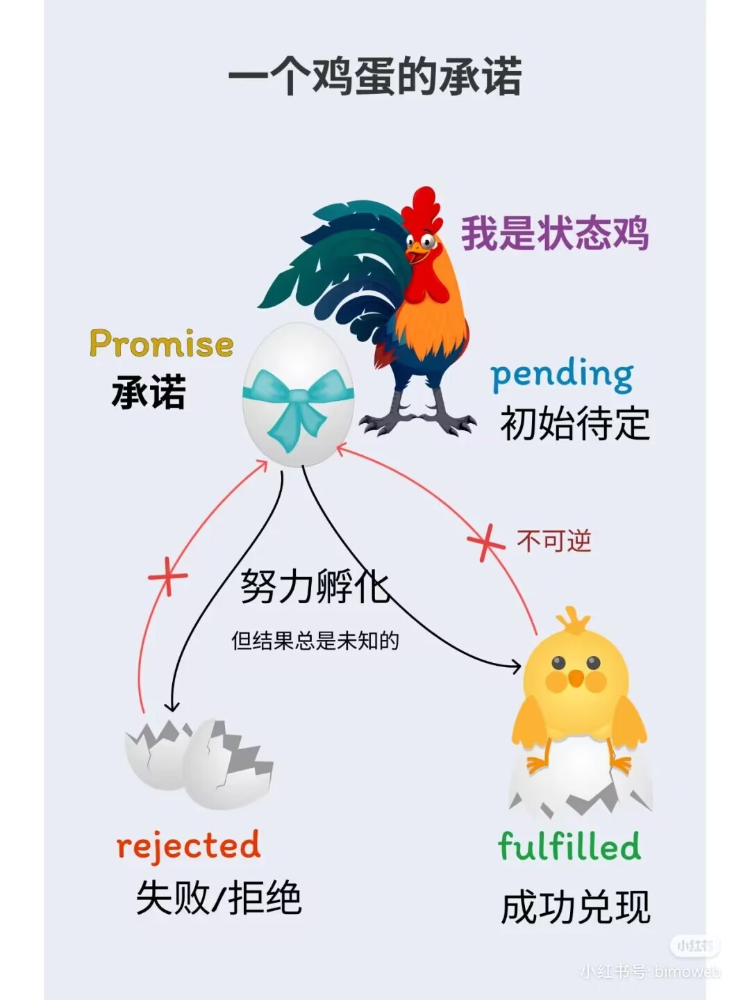

Promise是一种为了避免地狱回调的异步解决方案

Promise是一种状态机：Pending（进行中）、fulfilled（已成功）、rejected（已失败）只有异步操作的结果，可以决定当前是哪一种状态，任何其他操作都无法改变这个状态

> 回调地狱：回调函数中嵌套回调函数的情况；回调地狱就是为实现代码顺序执行而出现的一种操作，造成代码可读性差，后期不好维护
> 
## Promise是什么

Promise最早由社区提出和实现的一种解决异步编程的方案，比其他传统的解决方案(回调函数和事件)更合理和强大

ES6将其写进标准语言，提供原生Promise对象，**ES6规定Promise对象是一个构造函数**，用来生成Promise实例

## Promise是为解决什么问题而产生的*

为了解决异步处理回调地狱问题而产生的

## Promise的两个特点

①Promise对象的状态不受外界影响

pending  初始状态

fulfilled  成功状态

rejected  失败状态

以上三种状态只有**异步操作的结果可以决定当前状态**，其他操作都无法改变当前状态

②Promise状态一旦改变，就不会再改变，**状态不可逆**（底层promise构造函数中会判断当前是否是pending进行中状态，不是就会终止代码），并且只能由pengding——fulfilled或者pending——rejected

## Promise的缺点

①无法取消Promise，一旦建立就会立即执行，无法中途取消

②如果不设置回调函数，Promise内部抛出的错误，不会反映到外部

③当处于pending状态时，无法得知目前进展到哪一个阶段，是刚开始还是即将完成

## Promise在哪里存放成功回调序列和失败回调序列

①onResolveedCallbacks 成功后要执行的回调序列 是一个数组

②onRejectedCallbacks 失败后要执行的回调序列 是一个数组

以上数组存放在Promise创建实例时给Promise这个类传的函数中，默认为空

①每次实例.then()的时候，传入onFulfilled(成功回调)或者onRejected(失败回调)；

②但是如果此时的状态是pending，则将onFulfilled或者onRejected   push到相应的成功回调序列数组和失败回调序列数组中；

③如果此时状态是fulfilled，则onFulfilled立即执行

④如果此时状态是rejectd，则onRjected立即执行