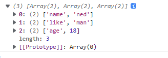

## 遍历数组的方法
- for循环

```jsx
let arr = ['a', 'b', 'c', 'd', 'e', 'f'];
for (let i = 0; i < arr.length; i++) {
      console.log(arr[i]);
}
```

- forEach循环

```jsx
arr.forEach((item, index) => {
    console.log(index + "=>" + item);
})
//index为索引,item为索引对应的值
```

- for of遍历

```jsx
for (const key of arr) {
     console.log(key);
}
```

- map   其中数组.map()会返回一个新数组，数组的大小跟原始数组一样，数组元素是函数返回的结果

```jsx
let newArr_map = arr.map((item, key) =>{
      console.log(item)
})
//key为索引,item为key索引对应的值
```

## 遍历对象的方法
- for….in

```jsx
let obj = {
    name:"ned",
    like:"man",
    age:18
}

for(item in obj){
    console.log(item);
}
```

- Object.keys()  方法可以遍历到所有对象本身的可枚举属性，但是其返回值为数组

```jsx
console.log(Object.keys(obj));
//['name', 'like', 'age']
```

- Object.values()   属性值

```jsx
console.log(Object.values(obj));
//['ned', 'man', 18]
```

- Object.entries()返回值为`Object.values()`与`Object.keys()`的结合

```jsx
console.log(Object.entries(obj));
```

