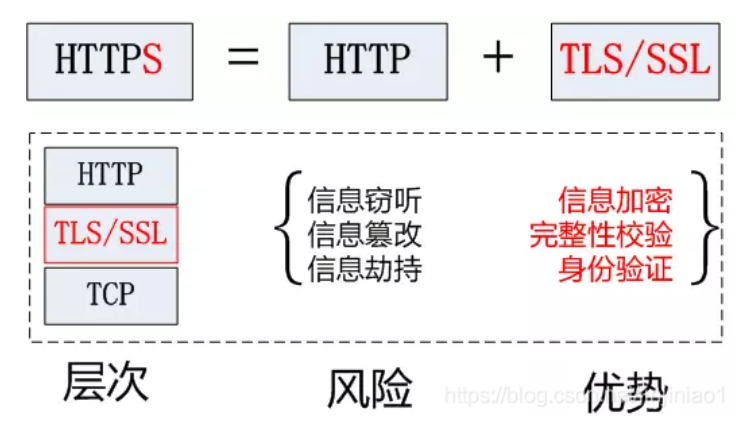
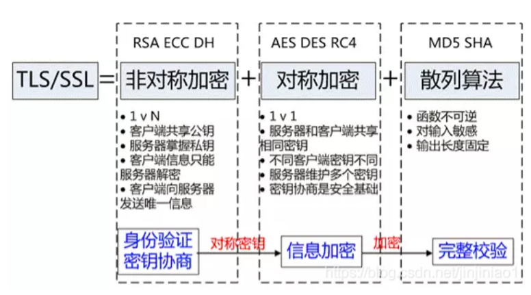
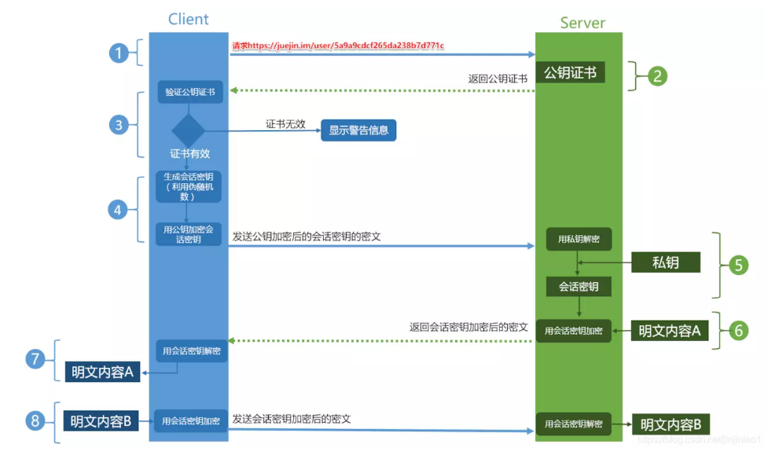

## **什么是HTTPS**

HTTPS是在HTTP上建立SSL加密层，并对传输数据进行加密，是HTTP协议的安全版

HTTPS主要作用：

1. 对数据进行加密并建立一个信息安全通道，并保证传输过程中的数据安全

2. 对网站服务器进行真实身份认证

## **为什么需要HTTPS**

在HTTP协议中有可能存在信息窃取或身份伪装等安全问题。

HTTP协议存在的问题：

1. 通信使用明文(不加密)，内容可能被窃听

2. 无法证明报文的完整性，所以可能被篡改

3. 不验证通信方的身份，因此有可能遭遇伪装

## **HTTPS如何解决HTTP上述问题**

通常HTTP直接和TCP通信。当使用SSL时则演变成先和SSL通信，再由SSL和TCP通信，所谓HTTPS，其实就是**身披SSL协议这层外壳的HTTP**

HTTPS协议主要功能基于都依赖于TLS/SSL协议，TLS/SSL的功能实现主要依赖于三类基本算法：**散列函数、对称加密和非对称加密**，其利用非对称加密实现身份认证和秘钥协商，对称加密算法采用协商的秘钥对数据加密，基于散列函数验证信息的完整性

## **HTTPS工作流程**

1. client发起一个HTTPS的请求，根据RFC2818规定，Client知道需要连接Server的443默认端口

2. Server把事先配置好的公钥证书，返回给客户端

3. Client验证公钥证书，验证通过则继续，不通过则显示警告信息

4. Clinet使用伪随机数生成器生成加密所使用的对称秘钥，用证书的公钥加密这个对称秘钥发送给Server

5. Server使用自己的私钥解密这个消息，得到对称秘钥。至此，client和server双方都持有了相同的对称秘钥

6. Server使用对称秘钥加密“明文内容A”，发送给Client

7. Client使用对称秘钥响应密文，得到“明文内容A”

8. Client再次发起HTTPS请求，使用对称秘钥加密请求”明文B”，然后server使用对称秘钥解密密文，得到“明文内容B”

## **HTTP和HTTPS的区别**

1. HTTP是明文传输协议，HTTPS协议是由SSL+HTTP协议构建的可进行加密传输，身份认证的网络协议，比HTTP协议更安全

2. HTTPS比HTTP更加安全，对搜素引擎更加友好，利于SEO

3. HTTPS需要SSL证书，而HTTP不用

4. HTTPS基于传输层，HTTP基于应用层

5. HTTPS在浏览器中显示安全锁，HTTP没有

## **对HTTP理解**

HTTP是超文本传输协议，规定客户端和服务端通信技术，由请求和响应两部分组成

状态码：

200 成功  201 成功并且服务器创建了新数据

301 站内跳转 302 站外跳转 304 浏览器缓存

400 你传递给后端的参数 401 密码错误 403 没有权限 404 文件不存在 405 请求方式有误

500 服务器有误

