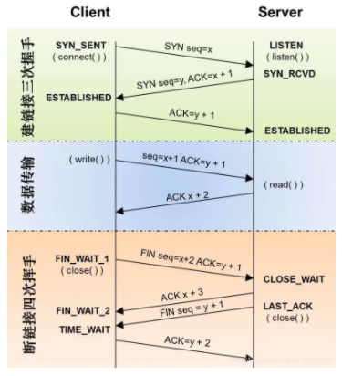

## 三次握手

为了对每次发送的数据进行跟踪与协商，确保数据段的发送和同步接收，根据所接收到的数据量而确认数据发送、接收完毕后何时撤销联系，并建立虚连接。

TCP协议位于传输层，作用是提供可靠的字节流服务，为了准确无误地将数据送达目的地，TCP协议采用三次握手策略。

第一次握手：客户端发送一个**带有SYN(synchronize)标志的数据包**给服务器

第二次握手：服务端连接成功后，回传一个**带有SYN/ACK标志的数据包传递确认信息**，表示我收到了

第三次握手：客户端回传一个**带有ACK标志的数据包**，表示我知道了，握手结束

SYN：发起一个新链接  （请求连接标志）

ACK：确认序号有效   （确认报文）

FIN：释放一个连接

**TCP为什么是三次握手：**

如果是两次握手，当客户端的SYN请求连接在网络中阻塞，客户端没有接收到ACK报文，就会重新发送SYN。重复发送多次SYN报文，那么服务器在收到请求后就会建立多个荣誉的无效链接，造成资源浪费。

## 四次挥手

第一次挥手：客户端发送一个FIN，用来关闭客户端的服务端的数据传送，客户端进入FIN_WAIT_1状态

第二次挥手：服务端收到FIN，发送ACK给客户端，服务端进行CLOSE_WAIT状态

第三次挥手：服务端发送一个FIN，用来关闭服务器端到客户端的数据传送，服务器进去LAST_ACK状态

第四次挥手：客户端收到FIN后，客户端进入TIME_WAIT状态，接着发送一个ACK给Server，服务器进去CLOSED状态，完成四次挥手

FIN_WAIT_1状态：等待远端TCP 的连接终止请求，或者等待之前发送的连接终止请求的确认。

CLOSE_WAIT状态：等待本地用户的连接终止请求。

LAST_ACK状态：1.等待先前发送给远端TCP 的连接终止请求的确认
CLOSED状态：不在连接状态

四次挥手是因为FIN释放连接报文与ACK确认接受报文分别是由第二次和第三次传输的。

ACK和FIN的触发时机是不同的，服务器在收到FIN报文可以立即发送ACK报文，表明服务器收到了报文，但是服务器想到发送FIN报文需要等到处理完接收缓存区的数据后才可以。