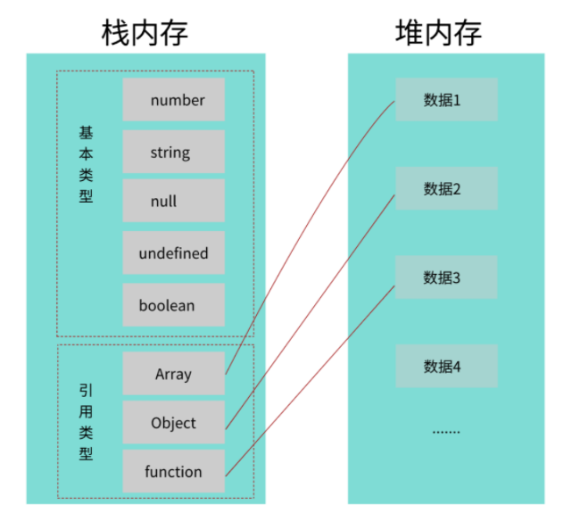
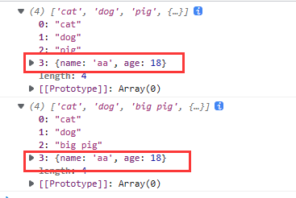

首先复习一下js的数据类型，分为两类：基本数据类型(Number String Boolean null undefined Symbol)和引用数据类型(Array Object function)。其中前者存储在栈内存当中，后者是将其地址存储到栈内存当中，而真实数据存储在堆内存中。



## **拷贝对象为基本数据类型**

在赋值的过程都是浅拷贝，`let a=10;b=a;` 当a发生改变并不会改变b的值

## **拷贝对象中有引用数据类型**

浅拷贝：会在栈中开辟一块空间，将拷贝对象的栈内存数据完全拷贝到该块空间中，即**基本数据类型的值会被完全拷贝**，而**引用类型的值则拷贝到指向的堆内存地址**

深拷贝：不仅会在栈中开辟空间，若被拷贝对象中有引用类型，则还会在**堆内存中开辟另一块空间存储引用类型的真实数据**

> 浅拷贝是拷贝一层，基本数据类型的真实值和引用类型指向堆内存的地址                                            深拷贝是递归拷贝深层次，在堆中开辟地址拷贝引用对象类型的真实数据
> 
### JS中的深浅拷贝

1. 浅拷贝

使用slice( )：

```jsx
let arr1 = [1, 42, [3, 4]]
let arr1Copy = arr1.slice()
arr1Copy[0] = 10
arr1Copy[2][0] = 100
console.log(arr1) // [1, 42, [100, 4]]
console.log(arr1Copy) // [10, 42, [100, 4]]
```

解释：在arr1中元素1为基本数据类型，所以可以通过浅拷贝改变其值，但是[3,4]为数组是引用数据类型，arr1和arr1Copy指向同一块堆内存地址，所以arr1Copy发生改变两个变量都会变化

使用concat(  ):

```jsx
let arr2 = ['cat', 'dog', 'pig', {'name': 'xia', 'age': 18}]
let arr2Copy = [].concat(arr2)
arr2Copy[2] = 'big pig'
arr2Copy[3]['name'] = 'aa'
console.log(arr2)
console.log(arr2Copy)
```



1. 深拷贝

使用JSON.parse(JSON.stringify(obj))

- JSON.stringfy( )将对象序列化成json对象
- JSON.parse( )反序列化：将json对象反序列化为js对象

```jsx
//JSON.stingify(obj)将js中的对象转换成JSON字符串
let jack = {
     name: 'jack'
 }
 console.log(jack)//{name:"jack"}  结果是对象
 console.log(JSON.stringify(jack)) //{"name":"jack"}   结果是json字符串

//JSON.parse()将json字符串解析成对象
let obj = {
     name: 'xiaoming'
 }
 console.log('obj: ', obj)
 console.log('json string: ', JSON.stringify(obj))  //{"name":"xiaoming"}

 let str = JSON.stringify(obj)
 console.log('--------------')
 console.log(str)
 console.log('str to obj: ', JSON.parse(str))
```