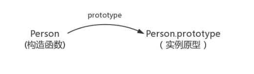
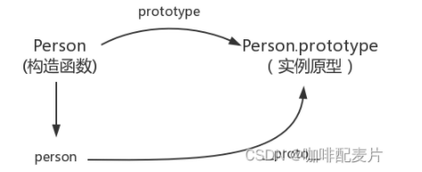
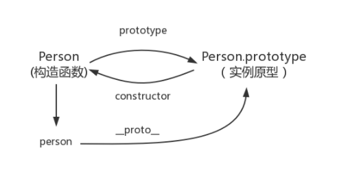
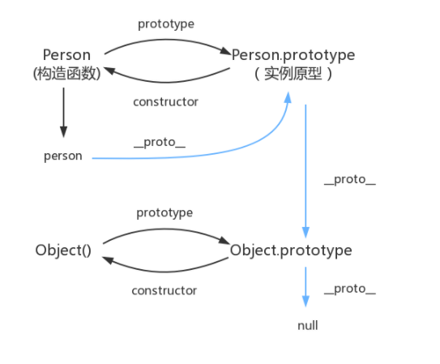

## 什么是原型链

原型组成的链，对象都_proto_它的是原型，而原型也是一个对象，也有_proto_属性。原型的_proto_又是原型的原型，一直通过_proto_向上找，就是原型链，当找到Object的原型时，就找到了尽头。

## 原型对象和实例之间有什么作用

通过一个构造函数创建出来多个实例，如果都需要添加一个方法，给每个实例添加很麻烦，所以可以通过在实例的原型上添加一个方法，这个原型的所有实例就会都有了该方法。

## prototype

prototype属性它是函数所独有的，**它是从一个函数指向一个对象(原型对象)**。含义是函数的原型对象(即这个函数所创建实例的原型对象)，这个属性是一个指针，指向一个对象(这个对象的用途就是包含所有实例共享的属性和方法，即原型对象)

## proto

proto是原型链查询中实际用到的，指向prototype，即指向构造函数的原型对象(是**对象独有的**)

## constructor

每个函数都有一个原型对象，该对象都有一个constructor属性，指向创建对象的函数本身(指向该关联的构造函数)

所有的实例对象都可以访问constructor属性，constructor属性是创建实例对象函数的引用

**总结构造函数、原型和实例的关系：**

每个构造函数都有一个原型对象，原型对象包含一个指向构造函数的指针(constructor)，而每个实例都包含一个指向原型对象的内部指针(prototype)。

如果让原型对象等于另一个类型的实例，此时原型对象将包含一个指向另一个原型的指针(proto)相应的另一个原型也包含一个指向另外一个构造函数的指针。依上层层递进，就构成了实例与原型链。

