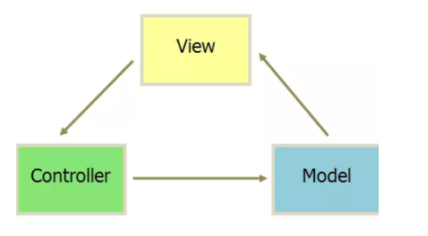
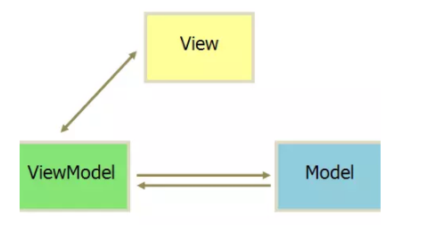
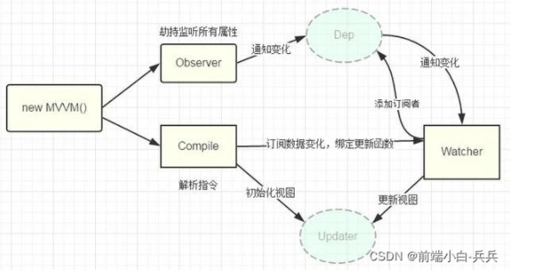

## ** MVC模式**

MVC模式是单向绑定，即model绑定到view，当js代码更新model时，view会自动更新

## ** MVVM模式**

Model-View-ViewModel模式

Model：当前页面渲染时所有依赖的数据源

View：当前页面所渲染的DOM结构

ViewModel：vue实例，是MVVW的核心

用户更新了View,Model的数据页自动被更新了，这种情况就是双向绑定

通过数据来显示视图层而不是节点操作，主要解决了**MVC中大量的dom操作**使页面渲染性能降低，加载速度变慢，影响用户体验等问题

## ** 双向绑定**

vue数据双向绑定是通过**数据劫持结合发布者-订阅者的方式来实现的**

1. 要对数据进行劫持监听，所以我们需要设置一个**监听器Observer**，用来监听所有属性

2. 如果属性发上变化了，就需要告诉**订阅者Watcher**看是否需要更新

3. 因为订阅者是有很多个，所以我们需要有一个**消息订阅器Dep**来专门收集这些订阅者，然后在监听器Observer和订阅者Watcher之间进行统一管理的

4. 需要有一个**指令解析器Compile**，对每个节点元素进行扫描和解析，将相关指令对应初始化成一个订阅者Watcher，并替换模板数据或者绑定相应的函数

5. 当订阅者Watcher接收到相应属性的变化，就会执行对应的更新函数，从而更新视图。

vue双向绑定的核心是`Obeject.defineProperty()`方法