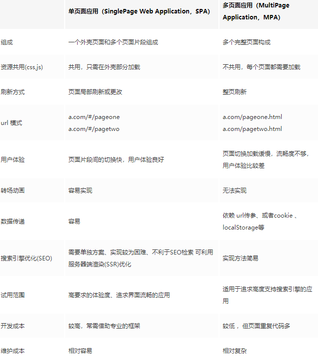

## 单页面应用(SPA,single page web application)：
只有一个主页面的应用，浏览器一开始需要加载所有必须的html js css。所有页面都包含在主页面当中。

**单页面优点：**

1. 公共资源不重新加载，局部加载，服务器压力小
2. 切换速度快，用户体验好
3. 前后端分离

**单页面缺点：**

1. 不利于SEO
2. 初次加载耗时较多
3. 开发难度较大

## **多页面应用(MPA,multi Page Application)：**
有多个HTML页面，跳转的时候从一个HTML页面跳转到另一个页面。

**多页面应用优点：**

1. 利于SEO
2. 更容易扩展
3. 更易数据分析

**多页面应用缺点：**

1. 开发成本高
2. 服务器压力大
3. 用户体验相对较差

