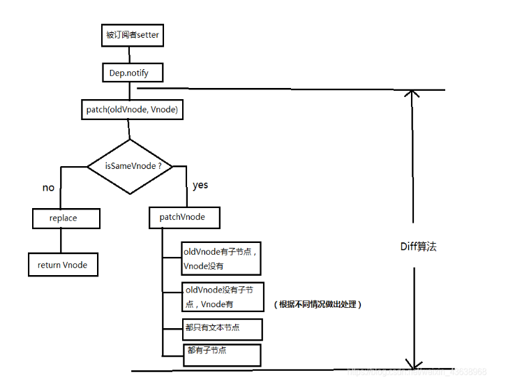

vue中的diff算法就是进行虚拟节点对比，并返回一个patch对象，用来存储两个节点不同的地方，最后用patch记录的信息区局部更新DOM

diff算法的特点：

1. 比较只会在同级进行，不会跨层级比较
2. 在diff比较的过程中，循环从两边向中间比较

diff算法的步骤：

1. 用JS对象结构表示DOM树的结构；然后用这个树构建一个真正的DOM树，插到文档中
2. 当状态发生变更的时候，重新构造一颗新的对象树。然后用新的树和旧的树进行比较，记录两棵树差异
3. 把第二棵树所记录的差异应用到第一棵树构建的真正的DOM树上(patch)，视图就更新了

找到真实的dom，为el

如果都有文本节点且不相等，则将el文本节点设置为Vnode文本节点

如果oldVnode有子节点而VNode没有，则删除el子节点

如果oldVnode没有子节点而VNode有，则将VNode子节点真实化后添加到el

如果两个都有子节点，则执行updataChildren函数比较子节点

diff整体策略为：深度优先，同层比较