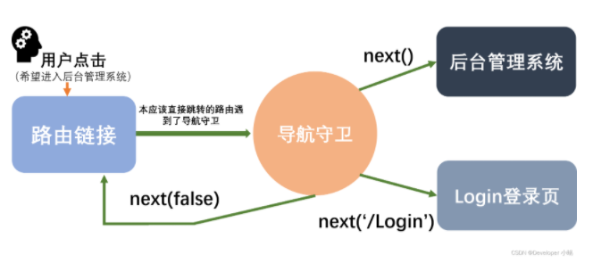

vue-router提供导航守卫主要是用来通过跳转或取消的方式守卫导航。植入路由导航的方式：全局，单个路由独享，或者组件级的。

## **全局前置守卫**

通过router.beforeEach注册

```jsx
const router = createRouter({ ... })

router.beforeEach((to, from) => {
  // ...
  // 返回 false 以取消导航
  return false
})
```

每个守卫方法接收两个参数：

- to：即将要进入的目标(将要访问的路由的信息对象)
- from：当前导航正要离开的理由(将要离开的路由的信息对象)

可以返回的值：

- false：取消当前的导航
- 一个路由地址：像调用router.push( )一样

可选择的第三个参数：

- next：是一个函数，调用next( )函数表示允许这次路由导航
- next函数的三种调用方法：①当用户拥有访问权限的时候直接next放行②当用户没有访问权限的时候，强制调转到其他页面next(’将要强制跳转的页面’)③当用户没有访问权限的时候不允许跳转制定页面，并停留在当前页面next(false)



## **全局解析守卫(beforeEnter)**

作用：全局解析守卫在所有组件内守卫和异步路由组件被解析之后触发（用的很少）

## **全局后置钩子(afterEach)**

作用：路由跳转之后触发

场景：可以让路由跳转之后让对应页面的网页标题改变

**补充：动态路由**

使用场景：当很多个页面或组件需要被重复利用，路由都指向同一个组件，此时需要从不同组件进入到一个共用组件，并且还需要传参数，渲染不同的数据，这时就用到动态路由传参。

动态路由主要通过两个函数来实现：`router.addRoute( )`和`router.removeRoute( )` 

动态路径参数使用冒号进行标识