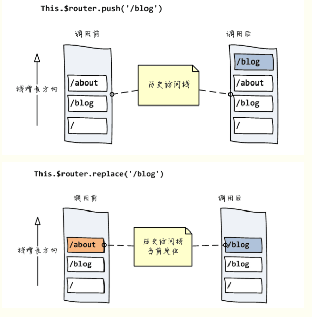
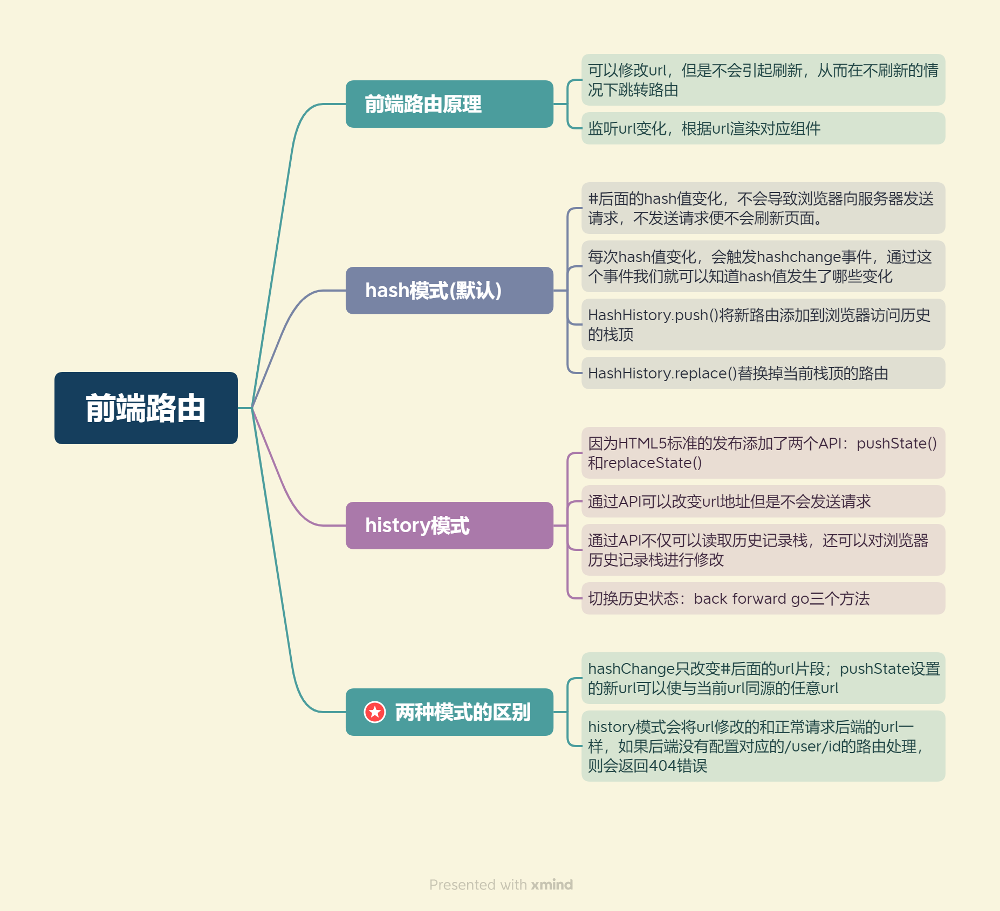

## **前端路由有两种模式：HTML5的history和hash(默认)**

两种模式本质是不同的底层浏览器技术，但是上层VueRouter做了统一化的封装，因此在开发组件和配置路由的时候使用这两种模式的区别并不大。一般默认是hash模式

## **前端路由的原理：**

①可以修改url，但不会引起刷新，从而在不刷新的情况下跳转路由

②监听url变化，根据url渲染对应组件

## **hash模式：**

#后面 hash 值的变化，并**不会导致浏览器向服务器发出请求**，浏览器不发出请求，也就不会刷新页面。每次 hash 值的变化，会**触发**`hashchange`这个事件，通过这个事件我们就可以知道 hash 值发生了哪些变化。

HashHistory有两个方法：

`HashHistory.push()将新路由添加到浏览器访问历史的栈顶` 

 `HashHistory.replace()替换掉当前栈顶的路由`

## **history模式：**

因为HTML5标准发布，多了两个 API，`pushState()`和 `replaceState()。`通过这两个 API： 

（1）可以改变 url 地址且不会发送请求

（2）不仅可以读取历史记录栈，还可以对**浏览器历史记录栈进行修改。**

切换历史状态：`back`,`forward`,`go`三个方法

## **hash模式和history模式的区别：**

前面的hashchange，你**只能改变#后面的url片段**。而pushState设置的新URL可以是与当前URL同源的任意URL。

history模式则**会将URL修改得就和正常请求后端的URL一样**,如后端没有配置对应/user/id的路由处理，则会返回404错误

