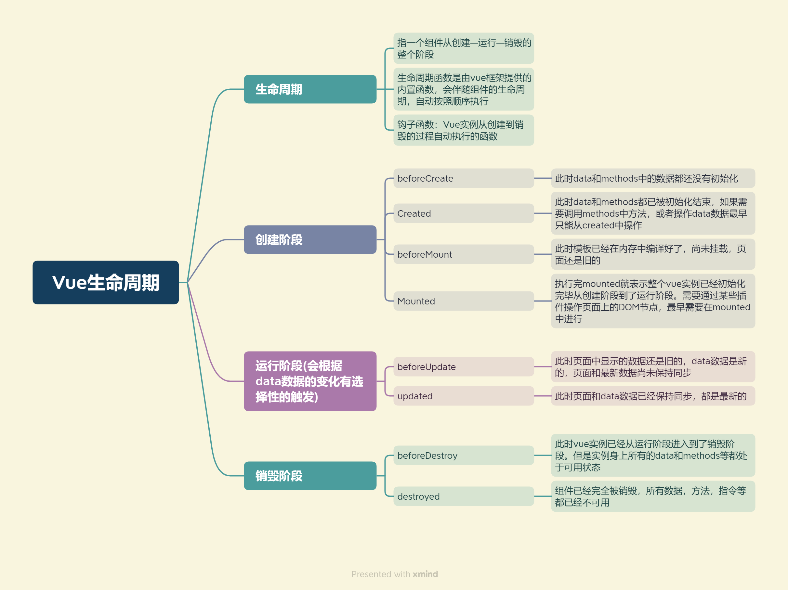

- beforeCreate：刚创建vue实例
- created：data和函数创建加载完毕，最早获取数据的时期(发送异步请求)
- beforeMount：el模板加载完毕，但是页面没解析
- mounted：页面解析完成，渲染页面
- beforeUpdate：data变才会执行，这里data是新的，但是1页面还是旧的还没有同步
- update：页面和data同步
- beforeDestroy：vue实例马上就要销毁，从运行阶段到销毁阶段，但是data和函数还处于可用状态
- destoryed：vue实例销毁，所有指令都被解绑

第一次加载页面会触发的钩子函数：beforeCreate created beforeMount mounted